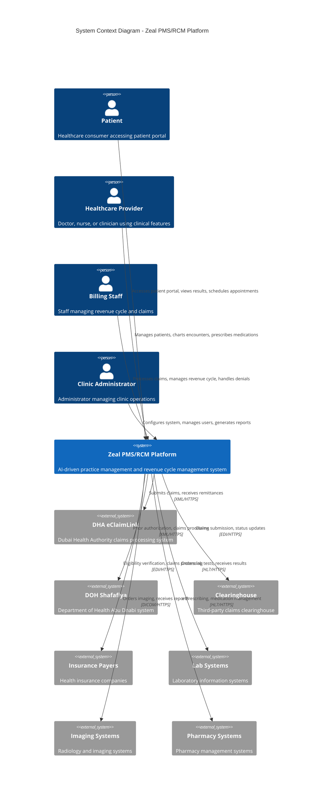
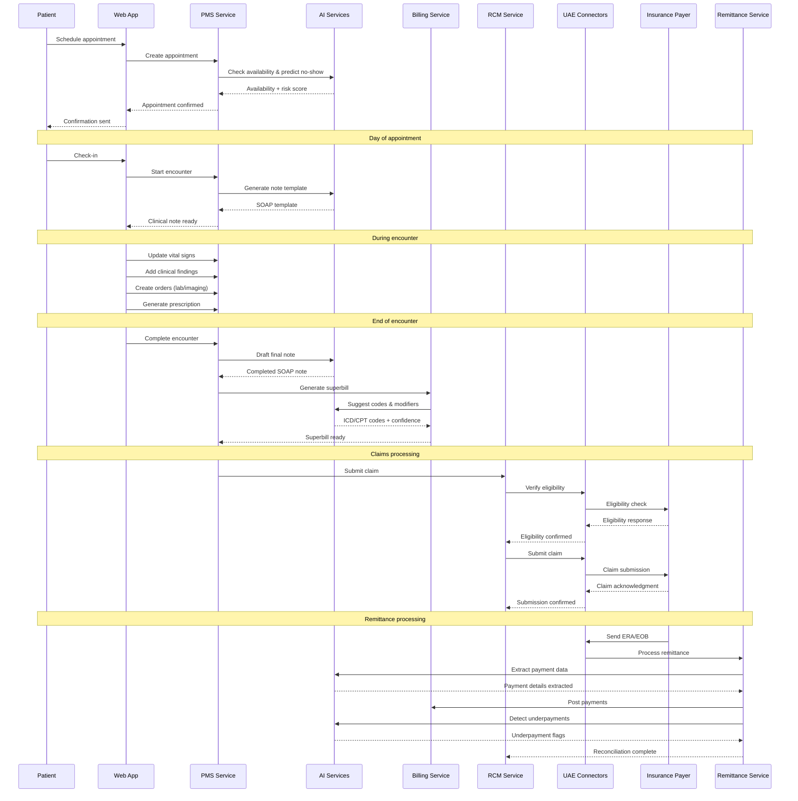
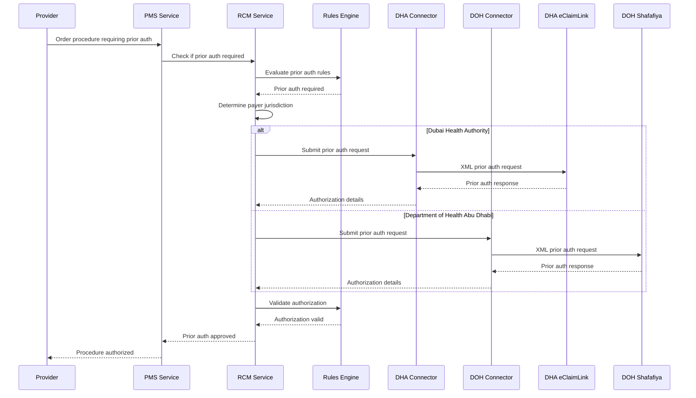
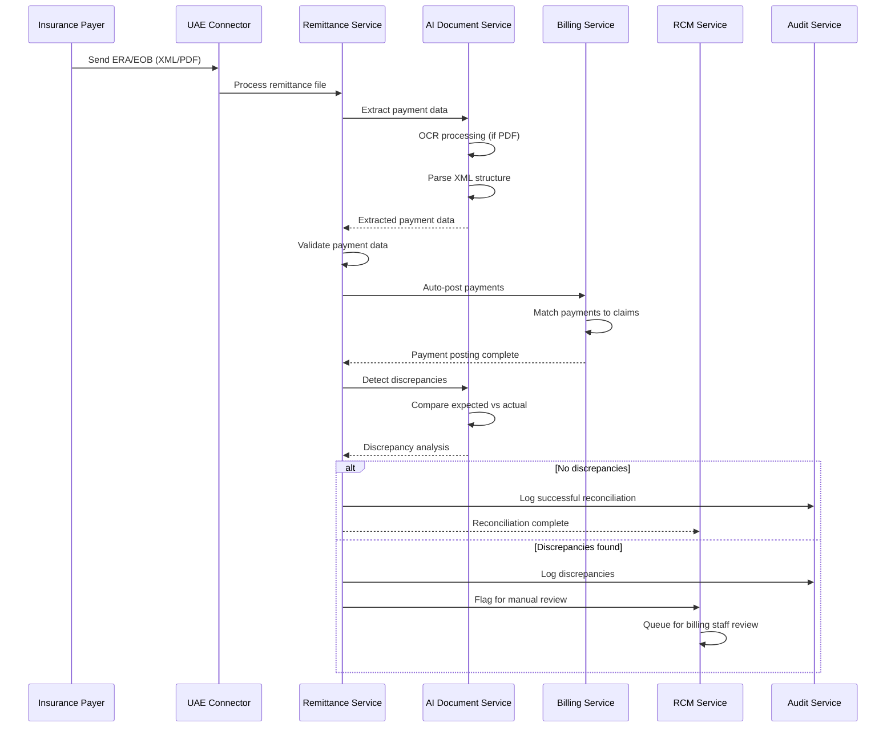

# Architecture Diagrams

## System Context Diagram

## Container Diagram

```mermaid
C4Container
    title Container Diagram - Zeal PMS/RCM Platform
    
    Person(patient, "Patient")
    Person(provider, "Healthcare Provider")
    Person(billing, "Billing Staff")
    Person(admin, "Clinic Administrator")
    
    System_Boundary(zeal, "Zeal PMS/RCM Platform") {
        Container(webapp, "Web Application", "React/TypeScript", "Patient portal, provider dashboard, admin console")
        Container(mobile, "Mobile App", "React Native", "Provider mobile app for clinical workflows")
        Container(api_gateway, "API Gateway", "Kong/Envoy", "Authentication, rate limiting, routing")
        
        Container(identity_service, "Identity Service", "Node.js/TypeScript", "Authentication, authorization, user management")
        Container(pms_service, "PMS Core Service", "Node.js/TypeScript", "Patient management, appointments, encounters")
        Container(billing_service, "Billing Service", "Node.js/TypeScript", "Charge capture, fee schedules, pricing")
        Container(rcm_service, "RCM Service", "Node.js/TypeScript", "Claims processing, eligibility, prior auth")
        Container(remittance_service, "Remittance Service", "Node.js/TypeScript", "ERA/EOB processing, reconciliation")
        Container(rules_engine, "Rules Engine", "Node.js/TypeScript", "Business rules, validation, contract edits")
        
        Container(ai_note_service, "AI Note Service", "Python/FastAPI", "Clinical note drafting, SOAP generation")
        Container(ai_coding_service, "AI Coding Service", "Python/FastAPI", "Medical coding assistance, ICD/CPT suggestions")
        Container(ai_scheduler_service, "AI Scheduler Service", "Python/FastAPI", "Smart scheduling, no-show prediction")
        Container(ai_anomaly_service, "AI Anomaly Service", "Python/FastAPI", "Anomaly detection, denial risk assessment")
        Container(ai_document_service, "AI Document Service", "Python/FastAPI", "OCR, document extraction, EOB processing")
        
        Container(dha_connector, "DHA Connector", "Node.js/TypeScript", "eClaimLink integration, XML processing")
        Container(doh_connector, "DOH Connector", "Node.js/TypeScript", "Shafafiya integration, prior auth")
        Container(clearinghouse_connector, "Clearinghouse Connector", "Node.js/TypeScript", "Third-party clearinghouse integration")
        
        Container(notification_service, "Notification Service", "Node.js/TypeScript", "Email, SMS, WhatsApp notifications")
        Container(audit_service, "Audit Service", "Node.js/TypeScript", "Audit logging, compliance reporting")
        Container(reporting_service, "Reporting Service", "Node.js/TypeScript", "Analytics, dashboards, KPI reporting")
        
        ContainerDb(postgres, "PostgreSQL Database", "PostgreSQL 16", "Primary data store with RLS")
        ContainerDb(redis, "Redis Cache", "Redis 7", "Session storage, caching, rate limiting")
        ContainerDb(kafka, "Message Queue", "Apache Kafka", "Event streaming, async processing")
        ContainerDb(s3, "Object Storage", "S3-compatible", "Document storage, backups, AV scanning")
        ContainerDb(opensearch, "Search Engine", "OpenSearch", "Full-text search, analytics")
        ContainerDb(prometheus, "Metrics Store", "Prometheus", "Metrics collection and storage")
        ContainerDb(jaeger, "Tracing Store", "Jaeger", "Distributed tracing")
    }
    
    System_Ext(dha, "DHA eClaimLink")
    System_Ext(doh, "DOH Shafafiya")
    System_Ext(clearinghouse, "Clearinghouse")
    System_Ext(payer, "Insurance Payers")
    System_Ext(lab, "Lab Systems")
    System_Ext(imaging, "Imaging Systems")
    System_Ext(pharmacy, "Pharmacy Systems")
    
    Rel(patient, webapp, "HTTPS")
    Rel(provider, webapp, "HTTPS")
    Rel(provider, mobile, "HTTPS")
    Rel(billing, webapp, "HTTPS")
    Rel(admin, webapp, "HTTPS")
    
    Rel(webapp, api_gateway, "HTTPS")
    Rel(mobile, api_gateway, "HTTPS")
    
    Rel(api_gateway, identity_service, "HTTPS")
    Rel(api_gateway, pms_service, "HTTPS")
    Rel(api_gateway, billing_service, "HTTPS")
    Rel(api_gateway, rcm_service, "HTTPS")
    Rel(api_gateway, remittance_service, "HTTPS")
    Rel(api_gateway, rules_engine, "HTTPS")
    Rel(api_gateway, ai_note_service, "HTTPS")
    Rel(api_gateway, ai_coding_service, "HTTPS")
    Rel(api_gateway, ai_scheduler_service, "HTTPS")
    Rel(api_gateway, ai_anomaly_service, "HTTPS")
    Rel(api_gateway, ai_document_service, "HTTPS")
    Rel(api_gateway, notification_service, "HTTPS")
    Rel(api_gateway, audit_service, "HTTPS")
    Rel(api_gateway, reporting_service, "HTTPS")
    
    Rel(pms_service, postgres, "SQL")
    Rel(billing_service, postgres, "SQL")
    Rel(rcm_service, postgres, "SQL")
    Rel(remittance_service, postgres, "SQL")
    Rel(rules_engine, postgres, "SQL")
    Rel(identity_service, postgres, "SQL")
    Rel(audit_service, postgres, "SQL")
    Rel(reporting_service, postgres, "SQL")
    
    Rel(identity_service, redis, "Redis Protocol")
    Rel(api_gateway, redis, "Redis Protocol")
    
    Rel(pms_service, kafka, "Kafka Protocol")
    Rel(billing_service, kafka, "Kafka Protocol")
    Rel(rcm_service, kafka, "Kafka Protocol")
    Rel(remittance_service, kafka, "Kafka Protocol")
    Rel(ai_note_service, kafka, "Kafka Protocol")
    Rel(ai_coding_service, kafka, "Kafka Protocol")
    Rel(ai_scheduler_service, kafka, "Kafka Protocol")
    Rel(ai_anomaly_service, kafka, "Kafka Protocol")
    Rel(ai_document_service, kafka, "Kafka Protocol")
    Rel(notification_service, kafka, "Kafka Protocol")
    Rel(audit_service, kafka, "Kafka Protocol")
    
    Rel(pms_service, s3, "S3 API")
    Rel(remittance_service, s3, "S3 API")
    Rel(ai_document_service, s3, "S3 API")
    Rel(audit_service, s3, "S3 API")
    
    Rel(reporting_service, opensearch, "OpenSearch API")
    Rel(ai_anomaly_service, opensearch, "OpenSearch API")
    
    Rel(dha_connector, dha, "XML/HTTPS")
    Rel(doh_connector, doh, "XML/HTTPS")
    Rel(clearinghouse_connector, clearinghouse, "EDI/HTTPS")
    Rel(clearinghouse_connector, payer, "EDI/HTTPS")
    
    Rel(rcm_service, dha_connector, "HTTPS")
    Rel(rcm_service, doh_connector, "HTTPS")
    Rel(rcm_service, clearinghouse_connector, "HTTPS")
    
    Rel(pms_service, lab, "HL7/HTTPS")
    Rel(pms_service, imaging, "DICOM/HTTPS")
    Rel(pms_service, pharmacy, "HL7/HTTPS")
```

## Key Sequence Diagrams

### 1. Complete Patient Journey: Booking → Encounter → Chart → Superbill → Claim → Remittance → Reconciliation

### 2. Eligibility + Prior Authorization Workflow

### 3. ERA Ingestion → Auto-post → Reconcile Workflow

## Component Responsibilities

### Core Services

#### Identity Service
- **Authentication**: OIDC-compliant authentication with JWT tokens
- **Authorization**: RBAC with tenant-scoped permissions
- **User Management**: SCIM-compatible user provisioning
- **Session Management**: Secure session handling with refresh tokens

#### PMS Core Service
- **Patient Management**: Demographics, insurance, consent management
- **Appointment Scheduling**: Multi-resource scheduling with conflict resolution
- **Encounter Management**: Clinical workflow and documentation
- **Orders Management**: Lab, imaging, and procedure orders
- **e-Prescribing**: Electronic prescription management

#### Billing Service
- **Charge Capture**: Automated superbill generation
- **Fee Schedule Management**: Payer-specific pricing rules
- **Contract Management**: Insurance contract validation
- **Price Validation**: Real-time pricing checks

#### RCM Service
- **Eligibility Verification**: Real-time insurance verification
- **Prior Authorization**: Automated prior auth workflows
- **Claims Processing**: Claim generation, validation, and submission
- **Status Tracking**: Real-time claim status updates

#### Remittance Service
- **ERA Processing**: Electronic remittance advice ingestion
- **EOB Processing**: Explanation of benefits processing
- **Payment Posting**: Automated payment posting
- **Reconciliation**: Payment reconciliation and discrepancy detection

#### Rules Engine
- **Business Rules**: Configurable business logic
- **Validation Rules**: Data validation and integrity checks
- **Contract Rules**: Payer-specific contract edits
- **Medical Necessity**: Clinical decision support rules

### AI Services

#### AI Note Service
- **Note Drafting**: SOAP note generation from encounter data
- **Template Management**: Specialty-specific note templates
- **Voice Integration**: Dictation and speech-to-text
- **Quality Assurance**: Note completeness and accuracy checks

#### AI Coding Service
- **Medical Coding**: ICD-10/CPT code suggestions
- **Modifier Suggestions**: Appropriate modifier recommendations
- **Code Validation**: Coding accuracy and compliance checks
- **Confidence Scoring**: AI confidence levels for suggestions

#### AI Scheduler Service
- **Demand Forecasting**: Appointment demand prediction
- **No-Show Prediction**: Patient no-show risk assessment
- **Resource Optimization**: Provider and room utilization
- **Smart Scheduling**: Automated appointment scheduling

#### AI Anomaly Service
- **Denial Risk Assessment**: Claim denial probability
- **Underpayment Detection**: Payment discrepancy identification
- **Anomaly Detection**: Unusual patterns in claims or payments
- **Risk Scoring**: Overall financial risk assessment

#### AI Document Service
- **OCR Processing**: Document text extraction
- **Data Extraction**: Structured data from unstructured documents
- **EOB Processing**: Explanation of benefits parsing
- **Document Classification**: Automatic document categorization

### Integration Services

#### DHA Connector
- **eClaimLink Integration**: Dubai Health Authority connectivity
- **XML Processing**: DHA-specific XML message handling
- **Authentication**: DHA system authentication
- **Error Handling**: DHA-specific error processing

#### DOH Connector
- **Shafafiya Integration**: Department of Health Abu Dhabi connectivity
- **Prior Authorization**: DOH prior auth workflows
- **Claims Processing**: DOH claims submission
- **Compliance**: DOH regulatory compliance

#### Clearinghouse Connector
- **Multi-Payer Support**: Multiple clearinghouse connectivity
- **EDI Processing**: Electronic data interchange
- **Batch Processing**: High-volume claim processing
- **Status Updates**: Real-time claim status updates

## Technology Stack

### Frontend
- **Web Application**: React 18 with TypeScript
- **Mobile Application**: React Native with TypeScript
- **State Management**: Redux Toolkit
- **UI Framework**: Material-UI with custom healthcare theme
- **Internationalization**: react-i18next for Arabic/English support

### Backend
- **Runtime**: Node.js 18+ with TypeScript
- **Framework**: Express.js with middleware
- **API Documentation**: OpenAPI 3.0 with Swagger
- **Validation**: Joi for request validation
- **Authentication**: Passport.js with OIDC

### AI/ML
- **Framework**: Python 3.9+ with FastAPI
- **ML Libraries**: scikit-learn, pandas, numpy
- **NLP**: spaCy, transformers
- **OCR**: Tesseract, PaddleOCR
- **Model Serving**: TensorFlow Serving, MLflow

### Database
- **Primary Database**: PostgreSQL 16 with RLS
- **Cache**: Redis 7 for session and data caching
- **Search**: OpenSearch for full-text search
- **Message Queue**: Apache Kafka for event streaming
- **Object Storage**: S3-compatible storage

### Infrastructure
- **Containerization**: Docker with multi-stage builds
- **Orchestration**: Kubernetes with Helm charts
- **Service Mesh**: Istio for service communication
- **API Gateway**: Kong for API management
- **Monitoring**: Prometheus, Grafana, Jaeger
- **Logging**: ELK Stack (Elasticsearch, Logstash, Kibana)

### Security
- **Secrets Management**: HashiCorp Vault
- **Certificate Management**: cert-manager
- **Network Security**: Calico for network policies
- **Image Security**: Trivy for container scanning
- **Code Security**: SonarQube for static analysis
