# Domain Model

## Entity Relationship Diagram

```mermaid
erDiagram
    %% Core Tenant Management
    TENANT {
        uuid id PK
        string name
        string domain
        string status
        jsonb settings
        timestamp created_at
        timestamp updated_at
    }
    
    USER {
        uuid id PK
        uuid tenant_id FK
        string email
        string first_name
        string last_name
        string role
        string status
        jsonb permissions
        timestamp last_login
        timestamp created_at
        timestamp updated_at
    }
    
    LOCATION {
        uuid id PK
        uuid tenant_id FK
        string name
        string address
        string city
        string emirate
        string postal_code
        string phone
        string email
        jsonb settings
        timestamp created_at
        timestamp updated_at
    }
    
    FACILITY {
        uuid id PK
        uuid location_id FK
        string name
        string license_number
        string specialty
        string facility_type
        string status
        jsonb configuration
        timestamp created_at
        timestamp updated_at
    }
    
    SPACE {
        uuid id PK
        uuid facility_id FK
        string name
        string space_number
        string space_type
        jsonb equipment
        integer capacity
        boolean is_active
        timestamp created_at
        timestamp updated_at
    }
    
    STAFF {
        uuid id PK
        uuid tenant_id FK
        string license_number
        string specialty
        string first_name
        string last_name
        string email
        string phone
        string staff_type
        jsonb credentials
        string status
        timestamp created_at
        timestamp updated_at
    }
    
    EQUIPMENT {
        uuid id PK
        uuid tenant_id FK
        uuid facility_id FK
        string name
        string equipment_type
        string model
        string serial_number
        string status
        jsonb specifications
        jsonb maintenance_schedule
        timestamp created_at
        timestamp updated_at
    }
    
    STAFF_SCHEDULE {
        uuid id PK
        uuid tenant_id FK
        uuid staff_id FK
        integer day_of_week
        time start_time
        time end_time
        boolean is_available
        text notes
        date effective_from
        date effective_to
        timestamp created_at
        timestamp updated_at
    }
    
    EQUIPMENT_SCHEDULE {
        uuid id PK
        uuid tenant_id FK
        uuid equipment_id FK
        integer day_of_week
        time start_time
        time end_time
        boolean is_available
        string maintenance_type
        text notes
        date effective_from
        date effective_to
        timestamp created_at
        timestamp updated_at
    }
    
    %% Patient Management
    PATIENT {
        uuid id PK
        uuid tenant_id FK
        string emirates_id
        string first_name
        string last_name
        string date_of_birth
        string gender
        string phone
        string email
        string address
        string city
        string emirate
        string postal_code
        string emergency_contact
        jsonb demographics
        timestamp created_at
        timestamp updated_at
    }
    
    POLICY {
        uuid id PK
        uuid patient_id FK
        string policy_number
        string group_number
        string payer_name
        string payer_id
        string relationship
        string effective_date
        string expiration_date
        jsonb benefits
        boolean is_primary
        timestamp created_at
        timestamp updated_at
    }
    
    CONSENT {
        uuid id PK
        uuid patient_id FK
        string consent_type
        string status
        text consent_text
        string signed_by
        timestamp signed_at
        timestamp expires_at
        timestamp created_at
        timestamp updated_at
    }
    
    %% Appointment Management
    APPOINTMENT {
        uuid id PK
        uuid tenant_id FK
        uuid patient_id FK
        uuid primary_staff_id FK
        uuid primary_space_id FK
        timestamp scheduled_at
        integer duration_minutes
        string appointment_type
        string status
        string reason
        text notes
        integer preparation_time_minutes
        integer cleanup_time_minutes
        jsonb metadata
        timestamp created_at
        timestamp updated_at
    }
    
    APPOINTMENT_RESOURCE {
        uuid id PK
        uuid appointment_id FK
        string resource_type
        uuid resource_id
        string resource_role
        timestamp start_time
        timestamp end_time
        boolean is_confirmed
        text notes
        timestamp created_at
        timestamp updated_at
    }
    
    APPOINTMENT_RESOURCE_REQUIREMENT {
        uuid id PK
        uuid tenant_id FK
        string appointment_type
        string resource_type
        uuid resource_id
        string resource_role
        boolean is_required
        integer min_duration_minutes
        integer max_duration_minutes
        integer preparation_time_minutes
        integer cleanup_time_minutes
        timestamp created_at
        timestamp updated_at
    }
    
    RESOURCE_CONFLICT {
        uuid id PK
        uuid tenant_id FK
        string conflict_type
        string resource_type
        uuid resource_id
        uuid conflicting_appointment_id FK
        timestamp conflict_start_time
        timestamp conflict_end_time
        string severity
        string status
        text resolution_notes
        uuid resolved_by FK
        timestamp resolved_at
        timestamp created_at
        timestamp updated_at
    }
    
    %% Clinical Management
    ENCOUNTER {
        uuid id PK
        uuid appointment_id FK
        uuid patient_id FK
        uuid primary_staff_id FK
        timestamp start_time
        timestamp end_time
        string encounter_type
        string status
        text chief_complaint
        text assessment
        text plan
        jsonb vital_signs
        timestamp created_at
        timestamp updated_at
    }
    
    VITALS {
        uuid id PK
        uuid encounter_id FK
        decimal height_cm
        decimal weight_kg
        decimal temperature_c
        integer systolic_bp
        integer diastolic_bp
        integer heart_rate
        integer respiratory_rate
        decimal oxygen_saturation
        decimal bmi
        timestamp recorded_at
        timestamp created_at
    }
    
    CLINICAL_NOTE {
        uuid id PK
        uuid encounter_id FK
        string note_type
        string section
        text content
        string status
        uuid created_by FK
        timestamp created_at
        timestamp updated_at
    }
    
    ORDER {
        uuid id PK
        uuid encounter_id FK
        uuid patient_id FK
        uuid primary_staff_id FK
        string order_type
        string status
        text description
        jsonb specifications
        timestamp ordered_at
        timestamp created_at
        timestamp updated_at
    }
    
    LAB_RESULT {
        uuid id PK
        uuid order_id FK
        string test_name
        string result_value
        string unit
        string reference_range
        string status
        text interpretation
        timestamp result_date
        timestamp created_at
        timestamp updated_at
    }
    
    IMAGING_RESULT {
        uuid id PK
        uuid order_id FK
        string study_type
        string modality
        text findings
        text impression
        string status
        string dicom_series_id
        timestamp study_date
        timestamp created_at
        timestamp updated_at
    }
    
    PRESCRIPTION {
        uuid id PK
        uuid encounter_id FK
        uuid patient_id FK
        uuid primary_staff_id FK
        string medication_name
        string dosage
        string frequency
        string duration
        string instructions
        string status
        timestamp prescribed_at
        timestamp created_at
        timestamp updated_at
    }
    
    DOCUMENT {
        uuid id PK
        uuid tenant_id FK
        uuid patient_id FK
        uuid encounter_id FK
        string document_type
        string file_name
        string mime_type
        bigint file_size
        string storage_path
        string status
        jsonb metadata
        timestamp created_at
        timestamp updated_at
    }
    
    %% Billing and RCM
    PAYER {
        uuid id PK
        uuid tenant_id FK
        string payer_name
        string payer_id
        string payer_type
        jsonb contact_info
        jsonb configuration
        string status
        timestamp created_at
        timestamp updated_at
    }
    
    FEE_SCHEDULE {
        uuid id PK
        uuid payer_id FK
        string code_type
        string code
        decimal fee_amount
        string effective_date
        string expiration_date
        timestamp created_at
        timestamp updated_at
    }
    
    CODE_SET {
        uuid id PK
        string code_type
        string code
        string description
        string category
        jsonb metadata
        timestamp created_at
        timestamp updated_at
    }
    
    SUPERBILL {
        uuid id PK
        uuid encounter_id FK
        uuid patient_id FK
        uuid primary_staff_id FK
        string status
        decimal total_amount
        jsonb charges
        timestamp generated_at
        timestamp created_at
        timestamp updated_at
    }
    
    CHARGE {
        uuid id PK
        uuid superbill_id FK
        string procedure_code
        string diagnosis_codes
        decimal quantity
        decimal unit_price
        decimal total_amount
        string status
        jsonb modifiers
        timestamp created_at
        timestamp updated_at
    }
    
    CLAIM_HEADER {
        uuid id PK
        uuid superbill_id FK
        uuid payer_id FK
        string claim_number
        string status
        decimal total_amount
        timestamp service_date
        timestamp submitted_at
        timestamp created_at
        timestamp updated_at
    }
    
    CLAIM_LINE {
        uuid id PK
        uuid claim_header_id FK
        string procedure_code
        string diagnosis_codes
        decimal quantity
        decimal unit_price
        decimal total_amount
        string status
        jsonb modifiers
        timestamp created_at
        timestamp updated_at
    }
    
    VALIDATION_FINDING {
        uuid id PK
        uuid claim_header_id FK
        string finding_type
        string severity
        text description
        string status
        timestamp created_at
        timestamp updated_at
    }
    
    SUBMISSION_LOG {
        uuid id PK
        uuid claim_header_id FK
        string submission_type
        string status
        text response_data
        timestamp submitted_at
        timestamp created_at
    }
    
    REMITTANCE_HEADER {
        uuid id PK
        uuid claim_header_id FK
        string remittance_id
        string payer_id
        decimal total_amount
        decimal paid_amount
        timestamp remittance_date
        timestamp processed_at
        timestamp created_at
        timestamp updated_at
    }
    
    REMITTANCE_LINE {
        uuid id PK
        uuid remittance_header_id FK
        uuid claim_line_id FK
        decimal paid_amount
        string adjustment_code
        string adjustment_reason
        timestamp created_at
        timestamp updated_at
    }
    
    RECONCILIATION {
        uuid id PK
        uuid remittance_header_id FK
        string status
        decimal expected_amount
        decimal actual_amount
        decimal variance
        text notes
        timestamp reconciled_at
        timestamp created_at
        timestamp updated_at
    }
    
    %% AI and Analytics
    AI_SUGGESTION {
        uuid id PK
        string suggestion_type
        string entity_type
        uuid entity_id FK
        jsonb suggestion_data
        decimal confidence_score
        string status
        timestamp created_at
        timestamp updated_at
    }
    
    AUDIT_LOG {
        uuid id PK
        uuid tenant_id FK
        uuid user_id FK
        string action
        string entity_type
        uuid entity_id FK
        jsonb old_values
        jsonb new_values
        string ip_address
        string user_agent
        timestamp created_at
    }
    
    %% Relationships
    TENANT ||--o{ USER : "has"
    TENANT ||--o{ LOCATION : "has"
    TENANT ||--o{ STAFF : "employs"
    TENANT ||--o{ PATIENT : "serves"
    TENANT ||--o{ PAYER : "contracts_with"
    TENANT ||--o{ DOCUMENT : "stores"
    TENANT ||--o{ AUDIT_LOG : "logs"
    TENANT ||--o{ EQUIPMENT : "owns"
    
    LOCATION ||--o{ FACILITY : "contains"
    FACILITY ||--o{ SPACE : "has"
    FACILITY ||--o{ EQUIPMENT : "uses"
    
    STAFF ||--o{ STAFF_SCHEDULE : "has"
    EQUIPMENT ||--o{ EQUIPMENT_SCHEDULE : "has"
    
    PATIENT ||--o{ POLICY : "has"
    PATIENT ||--o{ CONSENT : "gives"
    PATIENT ||--o{ APPOINTMENT : "schedules"
    PATIENT ||--o{ ENCOUNTER : "has"
    PATIENT ||--o{ ORDER : "receives"
    PATIENT ||--o{ PRESCRIPTION : "receives"
    PATIENT ||--o{ DOCUMENT : "owns"
    PATIENT ||--o{ SUPERBILL : "generates"
    
    STAFF ||--o{ APPOINTMENT : "conducts"
    STAFF ||--o{ ENCOUNTER : "performs"
    STAFF ||--o{ ORDER : "orders"
    STAFF ||--o{ PRESCRIPTION : "prescribes"
    STAFF ||--o{ SUPERBILL : "generates"
    
    SPACE ||--o{ APPOINTMENT : "hosts"
    
    APPOINTMENT ||--o{ APPOINTMENT_RESOURCE : "uses"
    APPOINTMENT ||--o{ RESOURCE_CONFLICT : "may_have"
    APPOINTMENT ||--o{ ENCOUNTER : "results_in"
    
    ENCOUNTER ||--o{ VITALS : "records"
    ENCOUNTER ||--o{ CLINICAL_NOTE : "documents"
    ENCOUNTER ||--o{ ORDER : "includes"
    ENCOUNTER ||--o{ PRESCRIPTION : "includes"
    ENCOUNTER ||--o{ SUPERBILL : "generates"
    
    ORDER ||--o{ LAB_RESULT : "produces"
    ORDER ||--o{ IMAGING_RESULT : "produces"
    
    PAYER ||--o{ FEE_SCHEDULE : "defines"
    PAYER ||--o{ CLAIM_HEADER : "receives"
    
    SUPERBILL ||--o{ CHARGE : "contains"
    SUPERBILL ||--o{ CLAIM_HEADER : "generates"
    
    CLAIM_HEADER ||--o{ CLAIM_LINE : "contains"
    CLAIM_HEADER ||--o{ VALIDATION_FINDING : "has"
    CLAIM_HEADER ||--o{ SUBMISSION_LOG : "tracks"
    CLAIM_HEADER ||--o{ REMITTANCE_HEADER : "receives"
    
    CLAIM_LINE ||--o{ REMITTANCE_LINE : "receives"
    
    REMITTANCE_HEADER ||--o{ REMITTANCE_LINE : "contains"
    REMITTANCE_HEADER ||--o{ RECONCILIATION : "requires"
    
    USER ||--o{ CLINICAL_NOTE : "creates"
    USER ||--o{ AUDIT_LOG : "performs"
    USER ||--o{ RESOURCE_CONFLICT : "resolves"
```

## Domain Model Description

### Core Tenant Management

#### Tenant
Represents a healthcare organization using the platform. Each tenant is isolated with their own data, users, and configuration.

#### User
System users with role-based access control. Users belong to a specific tenant and have defined permissions.

#### Location
Physical locations where healthcare services are provided. A tenant can have multiple locations.

#### Facility
Healthcare facilities within a location (clinics, hospital departments, diagnostic centers, surgical units). Each facility has its own license and specialty focus.

#### Space
Service areas within a facility (consultation rooms, patient rooms, OR suites, MRI suites, lab stations, ICU beds).

#### Staff
Healthcare staff members (physicians, nurses, technicians, administrators, support staff) who deliver care and services to patients.

#### Equipment
Medical equipment and devices (MRI scanners, CT scanners, surgical tables, ventilators) used in patient care and procedures.

#### Staff Schedule
Availability schedules for staff members showing when they are available for appointments and procedures.

#### Equipment Schedule
Availability and maintenance schedules for equipment, including planned downtime and service windows.

### Patient Management

#### Patient
Core patient entity with demographics, contact information, and Emirates ID for UAE compliance.

#### Policy
Insurance policies associated with patients, including primary and secondary coverage.

#### Consent
Patient consent records for various procedures and data processing activities (PDPL compliance).

### Clinical Management

#### Appointment
Scheduled appointments linking patients, primary staff, and primary space with timing and status. Supports multi-resource scheduling with preparation and cleanup times.

#### Appointment Resource
Individual resources (staff, equipment, spaces) assigned to appointments. Enables complex scheduling scenarios like surgical procedures requiring multiple staff members and equipment.

#### Appointment Resource Requirement
Template definitions for resource requirements by appointment type. Specifies which resources are needed, their roles, and timing constraints.

#### Resource Conflict
Detected conflicts in resource scheduling (double-booking, maintenance overlaps, staff unavailability). Tracks resolution status and notes.

#### Encounter
Clinical encounters that occur during appointments, containing clinical data and notes.

#### Vitals
Vital signs recorded during encounters (height, weight, blood pressure, etc.).

#### Clinical Note
Structured clinical documentation organized by sections (SOAP format).

#### Order
Clinical orders for lab tests, imaging, procedures, etc.

#### Lab Result
Laboratory test results linked to orders.

#### Imaging Result
Imaging study results and interpretations.

#### Prescription
Medication prescriptions with dosage and instructions.

#### Document
Clinical documents, reports, and attachments.

### Billing and Revenue Cycle Management

#### Payer
Insurance companies and payers that process claims.

#### Fee Schedule
Payer-specific fee schedules for procedures and services.

#### Code Set
Medical coding systems (ICD-10, CPT, HCPCS) with descriptions.

#### Superbill
Summary of charges generated from encounters for billing.

#### Charge
Individual line items on superbills with procedure codes and amounts.

#### Claim Header
Insurance claims submitted to payers with header information.

#### Claim Line
Individual line items within claims.

#### Validation Finding
Validation errors and warnings for claims before submission.

#### Submission Log
Audit trail of claim submissions and responses.

#### Remittance Header
Electronic remittance advice (ERA) received from payers.

#### Remittance Line
Individual payment line items within remittances.

#### Reconciliation
Payment reconciliation between expected and actual payments.

### AI and Analytics

#### AI Suggestion
AI-generated suggestions for coding, scheduling, and clinical decisions.

#### Audit Log
Comprehensive audit trail for all system activities and changes.

## Key Design Principles

### Multi-Tenancy
- All entities are scoped by `tenant_id` for data isolation
- Row-Level Security (RLS) policies enforce tenant boundaries
- Shared reference data (Code Set) is tenant-agnostic

### Auditability
- All critical entities have `created_at` and `updated_at` timestamps
- Audit log captures all changes with before/after values
- Immutable audit trail for compliance requirements

### Flexibility
- JSONB fields for extensible metadata and configuration
- Status fields for workflow state management
- Soft deletes preserve data integrity

### UAE Compliance
- Emirates ID field for patient identification
- Emirate field for geographic compliance
- Arabic/English support through internationalization

### Performance
- UUID primary keys for distributed systems
- Indexed foreign keys for efficient joins
- Partitioning strategy for high-volume tables (claims, remittances)

## Data Relationships

### Hierarchical Relationships
- Tenant → Location → Facility → Space
- Tenant → Staff → Staff Schedule
- Tenant → Equipment → Equipment Schedule
- Patient → Policy (one-to-many)
- Encounter → Clinical Note (one-to-many)

### Multi-Resource Scheduling
- Appointment → Appointment Resource (one-to-many)
  - Each resource can be: Staff, Equipment, or Space
  - Supports complex scenarios (surgeries, imaging, procedures)
- Appointment Type → Resource Requirements (template)
- Resource Conflicts → Detection and Resolution

### Clinical Workflow
- Appointment → Encounter → Orders/Notes/Prescriptions
- Encounter → Superbill → Charges → Claims
- Staff → Appointments → Encounters

### Revenue Cycle
- Claims → Remittances → Reconciliation
- Payers → Fee Schedules → Charges

### Resource Management
- Staff Schedules → Appointment Availability
- Equipment Schedules → Maintenance and Availability
- Space Capacity → Bed/Room Management

### AI Integration
- All clinical entities can have AI suggestions
- Audit log tracks AI interactions and decisions
- Confidence scores for AI recommendations
