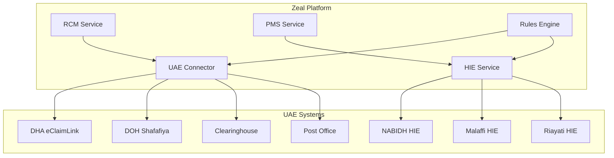
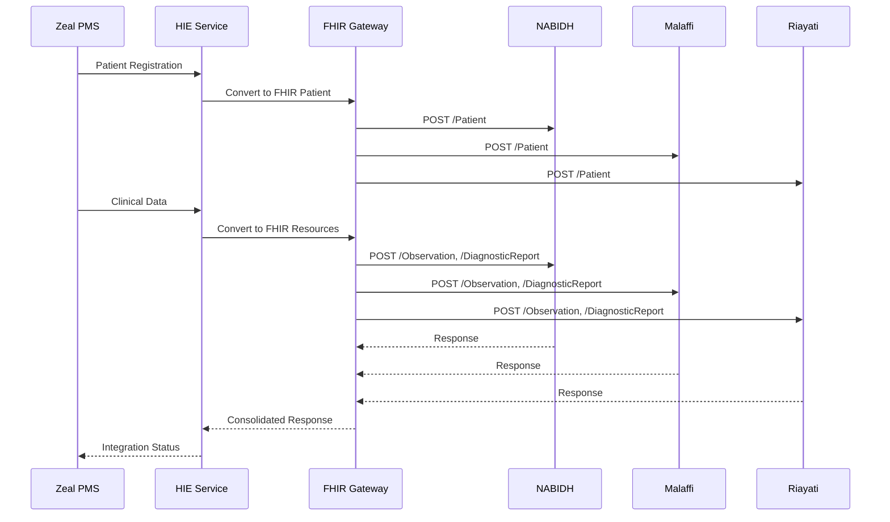

# UAE Integrations

## Overview

The Zeal platform integrates with UAE healthcare systems to enable seamless claims processing, eligibility verification, regulatory compliance, and health information exchange. This document outlines the integration architecture and specifications for DHA eClaimLink, DOH Shafafiya, UAE HIE platforms, and other UAE-specific systems.

## Integration Architecture

### Connector Pattern



### Integration Components

#### 1. UAE Connector Service
- **Purpose**: Centralized integration service for all UAE healthcare systems
- **Technology**: Node.js with TypeScript
- **Protocols**: HTTPS, XML, EDI
- **Authentication**: Certificate-based authentication
- **Error Handling**: Comprehensive error handling and retry logic

#### 2. HIE Service
- **Purpose**: Health Information Exchange integration service
- **Technology**: Node.js with TypeScript, FHIR R4 support
- **Protocols**: HTTPS, FHIR REST API, HL7 v2
- **Authentication**: OAuth 2.0, Certificate-based authentication
- **Standards**: FHIR R4, HL7 v2, IHE profiles

#### 3. Message Transformation Layer
- **Purpose**: Convert between internal JSON format and external XML/EDI/FHIR formats
- **Technology**: XSLT, FHIR transformers, custom transformers
- **Validation**: XML schema validation, FHIR validation
- **Mapping**: Field mapping between systems

#### 4. Queue Management
- **Purpose**: Handle asynchronous message processing
- **Technology**: Apache Kafka
- **Features**: Dead letter queues, retry policies, message ordering

## DHA eClaimLink Integration

### Overview
DHA eClaimLink is Dubai Health Authority's electronic claims processing system that handles eligibility verification, prior authorization, claims submission, and remittance processing.

### Authentication
```yaml
authentication:
  type: "certificate_based"
  certificate:
    client_cert: "/certs/dha_client.pem"
    client_key: "/certs/dha_client.key"
    ca_cert: "/certs/dha_ca.pem"
  headers:
    Authorization: "Bearer {jwt_token}"
    X-Client-ID: "{client_id}"
    X-Timestamp: "{timestamp}"
    X-Signature: "{hmac_signature}"
```

### API Endpoints

#### Eligibility Verification
```yaml
endpoint: "https://eclaimlink.dha.gov.ae/api/v1/eligibility/verify"
method: "POST"
content_type: "application/xml"
request_schema: "dha_eligibility_request.xsd"
response_schema: "dha_eligibility_response.xsd"
timeout: 30
retry_policy:
  max_retries: 3
  backoff_multiplier: 2
  initial_delay: 1000
```

#### Prior Authorization
```yaml
endpoint: "https://eclaimlink.dha.gov.ae/api/v1/prior-auth/submit"
method: "POST"
content_type: "application/xml"
request_schema: "dha_prior_auth_request.xsd"
response_schema: "dha_prior_auth_response.xsd"
timeout: 60
retry_policy:
  max_retries: 2
  backoff_multiplier: 1.5
  initial_delay: 2000
```

#### Claims Submission
```yaml
endpoint: "https://eclaimlink.dha.gov.ae/api/v1/claims/submit"
method: "POST"
content_type: "application/xml"
request_schema: "dha_claim_request.xsd"
response_schema: "dha_claim_response.xsd"
timeout: 120
retry_policy:
  max_retries: 3
  backoff_multiplier: 2
  initial_delay: 1000
```

### XML Schemas

#### Eligibility Request Schema
```xml
<?xml version="1.0" encoding="UTF-8"?>
<xs:schema xmlns:xs="http://www.w3.org/2001/XMLSchema">
  <xs:element name="EligibilityRequest">
    <xs:complexType>
      <xs:sequence>
        <xs:element name="Header">
          <xs:complexType>
            <xs:sequence>
              <xs:element name="TransactionID" type="xs:string"/>
              <xs:element name="Timestamp" type="xs:dateTime"/>
              <xs:element name="ClientID" type="xs:string"/>
              <xs:element name="ProviderID" type="xs:string"/>
            </xs:sequence>
          </xs:complexType>
        </xs:element>
        <xs:element name="Patient">
          <xs:complexType>
            <xs:sequence>
              <xs:element name="EmiratesID" type="xs:string"/>
              <xs:element name="FirstName" type="xs:string"/>
              <xs:element name="LastName" type="xs:string"/>
              <xs:element name="DateOfBirth" type="xs:date"/>
              <xs:element name="Gender" type="xs:string"/>
            </xs:sequence>
          </xs:complexType>
        </xs:element>
        <xs:element name="Insurance">
          <xs:complexType>
            <xs:sequence>
              <xs:element name="PolicyNumber" type="xs:string"/>
              <xs:element name="GroupNumber" type="xs:string"/>
              <xs:element name="PayerID" type="xs:string"/>
            </xs:sequence>
          </xs:complexType>
        </xs:element>
        <xs:element name="Service">
          <xs:complexType>
            <xs:sequence>
              <xs:element name="ServiceDate" type="xs:date"/>
              <xs:element name="ProcedureCodes" type="xs:string" maxOccurs="unbounded"/>
              <xs:element name="DiagnosisCodes" type="xs:string" maxOccurs="unbounded"/>
            </xs:sequence>
          </xs:complexType>
        </xs:element>
      </xs:sequence>
    </xs:complexType>
  </xs:element>
</xs:schema>
```

#### Eligibility Response Schema
```xml
<?xml version="1.0" encoding="UTF-8"?>
<xs:schema xmlns:xs="http://www.w3.org/2001/XMLSchema">
  <xs:element name="EligibilityResponse">
    <xs:complexType>
      <xs:sequence>
        <xs:element name="Header">
          <xs:complexType>
            <xs:sequence>
              <xs:element name="TransactionID" type="xs:string"/>
              <xs:element name="ResponseTimestamp" type="xs:dateTime"/>
              <xs:element name="Status" type="xs:string"/>
              <xs:element name="ErrorCode" type="xs:string" minOccurs="0"/>
              <xs:element name="ErrorMessage" type="xs:string" minOccurs="0"/>
            </xs:sequence>
          </xs:complexType>
        </xs:element>
        <xs:element name="Eligibility">
          <xs:complexType>
            <xs:sequence>
              <xs:element name="IsEligible" type="xs:boolean"/>
              <xs:element name="EffectiveDate" type="xs:date"/>
              <xs:element name="ExpirationDate" type="xs:date"/>
              <xs:element name="Benefits">
                <xs:complexType>
                  <xs:sequence>
                    <xs:element name="Copay" type="xs:decimal"/>
                    <xs:element name="Deductible" type="xs:decimal"/>
                    <xs:element name="Coinsurance" type="xs:decimal"/>
                    <xs:element name="OutOfPocketMax" type="xs:decimal"/>
                  </xs:sequence>
                </xs:complexType>
              </xs:element>
            </xs:sequence>
          </xs:complexType>
        </xs:element>
      </xs:sequence>
    </xs:complexType>
  </xs:element>
</xs:schema>
```

### Implementation Example

```typescript
class DHAConnector {
  private client: AxiosInstance;
  private config: DHAConfig;

  constructor(config: DHAConfig) {
    this.config = config;
    this.client = axios.create({
      baseURL: config.baseUrl,
      timeout: config.timeout,
      httpsAgent: new https.Agent({
        cert: fs.readFileSync(config.certPath),
        key: fs.readFileSync(config.keyPath),
        ca: fs.readFileSync(config.caPath)
      })
    });
  }

  async verifyEligibility(request: EligibilityRequest): Promise<EligibilityResponse> {
    try {
      const xmlRequest = this.transformToXML(request);
      const response = await this.client.post('/api/v1/eligibility/verify', xmlRequest, {
        headers: {
          'Content-Type': 'application/xml',
          'Authorization': `Bearer ${await this.getJWTToken()}`,
          'X-Client-ID': this.config.clientId,
          'X-Timestamp': new Date().toISOString(),
          'X-Signature': this.generateSignature(xmlRequest)
        }
      });

      return this.transformFromXML(response.data);
    } catch (error) {
      throw new DHAIntegrationError('Eligibility verification failed', error);
    }
  }

  private transformToXML(request: EligibilityRequest): string {
    const template = `
      <EligibilityRequest>
        <Header>
          <TransactionID>${request.transactionId}</TransactionID>
          <Timestamp>${request.timestamp}</Timestamp>
          <ClientID>${this.config.clientId}</ClientID>
          <ProviderID>${request.providerId}</ProviderID>
        </Header>
        <Patient>
          <EmiratesID>${request.patient.emiratesId}</EmiratesID>
          <FirstName>${request.patient.firstName}</FirstName>
          <LastName>${request.patient.lastName}</LastName>
          <DateOfBirth>${request.patient.dateOfBirth}</DateOfBirth>
          <Gender>${request.patient.gender}</Gender>
        </Patient>
        <Insurance>
          <PolicyNumber>${request.insurance.policyNumber}</PolicyNumber>
          <GroupNumber>${request.insurance.groupNumber}</GroupNumber>
          <PayerID>${request.insurance.payerId}</PayerID>
        </Insurance>
        <Service>
          <ServiceDate>${request.service.serviceDate}</ServiceDate>
          ${request.service.procedureCodes.map(code => `<ProcedureCodes>${code}</ProcedureCodes>`).join('')}
          ${request.service.diagnosisCodes.map(code => `<DiagnosisCodes>${code}</DiagnosisCodes>`).join('')}
        </Service>
      </EligibilityRequest>
    `;
    return template;
  }
}
```

## DOH Shafafiya Integration

### Overview
DOH Shafafiya is the Department of Health Abu Dhabi's system for prior authorization, claims processing, and provider management.

### Authentication
```yaml
authentication:
  type: "oauth2"
  grant_type: "client_credentials"
  token_url: "https://shafafiya.doh.gov.ae/oauth/token"
  client_id: "{client_id}"
  client_secret: "{client_secret}"
  scope: "claims:read claims:write prior-auth:read prior-auth:write"
  token_expiry: 3600
```

### API Endpoints

#### Prior Authorization
```yaml
endpoint: "https://shafafiya.doh.gov.ae/api/v2/prior-authorization"
method: "POST"
content_type: "application/json"
request_schema: "doh_prior_auth_request.json"
response_schema: "doh_prior_auth_response.json"
timeout: 60
retry_policy:
  max_retries: 3
  backoff_multiplier: 2
  initial_delay: 1000
```

#### Claims Submission
```yaml
endpoint: "https://shafafiya.doh.gov.ae/api/v2/claims"
method: "POST"
content_type: "application/json"
request_schema: "doh_claim_request.json"
response_schema: "doh_claim_response.json"
timeout: 120
retry_policy:
  max_retries: 3
  backoff_multiplier: 2
  initial_delay: 1000
```

### JSON Schemas

#### Prior Authorization Request
```json
{
  "$schema": "http://json-schema.org/draft-07/schema#",
  "type": "object",
  "required": ["patient", "provider", "service", "clinical_info"],
  "properties": {
    "patient": {
      "type": "object",
      "required": ["emirates_id", "first_name", "last_name", "date_of_birth"],
      "properties": {
        "emirates_id": {"type": "string", "pattern": "^[0-9]{3}-[0-9]{4}-[0-9]{7}-[0-9]{1}$"},
        "first_name": {"type": "string"},
        "last_name": {"type": "string"},
        "date_of_birth": {"type": "string", "format": "date"},
        "gender": {"type": "string", "enum": ["male", "female"]},
        "phone": {"type": "string"},
        "email": {"type": "string", "format": "email"}
      }
    },
    "provider": {
      "type": "object",
      "required": ["license_number", "specialty", "facility_id"],
      "properties": {
        "license_number": {"type": "string"},
        "specialty": {"type": "string"},
        "facility_id": {"type": "string"},
        "facility_name": {"type": "string"}
      }
    },
    "service": {
      "type": "object",
      "required": ["procedure_codes", "diagnosis_codes", "service_date"],
      "properties": {
        "procedure_codes": {
          "type": "array",
          "items": {"type": "string"}
        },
        "diagnosis_codes": {
          "type": "array",
          "items": {"type": "string"}
        },
        "service_date": {"type": "string", "format": "date"},
        "urgency": {"type": "string", "enum": ["routine", "urgent", "emergency"]}
      }
    },
    "clinical_info": {
      "type": "object",
      "required": ["clinical_notes"],
      "properties": {
        "clinical_notes": {"type": "string"},
        "attachments": {
          "type": "array",
          "items": {"type": "string"}
        },
        "previous_treatments": {"type": "string"},
        "allergies": {"type": "string"}
      }
    }
  }
}
```

#### Prior Authorization Response
```json
{
  "$schema": "http://json-schema.org/draft-07/schema#",
  "type": "object",
  "required": ["status", "authorization_id", "response_date"],
  "properties": {
    "status": {
      "type": "string",
      "enum": ["approved", "denied", "pending", "requires_additional_info"]
    },
    "authorization_id": {"type": "string"},
    "response_date": {"type": "string", "format": "date-time"},
    "expiration_date": {"type": "string", "format": "date"},
    "approved_procedures": {
      "type": "array",
      "items": {
        "type": "object",
        "properties": {
          "procedure_code": {"type": "string"},
          "quantity": {"type": "integer"},
          "unit_price": {"type": "number"},
          "total_amount": {"type": "number"}
        }
      }
    },
    "denial_reason": {"type": "string"},
    "additional_info_required": {
      "type": "array",
      "items": {"type": "string"}
    },
    "notes": {"type": "string"}
  }
}
```

### Implementation Example

```typescript
class DOHConnector {
  private client: AxiosInstance;
  private config: DOHConfig;
  private tokenManager: TokenManager;

  constructor(config: DOHConfig) {
    this.config = config;
    this.tokenManager = new TokenManager(config);
    this.client = axios.create({
      baseURL: config.baseUrl,
      timeout: config.timeout
    });
  }

  async submitPriorAuthorization(request: PriorAuthRequest): Promise<PriorAuthResponse> {
    try {
      const token = await this.tokenManager.getValidToken();
      
      const response = await this.client.post('/api/v2/prior-authorization', request, {
        headers: {
          'Content-Type': 'application/json',
          'Authorization': `Bearer ${token}`,
          'X-Client-ID': this.config.clientId,
          'X-Request-ID': uuidv4()
        }
      });

      return response.data;
    } catch (error) {
      throw new DOHIntegrationError('Prior authorization submission failed', error);
    }
  }

  async getPriorAuthorizationStatus(authorizationId: string): Promise<PriorAuthStatus> {
    try {
      const token = await this.tokenManager.getValidToken();
      
      const response = await this.client.get(`/api/v2/prior-authorization/${authorizationId}`, {
        headers: {
          'Authorization': `Bearer ${token}`,
          'X-Client-ID': this.config.clientId
        }
      });

      return response.data;
    } catch (error) {
      throw new DOHIntegrationError('Failed to get prior authorization status', error);
    }
  }
}
```

## Clearinghouse Integration

### Overview
Third-party clearinghouses provide additional connectivity to payers not directly supported by DHA or DOH systems.

### Supported Clearinghouses
- **Emirates Health Insurance**: Direct payer connectivity
- **Daman Health Insurance**: Claims processing and remittance
- **Oman Insurance**: Multi-payer support
- **AXA Gulf**: International payer support

### EDI Standards
```yaml
standards:
  eligibility: "270/271"
  claims: "837/835"
  prior_auth: "278/279"
  remittance: "835"
  status: "276/277"
```

### EDI Implementation
```typescript
class EDIConnector {
  private config: EDIConfig;
  private parser: EDIParser;

  constructor(config: EDIConfig) {
    this.config = config;
    this.parser = new EDIParser();
  }

  async submitClaim(claim: Claim): Promise<ClaimResponse> {
    try {
      const edi837 = this.generateEDI837(claim);
      const response = await this.sendEDI(edi837);
      const edi835 = this.parseEDI835(response);
      
      return this.transformFromEDI(edi835);
    } catch (error) {
      throw new EDIIntegrationError('Claim submission failed', error);
    }
  }

  private generateEDI837(claim: Claim): string {
    const segments = [
      this.generateISA(claim),
      this.generateGS(claim),
      this.generateST(claim),
      this.generateBHT(claim),
      this.generateNM1(claim),
      this.generateHL(claim),
      this.generateCLM(claim),
      this.generateDTP(claim),
      this.generateREF(claim),
      this.generateHI(claim),
      this.generateLX(claim),
      this.generateSV1(claim),
      this.generateSE(claim),
      this.generateGE(claim),
      this.generateIEA(claim)
    ];

    return segments.join('\n');
  }
}
```

## Post Office Integration

### Overview
Direct integration with UAE Post Office for claims submission and remittance processing.

### Authentication
```yaml
authentication:
  type: "api_key"
  api_key: "{api_key}"
  headers:
    X-API-Key: "{api_key}"
    X-Timestamp: "{timestamp}"
    X-Signature: "{hmac_signature}"
```

### API Endpoints
```yaml
endpoints:
  claims_submit: "https://api.postoffice.ae/healthcare/claims"
  remittance_receive: "https://api.postoffice.ae/healthcare/remittances"
  status_check: "https://api.postoffice.ae/healthcare/status"
  eligibility: "https://api.postoffice.ae/healthcare/eligibility"
```

## Error Handling and Retry Logic

### Error Classification
```typescript
enum IntegrationErrorType {
  NETWORK_ERROR = 'network_error',
  AUTHENTICATION_ERROR = 'authentication_error',
  VALIDATION_ERROR = 'validation_error',
  TIMEOUT_ERROR = 'timeout_error',
  RATE_LIMIT_ERROR = 'rate_limit_error',
  SYSTEM_ERROR = 'system_error'
}

class IntegrationError extends Error {
  constructor(
    public type: IntegrationErrorType,
    public message: string,
    public originalError?: Error,
    public retryable: boolean = false
  ) {
    super(message);
  }
}
```

### Retry Policy
```typescript
class RetryPolicy {
  constructor(
    public maxRetries: number = 3,
    public initialDelay: number = 1000,
    public backoffMultiplier: number = 2,
    public maxDelay: number = 30000
  ) {}

  async execute<T>(operation: () => Promise<T>): Promise<T> {
    let lastError: Error;
    
    for (let attempt = 0; attempt <= this.maxRetries; attempt++) {
      try {
        return await operation();
      } catch (error) {
        lastError = error;
        
        if (!this.isRetryable(error) || attempt === this.maxRetries) {
          throw error;
        }
        
        const delay = Math.min(
          this.initialDelay * Math.pow(this.backoffMultiplier, attempt),
          this.maxDelay
        );
        
        await this.sleep(delay);
      }
    }
    
    throw lastError!;
  }

  private isRetryable(error: Error): boolean {
    return error instanceof IntegrationError && error.retryable;
  }

  private sleep(ms: number): Promise<void> {
    return new Promise(resolve => setTimeout(resolve, ms));
  }
}
```

## Monitoring and Observability

### Integration Metrics
```typescript
interface IntegrationMetrics {
  requestCount: number;
  successCount: number;
  errorCount: number;
  averageResponseTime: number;
  p95ResponseTime: number;
  p99ResponseTime: number;
  timeoutCount: number;
  retryCount: number;
}

class IntegrationMonitor {
  private metrics: Map<string, IntegrationMetrics> = new Map();

  recordRequest(connector: string, duration: number, success: boolean) {
    const metrics = this.getMetrics(connector);
    metrics.requestCount++;
    
    if (success) {
      metrics.successCount++;
    } else {
      metrics.errorCount++;
    }
    
    this.updateResponseTime(metrics, duration);
  }

  recordRetry(connector: string) {
    const metrics = this.getMetrics(connector);
    metrics.retryCount++;
  }

  private getMetrics(connector: string): IntegrationMetrics {
    if (!this.metrics.has(connector)) {
      this.metrics.set(connector, {
        requestCount: 0,
        successCount: 0,
        errorCount: 0,
        averageResponseTime: 0,
        p95ResponseTime: 0,
        p99ResponseTime: 0,
        timeoutCount: 0,
        retryCount: 0
      });
    }
    return this.metrics.get(connector)!;
  }
}
```

### Health Checks
```typescript
class IntegrationHealthCheck {
  async checkDHAHealth(): Promise<HealthStatus> {
    try {
      const response = await this.dhaConnector.healthCheck();
      return {
        status: 'healthy',
        responseTime: response.responseTime,
        lastChecked: new Date()
      };
    } catch (error) {
      return {
        status: 'unhealthy',
        error: error.message,
        lastChecked: new Date()
      };
    }
  }

  async checkDOHHealth(): Promise<HealthStatus> {
    try {
      const response = await this.dohConnector.healthCheck();
      return {
        status: 'healthy',
        responseTime: response.responseTime,
        lastChecked: new Date()
      };
    } catch (error) {
      return {
        status: 'unhealthy',
        error: error.message,
        lastChecked: new Date()
      };
    }
  }
}
```

## Configuration Management

### Environment Configuration
```yaml
# config/integrations.yaml
integrations:
  dha:
    enabled: true
    base_url: "https://eclaimlink.dha.gov.ae"
    timeout: 30000
    retry_policy:
      max_retries: 3
      backoff_multiplier: 2
      initial_delay: 1000
    authentication:
      type: "certificate"
      cert_path: "/certs/dha_client.pem"
      key_path: "/certs/dha_client.key"
      ca_path: "/certs/dha_ca.pem"
  
  doh:
    enabled: true
    base_url: "https://shafafiya.doh.gov.ae"
    timeout: 30000
    retry_policy:
      max_retries: 3
      backoff_multiplier: 2
      initial_delay: 1000
    authentication:
      type: "oauth2"
      client_id: "${DOH_CLIENT_ID}"
      client_secret: "${DOH_CLIENT_SECRET}"
      token_url: "https://shafafiya.doh.gov.ae/oauth/token"
  
  clearinghouse:
    enabled: true
    base_url: "https://api.clearinghouse.ae"
    timeout: 60000
    retry_policy:
      max_retries: 5
      backoff_multiplier: 1.5
      initial_delay: 2000
    authentication:
      type: "api_key"
      api_key: "${CLEARINGHOUSE_API_KEY}"
```

## UAE Health Information Exchange (HIE) Integration

### Overview

The UAE has established three major HIE platforms to enable seamless health information exchange across the country:

1. **NABIDH** (Dubai Health Authority) - Dubai's unified electronic health records
2. **Malaffi** (Department of Health Abu Dhabi) - Abu Dhabi's health information exchange
3. **Riayati** (Ministry of Health and Prevention) - National unified medical record

### HIE Integration Architecture



### NABIDH Integration (Dubai)

#### Overview
- **Authority**: Dubai Health Authority (DHA)
- **Scope**: Dubai healthcare providers
- **Standards**: FHIR R4, HL7 v2, IHE profiles
- **Authentication**: OAuth 2.0 with client credentials

#### Supported Resources
```typescript
interface NABIDHResources {
  // Core Resources
  Patient: Patient;
  Practitioner: Practitioner;
  Organization: Organization;
  
  // Clinical Resources
  Encounter: Encounter;
  Observation: Observation;
  DiagnosticReport: DiagnosticReport;
  MedicationRequest: MedicationRequest;
  Procedure: Procedure;
  
  // Administrative Resources
  Appointment: Appointment;
  Schedule: Schedule;
  Location: Location;
}
```

#### API Endpoints
```yaml
nabidh:
  base_url: "https://api.nabidh.ae/fhir/R4"
  endpoints:
    patient:
      create: "POST /Patient"
      read: "GET /Patient/{id}"
      search: "GET /Patient?identifier={emirates_id}"
      update: "PUT /Patient/{id}"
    
    encounter:
      create: "POST /Encounter"
      read: "GET /Encounter/{id}"
      search: "GET /Encounter?patient={patient_id}&date={date}"
    
    observation:
      create: "POST /Observation"
      search: "GET /Observation?patient={patient_id}&category=vital-signs"
    
    diagnostic_report:
      create: "POST /DiagnosticReport"
      search: "GET /DiagnosticReport?patient={patient_id}&status=final"
```

#### Authentication
```typescript
interface NABIDHAuth {
  client_id: string;
  client_secret: string;
  token_url: "https://auth.nabidh.ae/oauth2/token";
  scope: "patient/*.read patient/*.write encounter/*.read encounter/*.write";
  grant_type: "client_credentials";
}
```

#### Data Mapping
```typescript
// Emirates ID to FHIR Patient mapping
const mapPatientToFHIR = (patient: Patient): FHIRPatient => ({
  resourceType: "Patient",
  id: patient.id,
  identifier: [
    {
      use: "official",
      system: "http://fhir.ae/identifier/emirates-id",
      value: patient.emirates_id
    }
  ],
  name: [
    {
      use: "official",
      family: patient.last_name,
      given: [patient.first_name]
    }
  ],
  gender: patient.gender,
  birthDate: patient.date_of_birth,
  address: [
    {
      use: "home",
      line: [patient.address_line_1, patient.address_line_2],
      city: patient.city,
      state: patient.emirate,
      postalCode: patient.postal_code,
      country: "AE"
    }
  ]
});
```

### Malaffi Integration (Abu Dhabi)

#### Overview
- **Authority**: Department of Health Abu Dhabi (DOH)
- **Scope**: Abu Dhabi healthcare providers
- **Standards**: FHIR R4, HL7 v2
- **Authentication**: Certificate-based authentication

#### API Configuration
```yaml
malaffi:
  base_url: "https://api.malaffi.ae/fhir/R4"
  authentication:
    type: "certificate"
    certificate_path: "/certs/malaffi-client.pem"
    private_key_path: "/certs/malaffi-private.key"
    ca_certificate_path: "/certs/malaffi-ca.pem"
  
  endpoints:
    patient:
      create: "POST /Patient"
      read: "GET /Patient/{id}"
      search: "GET /Patient?identifier={emirates_id}"
    
    encounter:
      create: "POST /Encounter"
      search: "GET /Encounter?patient={patient_id}"
    
    observation:
      create: "POST /Observation"
      search: "GET /Observation?patient={patient_id}"
```

#### Data Synchronization
```typescript
interface MalaffiSyncConfig {
  sync_interval: "15m"; // Sync every 15 minutes
  batch_size: 100;
  retry_policy: {
    max_retries: 3;
    backoff_multiplier: 2;
    initial_delay: 1000;
  };
  resources: [
    "Patient",
    "Encounter", 
    "Observation",
    "DiagnosticReport",
    "MedicationRequest"
  ];
}
```

### Riayati Integration (National)

#### Overview
- **Authority**: Ministry of Health and Prevention (MOHAP)
- **Scope**: National unified medical record
- **Standards**: FHIR R4, HL7 v2, IHE profiles
- **Authentication**: OAuth 2.0 with PKCE

#### National Patient Index
```typescript
interface RiayatiNPI {
  patient_id: string;
  emirates_id: string;
  unified_medical_record_number: string;
  participating_facilities: string[];
  last_updated: string;
  data_sources: {
    nabidh: boolean;
    malaffi: boolean;
    mohap: boolean;
    private_providers: string[];
  };
}
```

#### Cross-Platform Data Exchange
```typescript
interface CrossPlatformSync {
  source_platform: "nabidh" | "malaffi" | "riayati";
  target_platforms: string[];
  sync_resources: string[];
  conflict_resolution: "source_wins" | "target_wins" | "manual_review";
  sync_frequency: "real_time" | "batch" | "on_demand";
}
```

### HIE Service Implementation

#### Core Service
```typescript
class HIEService {
  private nabidhClient: NABIDHClient;
  private malaffiClient: MalaffiClient;
  private riayatiClient: RiayatiClient;
  private fhirGateway: FHIRGateway;

  async syncPatient(patient: Patient): Promise<SyncResult> {
    const fhirPatient = this.fhirGateway.convertToFHIR(patient);
    
    const results = await Promise.allSettled([
      this.nabidhClient.createPatient(fhirPatient),
      this.malaffiClient.createPatient(fhirPatient),
      this.riayatiClient.createPatient(fhirPatient)
    ]);

    return this.processSyncResults(results);
  }

  async syncClinicalData(encounter: Encounter): Promise<SyncResult> {
    const fhirResources = this.fhirGateway.convertEncounterToFHIR(encounter);
    
    const results = await Promise.allSettled([
      this.nabidhClient.createEncounter(fhirResources.encounter),
      this.nabidhClient.createObservations(fhirResources.observations),
      this.malaffiClient.createEncounter(fhirResources.encounter),
      this.malaffiClient.createObservations(fhirResources.observations),
      this.riayatiClient.createEncounter(fhirResources.encounter),
      this.riayatiClient.createObservations(fhirResources.observations)
    ]);

    return this.processSyncResults(results);
  }

  async queryPatientData(emiratesId: string): Promise<ConsolidatedPatientData> {
    const queries = await Promise.allSettled([
      this.nabidhClient.searchPatient(emiratesId),
      this.malaffiClient.searchPatient(emiratesId),
      this.riayatiClient.searchPatient(emiratesId)
    ]);

    return this.consolidatePatientData(queries);
  }
}
```

#### FHIR Gateway
```typescript
class FHIRGateway {
  convertToFHIR(patient: Patient): FHIRPatient {
    return {
      resourceType: "Patient",
      id: patient.id,
      identifier: [
        {
          use: "official",
          system: "http://fhir.ae/identifier/emirates-id",
          value: patient.emirates_id
        }
      ],
      name: [
        {
          use: "official",
          family: patient.last_name,
          given: [patient.first_name]
        }
      ],
      gender: patient.gender,
      birthDate: patient.date_of_birth,
      address: [
        {
          use: "home",
          line: [patient.address_line_1],
          city: patient.city,
          state: patient.emirate,
          postalCode: patient.postal_code,
          country: "AE"
        }
      ]
    };
  }

  convertEncounterToFHIR(encounter: Encounter): FHIRResources {
    return {
      encounter: {
        resourceType: "Encounter",
        id: encounter.id,
        status: "finished",
        class: {
          system: "http://terminology.hl7.org/CodeSystem/v3-ActCode",
          code: "AMB",
          display: "ambulatory"
        },
        subject: {
          reference: `Patient/${encounter.patient_id}`
        },
        participant: [
          {
            individual: {
              reference: `Practitioner/${encounter.primary_staff_id}`
            }
          }
        ],
        period: {
          start: encounter.start_time,
          end: encounter.end_time
        }
      },
      observations: encounter.vitals.map(vital => ({
        resourceType: "Observation",
        status: "final",
        category: [
          {
            coding: [
              {
                system: "http://terminology.hl7.org/CodeSystem/observation-category",
                code: "vital-signs",
                display: "Vital Signs"
              }
            ]
          }
        ],
        code: {
          coding: [
            {
              system: "http://loinc.org",
              code: vital.loinc_code,
              display: vital.description
            }
          ]
        },
        subject: {
          reference: `Patient/${encounter.patient_id}`
        },
        encounter: {
          reference: `Encounter/${encounter.id}`
        },
        valueQuantity: {
          value: vital.value,
          unit: vital.unit,
          system: "http://unitsofmeasure.org",
          code: vital.unit_code
        },
        effectiveDateTime: vital.recorded_at
      }))
    };
  }
}
```

### Data Governance and Compliance

#### Consent Management
```typescript
interface HIEConsent {
  patient_id: string;
  consent_type: "data_sharing" | "research" | "emergency_access";
  platforms: ("nabidh" | "malaffi" | "riayati")[];
  consent_status: "granted" | "denied" | "partial";
  granted_resources: string[];
  denied_resources: string[];
  consent_date: string;
  expiration_date?: string;
  withdrawal_date?: string;
}
```

#### Audit Trail
```typescript
interface HIEAuditLog {
  id: string;
  timestamp: string;
  user_id: string;
  patient_id: string;
  action: "create" | "read" | "update" | "delete" | "sync";
  platform: "nabidh" | "malaffi" | "riayati";
  resource_type: string;
  resource_id: string;
  ip_address: string;
  user_agent: string;
  success: boolean;
  error_message?: string;
}
```

### Error Handling and Monitoring

#### Error Types
```typescript
enum HIEErrorType {
  AUTHENTICATION_FAILED = "authentication_failed",
  AUTHORIZATION_DENIED = "authorization_denied",
  RESOURCE_NOT_FOUND = "resource_not_found",
  VALIDATION_ERROR = "validation_error",
  NETWORK_ERROR = "network_error",
  RATE_LIMIT_EXCEEDED = "rate_limit_exceeded",
  SERVER_ERROR = "server_error"
}
```

#### Retry Policy
```typescript
interface HIERetryPolicy {
  max_retries: 3;
  backoff_strategy: "exponential" | "linear" | "fixed";
  initial_delay: 1000; // milliseconds
  max_delay: 30000; // milliseconds
  retryable_errors: HIEErrorType[];
}
```

### Testing Strategy

### Unit Tests
```typescript
describe('DHA Connector', () => {
  let dhaConnector: DHAConnector;
  let mockAxios: jest.Mocked<AxiosInstance>;

  beforeEach(() => {
    mockAxios = axios as jest.Mocked<AxiosInstance>;
    dhaConnector = new DHAConnector(mockConfig);
  });

  it('should verify eligibility successfully', async () => {
    const request: EligibilityRequest = {
      transactionId: 'test-123',
      timestamp: new Date().toISOString(),
      providerId: 'provider-123',
      patient: {
        emiratesId: '784-1234-1234567-1',
        firstName: 'Ahmed',
        lastName: 'Al-Rashid',
        dateOfBirth: '1990-01-01',
        gender: 'male'
      },
      insurance: {
        policyNumber: 'POL123',
        groupNumber: 'GRP123',
        payerId: 'PAYER123'
      },
      service: {
        serviceDate: '2024-01-01',
        procedureCodes: ['99213'],
        diagnosisCodes: ['Z00.00']
      }
    };

    const mockResponse = {
      data: '<EligibilityResponse>...</EligibilityResponse>'
    };

    mockAxios.post.mockResolvedValue(mockResponse);

    const result = await dhaConnector.verifyEligibility(request);

    expect(result.isEligible).toBe(true);
    expect(mockAxios.post).toHaveBeenCalledWith(
      '/api/v1/eligibility/verify',
      expect.stringContaining('<EligibilityRequest>'),
      expect.objectContaining({
        headers: expect.objectContaining({
          'Content-Type': 'application/xml'
        })
      })
    );
  });
});
```

### Integration Tests
```typescript
describe('UAE Integration Tests', () => {
  it('should handle DHA eligibility verification end-to-end', async () => {
    const patient = await createTestPatient();
    const eligibilityRequest = await buildEligibilityRequest(patient);
    
    const response = await dhaConnector.verifyEligibility(eligibilityRequest);
    
    expect(response.isEligible).toBeDefined();
    expect(response.effectiveDate).toBeDefined();
    expect(response.expirationDate).toBeDefined();
  });

  it('should handle DOH prior authorization end-to-end', async () => {
    const encounter = await createTestEncounter();
    const priorAuthRequest = await buildPriorAuthRequest(encounter);
    
    const response = await dohConnector.submitPriorAuthorization(priorAuthRequest);
    
    expect(response.status).toBeDefined();
    expect(response.authorizationId).toBeDefined();
  });
});
```

## Compliance and Security

### Data Privacy
- **PHI Encryption**: All patient data encrypted in transit and at rest
- **Audit Logging**: Complete audit trail for all integration activities
- **Access Control**: Role-based access to integration endpoints
- **Data Minimization**: Only necessary data sent to external systems

### Regulatory Compliance
- **DHA Compliance**: Adherence to DHA technical specifications
- **DOH Compliance**: Adherence to DOH integration requirements
- **UAE Standards**: Compliance with UAE healthcare data standards
- **International Standards**: HL7, FHIR, and EDI compliance

### Security Measures
- **Certificate Management**: Automated certificate renewal
- **Token Management**: Secure token storage and rotation
- **Network Security**: VPN and firewall protection
- **Monitoring**: Real-time security monitoring and alerting
