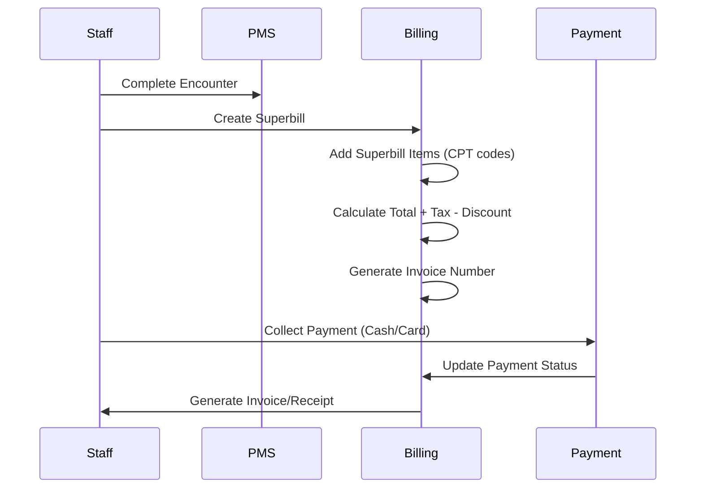
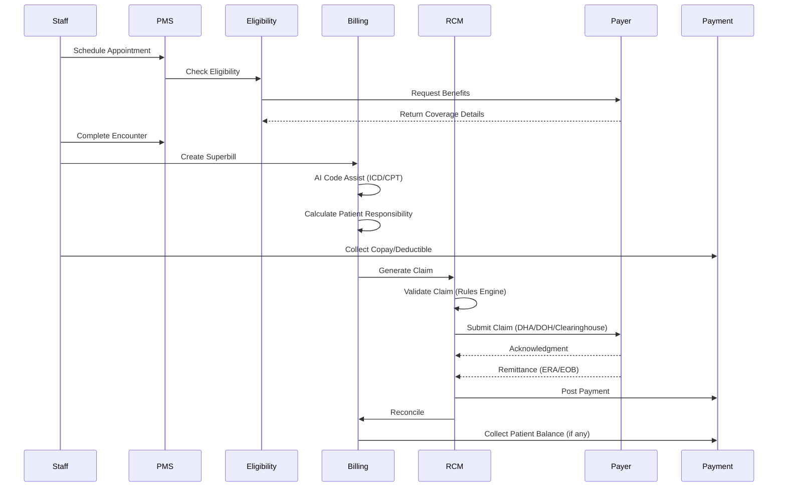
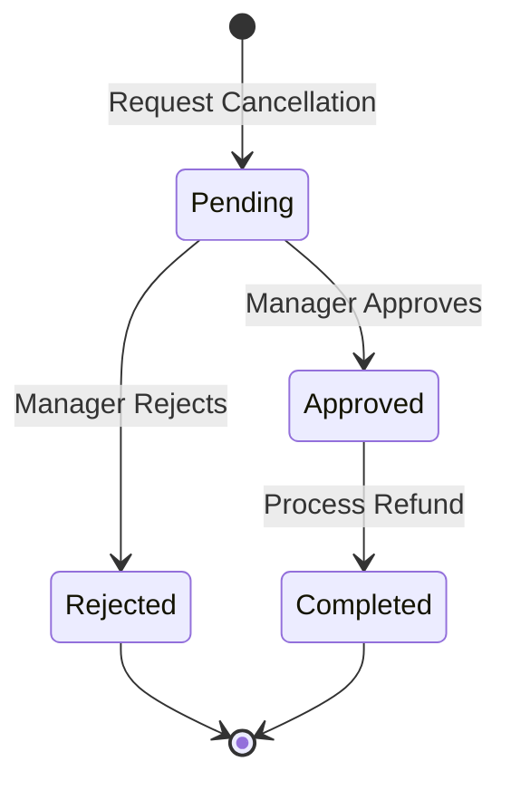
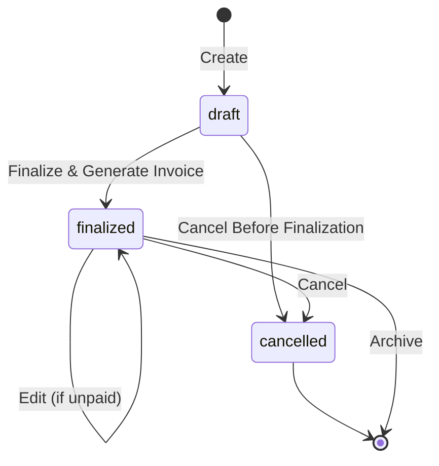
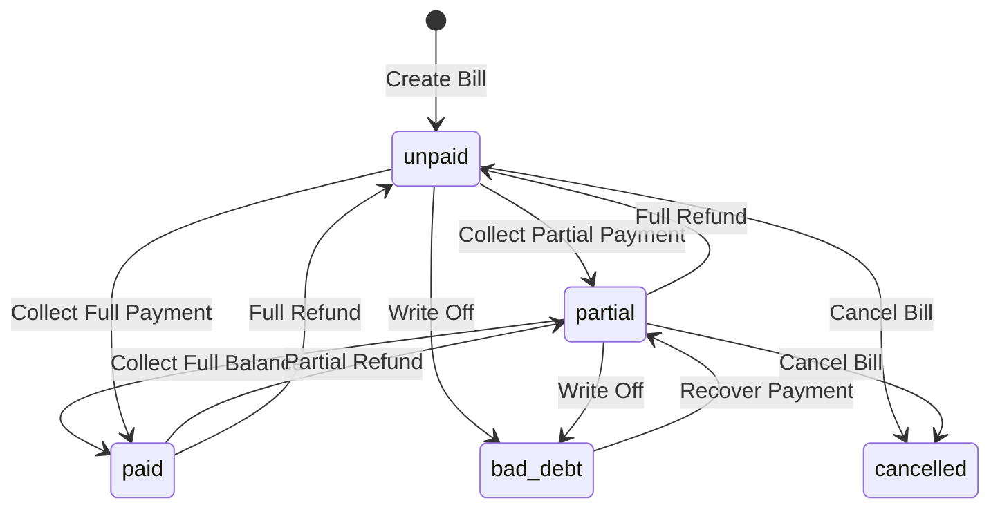
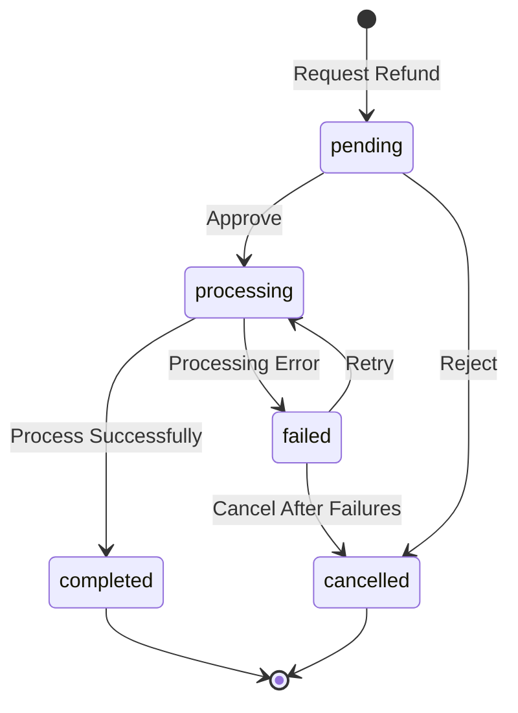
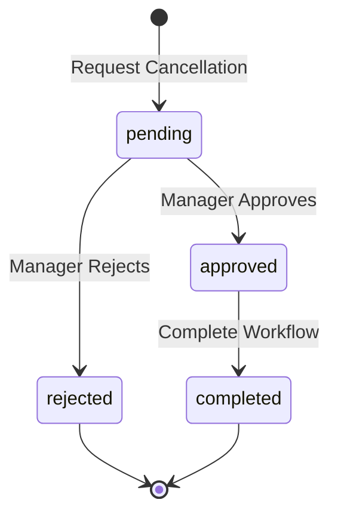

# Billing Workflows

## Overview

This document describes the complete billing workflows for the Zeal PMS+RCM platform, covering both cash and insurance-based billing, including cancellations, refunds, adjustments, and reconciliation processes.

---

## Table of Contents

1. [Visit Types: New, Revisit, and Follow-up](#1-visit-types-new-revisit-and-follow-up)
2. [Cash Patient Billing Workflow](#2-cash-patient-billing-workflow)
3. [Insurance Patient Billing Workflow](#3-insurance-patient-billing-workflow)
4. [Bill Cancellation Workflows](#4-bill-cancellation-workflows)
5. [Refund Workflows](#5-refund-workflows)
6. [Payment Collection Workflows](#6-payment-collection-workflows)
7. [Bill Adjustment Workflows](#7-bill-adjustment-workflows)
8. [Partial Payment Workflows](#8-partial-payment-workflows)
9. [Credit Note Workflows](#9-credit-note-workflows)
10. [Overpayment Handling](#10-overpayment-handling)
11. [Bad Debt Management](#11-bad-debt-management)
12. [Reconciliation Workflows](#12-reconciliation-workflows)
13. [State Transitions](#13-state-transitions)

---

## 1. Visit Types: New, Revisit, and Follow-up

### Overview

Visit type classification is critical for accurate billing, as it affects CPT code selection, pricing, insurance requirements, and patient expectations.

### Visit Type Definitions

| Visit Type | Code | Definition | CPT Codes | Pricing |
|------------|------|------------|-----------|---------|
| **New Visit** | `new_visit` | First visit OR no visit in 3+ years | 99201-99205 | Full fee |
| **Revisit** | `revisit` | Return visit for new/different complaint | 99211-99215 | Full fee |
| **Follow-up** | `follow_up` | Planned return for ongoing treatment | 99211-99215 | May be discounted/free |
| **Post-Op Follow-up** | `post_op_followup` | Within global surgical period | 99024 | No charge |

### Auto-Classification Algorithm

```sql
CREATE OR REPLACE FUNCTION determine_visit_type(
    p_patient_id UUID,
    p_staff_id UUID,
    p_appointment_date DATE
) RETURNS VARCHAR AS $$
DECLARE
    v_days_since_visit INTEGER;
BEGIN
    SELECT EXTRACT(DAY FROM (p_appointment_date - DATE(start_time)))
    INTO v_days_since_visit
    FROM encounters
    WHERE patient_id = p_patient_id
      AND primary_staff_id = p_staff_id
      AND status = 'completed'
    ORDER BY start_time DESC
    LIMIT 1;
    
    IF v_days_since_visit IS NULL THEN
        RETURN 'new_visit';
    ELSIF v_days_since_visit > 1095 THEN
        RETURN 'new_visit';  -- 3+ years
    ELSIF v_days_since_visit <= 14 THEN
        RETURN 'follow_up';
    ELSE
        RETURN 'revisit';
    END IF;
END;
$$ LANGUAGE plpgsql;
```

### New Visit Workflow

**Use Case**: Patient's first visit with provider

```sql
-- Create appointment
INSERT INTO appointments (
    tenant_id, patient_id, primary_staff_id,
    scheduled_at, appointment_type
) VALUES (
    :tenant_id, :patient_id, :staff_id,
    :scheduled_time, 'new_visit'
);

-- Generate superbill with new patient code
INSERT INTO superbill_items (
    superbill_id, code_type, code, description, units, unit_price
) VALUES (
    :superbill_id, 'CPT', '99203',
    'Office Visit - New Patient - Level 3', 1, 450.00
);
```

### Revisit Workflow

**Use Case**: Established patient with new complaint

```sql
-- Create appointment
INSERT INTO appointments (
    tenant_id, patient_id, primary_staff_id,
    scheduled_at, appointment_type, reason,
    metadata
) VALUES (
    :tenant_id, :patient_id, :staff_id,
    :scheduled_time, 'revisit', 'New complaint: Cough',
    '{"days_since_last_visit": 45, "previous_complaint": "Back pain"}'
);

-- Use established patient code, full fee
INSERT INTO superbill_items (
    superbill_id, code_type, code, description, units, unit_price
) VALUES (
    :superbill_id, 'CPT', '99213',
    'Office Visit - Established Patient', 1, 350.00
);
```

### Follow-up Visit Workflow

**Use Case**: Planned return for ongoing treatment

```sql
-- Schedule follow-up from original encounter
INSERT INTO appointments (
    tenant_id, patient_id, primary_staff_id,
    scheduled_at, appointment_type,
    metadata
) VALUES (
    :tenant_id, :patient_id, :staff_id,
    NOW() + INTERVAL '14 days', 'follow_up',
    jsonb_build_object(
        'original_encounter_id', :current_encounter_id,
        'follow_up_window_days', 14,
        'billing_rule', 'free_followup_14_days'
    )
);

-- Generate superbill with follow-up pricing
INSERT INTO superbill_items (
    superbill_id, code_type, code, description, units, unit_price
) VALUES (
    :superbill_id, 'CPT', '99024',
    'Follow-up Visit - No Charge', 1, 0.00
);

-- OR with discount
UPDATE superbills SET
    discount_amount = total_amount * 0.50,
    metadata = jsonb_set(
        metadata, '{discount_details}',
        '{"type": "follow_up_discount", "reason": "Within 30 days", "discount_pct": 50}'
    )
WHERE id = :superbill_id;
```

### Post-Operative Follow-up (Special Case)

**Use Case**: Follow-up within global surgical period (10-90 days)

```sql
INSERT INTO appointments (
    tenant_id, patient_id, primary_staff_id,
    scheduled_at, appointment_type,
    metadata
) VALUES (
    :tenant_id, :patient_id, :staff_id,
    :scheduled_time, 'post_op_followup',
    jsonb_build_object(
        'original_procedure_code', '12345',
        'procedure_date', '2025-09-15',
        'global_period_days', 90
    )
);

-- Always use CPT 99024 (no charge)
INSERT INTO superbill_items (
    superbill_id, code_type, code, description, units, unit_price
) VALUES (
    :superbill_id, 'CPT', '99024',
    'Postoperative Follow-up Visit', 1, 0.00
);
```

### Follow-up Pricing Policies

| Policy | Window | Pricing | CPT Code |
|--------|--------|---------|----------|
| Free Post-Op | 14 days | Free | 99024 |
| Discounted Follow-up | 30 days | 50% off | 99211-99215 |
| Free Recheck | 7 days | Free | 99024 |
| Standard Follow-up | Beyond window | Full fee | 99211-99215 |

### Insurance Considerations

| Visit Type | Auth Required? | Copay Applies? |
|------------|---------------|----------------|
| New Visit | Sometimes | Yes (higher) |
| Revisit | Rarely | Yes |
| Follow-up | No | Maybe waived |
| Post-Op Follow-up | No | No |

### Validation Rules

```json
{
  "rule_id": "visit_type_validation",
  "validations": [
    {
      "rule": "new_visit_cpt",
      "condition": "appointment_type == 'new_visit'",
      "validation": "code BETWEEN '99201' AND '99205'",
      "error": "New patient must use CPT 99201-99205"
    },
    {
      "rule": "postop_no_charge",
      "condition": "appointment_type == 'post_op_followup'",
      "validation": "code = '99024' AND unit_price = 0",
      "error": "Post-op follow-up must be no charge"
    }
  ]
}
```

### Best Practices

1. **Auto-classify** visit type at booking using `determine_visit_type()` function
2. **Link follow-ups** to original encounter via `metadata.original_encounter_id`
3. **Apply pricing rules** consistently (free within 14 days, 50% off within 30 days)
4. **Validate CPT codes** match visit type (new vs established patient codes)
5. **Communicate clearly** to patients about follow-up pricing
6. **Track compliance** - flag patients who miss recommended follow-ups

---

## 2. Cash Patient Billing Workflow

### Standard Cash Billing Flow



### Steps

1. **Create Encounter** (`encounters` table)
   - Patient visits, encounter starts
   - Staff performs services
   - Status: `in_progress` → `completed`

2. **Generate Superbill** (`superbills` table)
   ```sql
   INSERT INTO superbills (
       encounter_id, patient_id, primary_staff_id,
       status, payment_status
   ) VALUES (
       :encounter_id, :patient_id, :staff_id,
       'draft', 'unpaid'
   );
   ```

3. **Add Line Items** (`superbill_items` table)
   ```sql
   INSERT INTO superbill_items (
       superbill_id, line_number, code_type, code,
       description, units, unit_price
   ) VALUES (
       :superbill_id, 1, 'CPT', '99213',
       'Office Visit - Level 3', 1, 350.00
   );
   ```

4. **Apply Discounts & Tax**
   ```sql
   UPDATE superbills SET
       total_amount = (SELECT SUM(amount) FROM superbill_items WHERE superbill_id = :id),
       discount_amount = :discount,
       tax_amount = :tax,
       -- net_amount auto-calculated
       invoice_number = generate_invoice_number(),
       status = 'finalized',
       generated_at = NOW()
   WHERE id = :superbill_id;
   ```

5. **Collect Payment** (`patient_payments` table)
   ```sql
   INSERT INTO patient_payments (
       tenant_id, patient_id, encounter_id, superbill_id,
       amount, currency, method, txn_reference,
       collected_by, collected_at
   ) VALUES (
       :tenant_id, :patient_id, :encounter_id, :superbill_id,
       :net_amount, 'AED', 'cash', NULL,
       :user_id, NOW()
   );
   ```

6. **Update Payment Status**
   ```sql
   UPDATE superbills SET
       payment_status = 'paid'
   WHERE id = :superbill_id;
   ```

7. **Generate Receipt**
   - Print/email invoice with payment confirmation
   - Include: Invoice number, items, amounts, payment method, receipt number

---

## 2. Insurance Patient Billing Workflow

### Insurance Claim Submission Flow



### Steps

1. **Pre-Service Eligibility Check**
   ```sql
   INSERT INTO eligibility_requests (
       tenant_id, patient_id, policy_id, staff_id, service_date
   ) VALUES (
       :tenant_id, :patient_id, :policy_id, :staff_id, :service_date
   );
   ```

2. **Create Superbill with Expected Amounts**
   ```sql
   INSERT INTO superbill_items (
       superbill_id, code, units, unit_price,
       eligibility_request_id,
       expected_allowed, expected_patient_resp, expected_payer_resp
   ) VALUES (
       :superbill_id, '99213', 1, 350.00,
       :elig_req_id,
       300.00, 50.00, 250.00  -- Based on benefits
   );
   ```

3. **Collect Upfront Patient Responsibility**
   ```sql
   INSERT INTO patient_payments (
       tenant_id, patient_id, superbill_id,
       amount, method, allocation
   ) VALUES (
       :tenant_id, :patient_id, :superbill_id,
       50.00, 'card', '{"type": "copay", "item_id": ...}'
   );
   ```

4. **Generate Claim** (`claim_headers`, `claim_lines`)
   ```sql
   INSERT INTO claim_headers (
       tenant_id, superbill_id, payer_id,
       claim_number, status, total_amount, service_date
   ) VALUES (
       :tenant_id, :superbill_id, :payer_id,
       generate_claim_number(), 'pending', 250.00, :service_date
   );
   
   INSERT INTO claim_lines (
       claim_header_id, line_number, code, units, unit_price, billed_amount
   ) SELECT
       :claim_header_id, line_number, code, units, unit_price, 
       expected_payer_resp
   FROM superbill_items
   WHERE superbill_id = :superbill_id;
   ```

5. **Submit to Payer**
   - Validate via Rules Engine
   - Submit to DHA eClaimLink / DOH Shafafiya / Clearinghouse
   - Update status: `submitted`

6. **Receive Remittance** (`remittance_headers`, `remittance_lines`)
   - Ingest ERA/EOB
   - Parse paid/allowed/adjustment amounts
   - Create remittance records

7. **Reconcile**
   - Compare expected vs actual amounts
   - Flag underpayments/denials
   - Update superbill payment_status

8. **Collect Balance**
   - If patient responsibility > copay collected
   - Generate patient statement
   - Collect balance due

---

## 3. Bill Cancellation Workflows

### 3.1 Full Bill Cancellation + Refund

**Use Case**: Service was not rendered, billing error, duplicate bill



#### Steps

1. **Request Cancellation**
   ```sql
   INSERT INTO bill_cancellations (
       tenant_id, superbill_id, cancellation_type,
       reason, reason_notes,
       original_amount, cancelled_amount,
       status, requested_by, requested_at
   ) VALUES (
       :tenant_id, :superbill_id, 'full',
       'service_not_rendered', 'Patient no-show, service cancelled',
       500.00, 500.00,
       'pending', :user_id, NOW()
   );
   ```

2. **Manager Approval**
   ```sql
   UPDATE bill_cancellations SET
       status = 'approved',
       approved_by = :manager_id,
       approved_at = NOW()
   WHERE id = :cancellation_id
     AND status = 'pending';
   ```

3. **Create Refund** (if payment was collected)
   ```sql
   INSERT INTO refunds (
       tenant_id, patient_id, superbill_id, bill_cancellation_id,
       refund_number, refund_type, amount, currency, method,
       status, requested_by, requested_at
   ) VALUES (
       :tenant_id, :patient_id, :superbill_id, :cancellation_id,
       generate_refund_number(), 'full', 500.00, 'AED', 'cash',
       'pending', :user_id, NOW()
   );
   ```

4. **Link to Original Payments**
   ```sql
   INSERT INTO refund_allocations (
       refund_id, patient_payment_id, allocated_amount
   ) SELECT
       :refund_id, pp.id, pp.amount
   FROM patient_payments pp
   WHERE pp.superbill_id = :superbill_id;
   ```

5. **Process Refund**
   ```sql
   -- After physical cash/card refund processed
   UPDATE refunds SET
       status = 'completed',
       processed_by = :user_id,
       processed_at = NOW(),
       txn_reference = :refund_txn_ref
   WHERE id = :refund_id;
   ```

6. **Complete Cancellation**
   ```sql
   UPDATE bill_cancellations SET
       status = 'completed',
       completed_at = NOW()
   WHERE id = :cancellation_id;
   
   UPDATE superbills SET
       status = 'cancelled',
       payment_status = 'cancelled'
   WHERE id = :superbill_id;
   ```

### 3.2 Partial Bill Cancellation

**Use Case**: Cancel specific line items, reduce quantities

#### Steps

1. **Request Partial Cancellation**
   ```sql
   INSERT INTO bill_cancellations (
       tenant_id, superbill_id, cancellation_type,
       reason, original_amount, cancelled_amount,
       status, requested_by
   ) VALUES (
       :tenant_id, :superbill_id, 'partial',
       'billing_error', 500.00, 150.00,
       'pending', :user_id
   );
   ```

2. **Specify Line Items to Cancel**
   ```sql
   INSERT INTO bill_cancellation_items (
       bill_cancellation_id, superbill_item_id,
       original_units, cancelled_units,
       original_amount, cancelled_amount,
       reason_notes
   ) VALUES (
       :cancellation_id, :item_id,
       2, 1,  -- Cancel 1 out of 2 units
       300.00, 150.00,
       'One procedure was not performed'
   );
   ```

3. **Approve & Process**
   - Manager approves cancellation
   - Create partial refund (if needed)
   - Update superbill amounts:
   ```sql
   UPDATE superbills SET
       total_amount = total_amount - :cancelled_amount,
       -- net_amount recalculates automatically
       updated_at = NOW()
   WHERE id = :superbill_id;
   
   UPDATE superbill_items SET
       units = units - :cancelled_units,
       -- amount recalculates via GENERATED ALWAYS AS
       updated_at = NOW()
   WHERE id = :item_id;
   ```

---

## 4. Refund Workflows

### 4.1 Full Refund (with Cancellation)

See [3.1 Full Bill Cancellation + Refund](#31-full-bill-cancellation--refund)

### 4.2 Partial Refund

**Use Case**: Refund part of payment, service partially rendered

#### Steps

1. **Create Partial Refund**
   ```sql
   INSERT INTO refunds (
       tenant_id, patient_id, superbill_id,
       refund_type, amount, method, status, requested_by
   ) VALUES (
       :tenant_id, :patient_id, :superbill_id,
       'partial', 100.00, 'card_reversal', 'pending', :user_id
   );
   ```

2. **Allocate to Original Payments**
   ```sql
   INSERT INTO refund_allocations (
       refund_id, patient_payment_id, allocated_amount
   ) VALUES (
       :refund_id, :payment_id, 100.00
   );
   ```

3. **Approve & Process**
   ```sql
   -- Approval
   UPDATE refunds SET
       status = 'processing',
       approved_by = :manager_id,
       approved_at = NOW()
   WHERE id = :refund_id;
   
   -- Process (after actual refund)
   UPDATE refunds SET
       status = 'completed',
       processed_by = :user_id,
       processed_at = NOW(),
       txn_reference = :refund_txn_ref
   WHERE id = :refund_id;
   ```

4. **Update Bill Status**
   ```sql
   UPDATE superbills SET
       payment_status = CASE
           WHEN (total_paid - total_refunded) = 0 THEN 'unpaid'
           WHEN (total_paid - total_refunded) < net_amount THEN 'partial'
           ELSE 'paid'
       END
   WHERE id = :superbill_id;
   ```

### 4.3 Overpayment Refund

**Use Case**: Patient paid more than bill amount

#### Steps

1. **Detect Overpayment**
   ```sql
   SELECT 
       sb.id,
       sb.net_amount,
       COALESCE(SUM(pp.amount), 0) as total_paid,
       COALESCE(SUM(pp.amount), 0) - sb.net_amount as overpayment
   FROM superbills sb
   LEFT JOIN patient_payments pp ON pp.superbill_id = sb.id
   WHERE sb.id = :superbill_id
   GROUP BY sb.id, sb.net_amount
   HAVING COALESCE(SUM(pp.amount), 0) > sb.net_amount;
   ```

2. **Create Overpayment Refund**
   ```sql
   INSERT INTO refunds (
       tenant_id, patient_id, superbill_id,
       bill_cancellation_id,  -- NULL (no cancellation)
       refund_type, amount, method, status, requested_by
   ) VALUES (
       :tenant_id, :patient_id, :superbill_id,
       NULL,
       'overpayment', :overpayment_amount, 'bank_transfer',
       'pending', :user_id
   );
   ```

3. **Process Refund**
   - Collect bank details (store in `refunds.bank_details` JSONB)
   - Initiate bank transfer
   - Update status to `completed`

---

## 5. Payment Collection Workflows

### 5.1 Full Payment at Time of Service

See [1. Cash Patient Billing Workflow](#1-cash-patient-billing-workflow)

### 5.2 Split Payment (Multiple Methods)

**Use Case**: Patient pays partly by cash, partly by card

#### Steps

1. **Collect First Payment**
   ```sql
   INSERT INTO patient_payments (
       tenant_id, patient_id, superbill_id,
       amount, method, collected_by, allocation
   ) VALUES (
       :tenant_id, :patient_id, :superbill_id,
       200.00, 'cash', :user_id,
       '{"type": "partial", "sequence": 1}'
   );
   ```

2. **Collect Second Payment**
   ```sql
   INSERT INTO patient_payments (
       tenant_id, patient_id, superbill_id,
       amount, method, txn_reference, collected_by, allocation
   ) VALUES (
       :tenant_id, :patient_id, :superbill_id,
       300.00, 'card', :card_txn_ref, :user_id,
       '{"type": "partial", "sequence": 2}'
   );
   ```

3. **Update Payment Status**
   ```sql
   UPDATE superbills SET
       payment_status = CASE
           WHEN (SELECT SUM(amount) FROM patient_payments WHERE superbill_id = :id) >= net_amount
           THEN 'paid'
           ELSE 'partial'
       END
   WHERE id = :superbill_id;
   ```

### 5.3 Deferred Payment / Credit Terms

**Use Case**: Corporate account, credit arrangements

#### Steps

1. **Create Bill with Credit Terms**
   ```sql
   INSERT INTO superbills (
       encounter_id, patient_id, primary_staff_id,
       status, payment_status, metadata
   ) VALUES (
       :encounter_id, :patient_id, :staff_id,
       'finalized', 'unpaid',
       '{"payment_terms": "net_30", "due_date": "2025-10-29"}'
   );
   ```

2. **Track as Accounts Receivable**
   - Generate patient statement
   - Send reminders at intervals
   - Track aging (30/60/90 days)

3. **Collect Payment Later**
   ```sql
   INSERT INTO patient_payments (
       tenant_id, patient_id, superbill_id,
       amount, method, txn_reference, collected_by
   ) VALUES (
       :tenant_id, :patient_id, :superbill_id,
       :net_amount, 'bank_transfer', :txn_ref, :user_id
   );
   ```

---

## 6. Bill Adjustment Workflows

### 6.1 Price Adjustment (Before Payment)

**Use Case**: Promotional discount, price correction

#### Steps

1. **Apply Discount**
   ```sql
   UPDATE superbills SET
       discount_amount = :discount_amount,
       metadata = jsonb_set(
           metadata,
           '{discount_reason}',
           '"Senior citizen discount"'
       ),
       updated_at = NOW()
   WHERE id = :superbill_id
     AND payment_status = 'unpaid';
   ```

2. **Recalculate Net Amount**
   - `net_amount` auto-recalculates via GENERATED column
   - `= total_amount - discount_amount + tax_amount`

### 6.2 Write-off / Adjustment (After Claim)

**Use Case**: Insurance underpayment, contractual adjustment

#### Steps

1. **Create Adjustment Record** (use `superbills.metadata` or separate table)
   ```sql
   UPDATE superbills SET
       metadata = jsonb_set(
           metadata,
           '{adjustments}',
           jsonb_build_array(
               jsonb_build_object(
                   'type', 'contractual_adjustment',
                   'amount', 50.00,
                   'reason', 'Payer allowed amount lower than billed',
                   'date', NOW(),
                   'user_id', :user_id
               )
           )
       )
   WHERE id = :superbill_id;
   ```

2. **Update Expected vs Actual**
   ```sql
   -- Track in superbill_items
   UPDATE superbill_items SET
       expected_payer_resp = 250.00,  -- original
       metadata = jsonb_set(
           metadata,
           '{actual_payer_resp}',
           '200.00'  -- after adjustment
       )
   WHERE superbill_id = :superbill_id;
   ```

---

## 7. Partial Payment Workflows

### 7.1 Initial Partial Payment

**Use Case**: Patient can't pay full amount upfront

#### Steps

1. **Collect Partial Payment**
   ```sql
   INSERT INTO patient_payments (
       tenant_id, patient_id, superbill_id,
       amount, method, collected_by, allocation
   ) VALUES (
       :tenant_id, :patient_id, :superbill_id,
       150.00, 'cash', :user_id,
       '{"type": "partial", "balance_due": 350.00}'
   );
   ```

2. **Update Payment Status**
   ```sql
   UPDATE superbills SET
       payment_status = 'partial'
   WHERE id = :superbill_id;
   ```

3. **Create Payment Plan** (store in metadata or separate table)
   ```sql
   UPDATE superbills SET
       metadata = jsonb_set(
           metadata,
           '{payment_plan}',
           jsonb_build_object(
               'installments', 3,
               'amount_per_installment', 116.67,
               'next_due_date', '2025-10-15',
               'status', 'active'
           )
       )
   WHERE id = :superbill_id;
   ```

### 7.2 Subsequent Installment

#### Steps

1. **Collect Installment**
   ```sql
   INSERT INTO patient_payments (
       tenant_id, patient_id, superbill_id,
       amount, method, collected_by, allocation
   ) VALUES (
       :tenant_id, :patient_id, :superbill_id,
       116.67, 'card', :user_id,
       '{"type": "installment", "installment_number": 2}'
   );
   ```

2. **Check if Fully Paid**
   ```sql
   UPDATE superbills SET
       payment_status = CASE
           WHEN (SELECT SUM(amount) FROM patient_payments WHERE superbill_id = :id) >= net_amount
           THEN 'paid'
           ELSE 'partial'
       END
   WHERE id = :superbill_id;
   ```

---

## 8. Credit Note Workflows

### 8.1 Issue Credit Note (for future use)

**Use Case**: Overpayment applied as credit for future visits

#### Steps

1. **Create Credit Note** (use `patient_payments` with negative amount or separate table)
   ```sql
   -- Option 1: Using patient_payments with negative amount
   INSERT INTO patient_payments (
       tenant_id, patient_id, superbill_id,
       amount, method, allocation, collected_by
   ) VALUES (
       :tenant_id, :patient_id, :original_superbill_id,
       -100.00,  -- negative = credit
       'credit_note', 
       '{"type": "credit_note", "reason": "overpayment", "available_balance": 100.00}',
       :user_id
   );
   ```

2. **Track Credit Balance in Patient Record**
   ```sql
   UPDATE patients SET
       demographics = jsonb_set(
           COALESCE(demographics, '{}'),
           '{credit_balance}',
           to_jsonb(COALESCE((demographics->>'credit_balance')::decimal, 0) + 100.00)
       )
   WHERE id = :patient_id;
   ```

### 8.2 Apply Credit Note to New Bill

#### Steps

1. **Apply Credit**
   ```sql
   INSERT INTO patient_payments (
       tenant_id, patient_id, superbill_id,
       amount, method, allocation, collected_by
   ) VALUES (
       :tenant_id, :patient_id, :new_superbill_id,
       100.00,  -- positive = payment
       'credit_note',
       '{"type": "credit_applied", "original_superbill_id": :original_id}',
       :user_id
   );
   ```

2. **Reduce Credit Balance**
   ```sql
   UPDATE patients SET
       demographics = jsonb_set(
           demographics,
           '{credit_balance}',
           to_jsonb((demographics->>'credit_balance')::decimal - 100.00)
       )
   WHERE id = :patient_id;
   ```

---

## 9. Overpayment Handling

### 9.1 Detect Overpayment

```sql
-- Query to find overpaid bills
SELECT 
    sb.id,
    sb.invoice_number,
    sb.net_amount,
    COALESCE(SUM(pp.amount), 0) as total_paid,
    COALESCE(SUM(pp.amount), 0) - sb.net_amount as overpayment_amount
FROM superbills sb
LEFT JOIN patient_payments pp ON pp.superbill_id = sb.id
WHERE sb.tenant_id = :tenant_id
GROUP BY sb.id, sb.invoice_number, sb.net_amount
HAVING COALESCE(SUM(pp.amount), 0) > sb.net_amount;
```

### 9.2 Resolution Options

1. **Refund Overpayment**: See [4.3 Overpayment Refund](#43-overpayment-refund)
2. **Convert to Credit**: See [8.1 Issue Credit Note](#81-issue-credit-note-for-future-use)
3. **Adjust Bill**: Increase bill amount if justified

---

## 10. Bad Debt Management

### 10.1 Mark as Bad Debt

**Use Case**: Patient unable/unwilling to pay after collection efforts

#### Steps

1. **Flag as Bad Debt**
   ```sql
   UPDATE superbills SET
       payment_status = 'bad_debt',
       metadata = jsonb_set(
           metadata,
           '{bad_debt}',
           jsonb_build_object(
               'marked_at', NOW(),
               'marked_by', :user_id,
               'outstanding_amount', :balance,
               'reason', 'Unable to contact patient after 90 days',
               'collection_attempts', 5
           )
       )
   WHERE id = :superbill_id;
   ```

2. **Send to Collections Agency** (optional)
   ```sql
   UPDATE superbills SET
       metadata = jsonb_set(
           metadata,
           '{collections}',
           jsonb_build_object(
               'agency', 'ABC Collections',
               'sent_date', NOW(),
               'case_number', :case_number
           )
       )
   WHERE id = :superbill_id;
   ```

### 10.2 Recover Bad Debt

**Use Case**: Patient later pays

#### Steps

1. **Record Payment**
   ```sql
   INSERT INTO patient_payments (
       tenant_id, patient_id, superbill_id,
       amount, method, allocation, collected_by
   ) VALUES (
       :tenant_id, :patient_id, :superbill_id,
       :amount, :method,
       '{"type": "bad_debt_recovery"}',
       :user_id
   );
   ```

2. **Update Status**
   ```sql
   UPDATE superbills SET
       payment_status = CASE
           WHEN (SELECT SUM(amount) FROM patient_payments WHERE superbill_id = :id) >= net_amount
           THEN 'paid'
           ELSE 'partial'
       END,
       metadata = jsonb_set(
           metadata,
           '{bad_debt,recovered_at}',
           to_jsonb(NOW())
       )
   WHERE id = :superbill_id;
   ```

---

## 11. Reconciliation Workflows

### 11.1 Daily Cash Reconciliation

#### Steps

1. **Generate Daily Cash Report**
   ```sql
   SELECT 
       DATE(collected_at) as date,
       method,
       COUNT(*) as transaction_count,
       SUM(amount) as total_amount,
       collected_by
   FROM patient_payments
   WHERE tenant_id = :tenant_id
     AND DATE(collected_at) = CURRENT_DATE
   GROUP BY DATE(collected_at), method, collected_by
   ORDER BY method, collected_by;
   ```

2. **Match Physical Cash**
   - Compare system total vs actual cash counted
   - Flag discrepancies

3. **Record Reconciliation**
   ```sql
   -- Create reconciliation record (separate table or audit log)
   INSERT INTO cash_reconciliations (
       tenant_id, date, expected_amount, actual_amount,
       variance, reconciled_by, status
   ) VALUES (
       :tenant_id, CURRENT_DATE, 5000.00, 4995.00,
       -5.00, :user_id, 'completed'
   );
   ```

### 11.2 Insurance Payment Reconciliation

#### Steps

1. **Match Remittance to Claims**
   ```sql
   SELECT 
       ch.claim_number,
       ch.total_amount as billed,
       rh.paid_amount as paid,
       rl.adjustment_codes,
       ch.total_amount - rh.paid_amount as variance
   FROM claim_headers ch
   JOIN remittance_headers rh ON rh.claim_header_id = ch.id
   JOIN remittance_lines rl ON rl.remittance_header_id = rh.id
   WHERE ch.tenant_id = :tenant_id
     AND DATE(rh.remittance_date) = CURRENT_DATE;
   ```

2. **Flag Underpayments**
   ```sql
   -- AI anomaly detection or manual review
   UPDATE claim_headers SET
       status = 'underpaid',
       metadata = jsonb_set(
           metadata,
           '{underpayment}',
           jsonb_build_object(
               'expected', total_amount,
               'received', :paid_amount,
               'variance', total_amount - :paid_amount,
               'requires_review', true
           )
       )
   WHERE id = :claim_header_id
     AND :paid_amount < total_amount * 0.95;  -- >5% variance
   ```

3. **Post Payment to Superbill**
   ```sql
   -- Update superbill with payer payment
   UPDATE superbills SET
       metadata = jsonb_set(
           metadata,
           '{payer_payment}',
           jsonb_build_object(
               'claim_id', :claim_id,
               'paid_amount', :paid_amount,
               'posted_date', NOW()
           )
       )
   WHERE id = (SELECT superbill_id FROM claim_headers WHERE id = :claim_id);
   ```

---

## 12. State Transitions

### 12.1 Superbill Status Transitions



### 12.2 Payment Status Transitions



### 12.3 Refund Status Transitions



### 12.4 Cancellation Status Transitions



---

## Summary Tables

### Payment Methods Supported

| Method | Code | Use Case | Refund Method |
|--------|------|----------|---------------|
| Cash | `cash` | Walk-in patients | Cash refund |
| Card | `card` | Credit/Debit card | Card reversal |
| UPI | `upi` | Digital payments | UPI refund |
| Wallet | `wallet` | Mobile wallet (ApplePay, etc.) | Wallet credit |
| Bank Transfer | `bank_transfer` | Corporate, large amounts | Bank transfer |
| Cheque | `cheque` | Corporate accounts | Cheque refund |
| Credit Note | `credit_note` | Apply existing credit | N/A |

### Cancellation Reasons

| Reason | Code | Requires Approval | Common Scenario |
|--------|------|-------------------|-----------------|
| Patient Request | `patient_request` | Yes | Patient changed mind |
| Billing Error | `billing_error` | Yes | Wrong codes/amounts |
| Service Not Rendered | `service_not_rendered` | Yes | Appointment cancelled |
| Duplicate | `duplicate` | No | Duplicate entry |
| Administrative | `administrative` | Yes | Policy adjustment |
| Other | `other` | Yes | Custom reason |

### Refund Types

| Type | Code | Linked to Cancellation | Use Case |
|------|------|------------------------|----------|
| Full | `full` | Yes | Complete service cancellation |
| Partial | `partial` | Optional | Partial service/overpayment |
| Overpayment | `overpayment` | No | Patient paid too much |

---

## Best Practices

### 1. **Always Use Transactions**
```sql
BEGIN;
-- Multiple operations (cancellation + refund)
COMMIT;  -- or ROLLBACK on error
```

### 2. **Audit Trail**
- Never delete financial records
- Track all status changes with timestamps and user IDs
- Use `metadata` JSONB for extensible audit data

### 3. **Approval Workflows**
- Require manager approval for cancellations > AED 500
- Require director approval for write-offs > AED 5,000
- Implement dual approval for refunds > AED 10,000

### 4. **Reconciliation**
- Daily cash reconciliation
- Weekly insurance payment reconciliation
- Monthly AR aging review

### 5. **Payment Security**
- Never store full card numbers (use tokenization)
- Log all payment attempts (success and failure)
- Implement fraud detection for unusual patterns

### 6. **Patient Communication**
- Auto-send invoice/receipt after payment
- Send payment reminders for unpaid bills
- Notify patient of refund status

---

## Integration Points

### With Other Modules

| Module | Integration Point | Data Flow |
|--------|-------------------|-----------|
| **PMS Core** | Encounters → Superbills | Encounter completion triggers billing |
| **RCM** | Superbills → Claims | Finalized superbills generate claims |
| **RCM** | Remittances → Payments | ERA/EOB posts payer payments |
| **AI Services** | Superbill Items | AI suggests CPT/ICD codes |
| **Rules Engine** | Claim Validation | Validate before submission |
| **Notifications** | All Workflows | Email/SMS for invoices, reminders, receipts |
| **Reporting** | All Tables | Financial KPIs, AR aging, collection rates |

### External Systems

- **Payment Gateways**: Card processing, UPI, wallets
- **Bank APIs**: Bank transfer refunds, reconciliation
- **Accounting Systems**: Export GL entries, journal vouchers
- **Collections Agencies**: Bad debt handoff

---

## Validation Rules

### Pre-Payment Validations

```sql
-- Ensure no duplicate payments
SELECT COUNT(*) FROM patient_payments
WHERE superbill_id = :superbill_id
  AND method = :method
  AND ABS(EXTRACT(EPOCH FROM (NOW() - collected_at))) < 60;  -- within 1 min

-- Ensure payment doesn't exceed balance
SELECT 
    sb.net_amount,
    COALESCE(SUM(pp.amount), 0) as paid,
    sb.net_amount - COALESCE(SUM(pp.amount), 0) as balance
FROM superbills sb
LEFT JOIN patient_payments pp ON pp.superbill_id = sb.id
WHERE sb.id = :superbill_id
GROUP BY sb.id, sb.net_amount
HAVING :new_payment_amount <= (sb.net_amount - COALESCE(SUM(pp.amount), 0));
```

### Pre-Refund Validations

```sql
-- Ensure refund doesn't exceed paid amount
SELECT 
    COALESCE(SUM(pp.amount), 0) as total_paid,
    COALESCE(SUM(r.amount), 0) as total_refunded,
    COALESCE(SUM(pp.amount), 0) - COALESCE(SUM(r.amount), 0) as refundable
FROM patient_payments pp
LEFT JOIN refund_allocations ra ON ra.patient_payment_id = pp.id
LEFT JOIN refunds r ON r.id = ra.refund_id AND r.status = 'completed'
WHERE pp.superbill_id = :superbill_id
GROUP BY pp.superbill_id
HAVING :refund_amount <= (COALESCE(SUM(pp.amount), 0) - COALESCE(SUM(r.amount), 0));
```

---

This comprehensive billing workflows document covers all major financial transactions and edge cases in the Zeal PMS+RCM platform, ensuring robust, auditable, and compliant billing operations.
