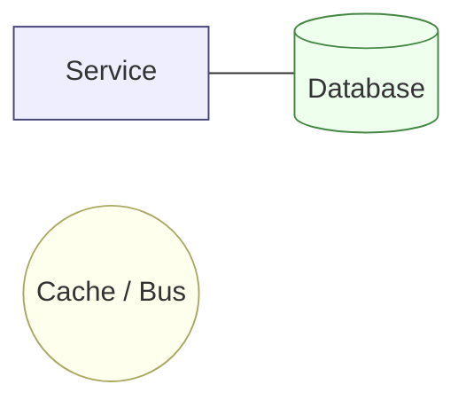
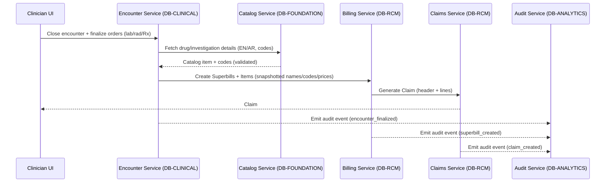

# Service ↔ Database Interaction Map

## Purpose
This document captures how Zeal's core services interact with persistence layers across the platform. It highlights the domain boundaries, summarizes data ownership, and visualizes synchronous and asynchronous flows so teams can evaluate cross-service dependencies quickly.

## Domain Boundaries
- **Foundation**: Auth, tenant/org, and catalog capabilities backed by `DB-FOUNDATION`; shared identity and reference data lives here with role-based access controls.
- **Clinical**: Patient, scheduling, encounter, and care plan services backed by `DB-CLINICAL`; row-level security (RLS) protects PHI.
- **Revenue Cycle (RCM)**: Billing, claims, eligibility, accounts receivable, and pharmacy services backed by `DB-RCM`; financial artifacts snapshot catalog references for auditability.
- **Analytics & Audit**: Audit, reporting, and ML services backed by `DB-ANALYTICS`; downstream stores receive CDC/ETL streams.
- **Shared Infrastructure**: Event bus, cache, secret manager, and observability tooling reused by services across domains.

## Service ↔ Database Map
The diagram below shows how client-facing channels reach backend services, which in turn interact with their respective domain databases and shared infrastructure. Cross-domain reads occur through service APIs rather than SQL joins to preserve ownership boundaries.

```mermaid
flowchart LR
  subgraph Clients
    W[Web App (Clinicians/Front Office)]
    B[Backoffice Admin]
    P[Public APIs / Partners]
  end

  subgraph Edge
    GW[API Gateway / Ingress]
    BFF[BFF / GraphQL Router]
  end

  Clients --> GW --> BFF

  %% Foundation
  subgraph DBF[DB-FOUNDATION]
    TBL1[(tenants\\nusers/roles\\nlocations/facilities/departments/spaces\\nstaff/staff_licenses\\nspecialties/value_sets\\ncatalogs: drugs/investigations(+translations)\\npost_offices)]
  end
  subgraph S1[Foundation Services]
    AUTH[Auth Service]
    ORG[Tenant & Org Service]
    CAT[Catalog Service]
  end
  BFF --> AUTH
  BFF --> ORG
  BFF --> CAT
  AUTH --- DBF
  ORG  --- DBF
  CAT  --- DBF

  %% Clinical
  subgraph DBC[DB-CLINICAL]
    TBL2[(patients\\npolicies/consents\\nappointments\\nencounters/notes/vitals\\norders (lab/rad/Rx)\\ncare_plans)]
  end
  subgraph S2[Clinical Services]
    PAT[Patient Service]
    SCHED[Scheduling Service]
    ENC[Encounter Service]
    CARE[Care Plan Service]
  end
  BFF --> PAT
  BFF --> SCHED
  BFF --> ENC
  BFF --> CARE
  PAT --- DBC
  SCHED --- DBC
  ENC --- DBC
  CARE --- DBC

  %% RCM
  subgraph DBR[DB-RCM]
    TBL3[(payers/fee_schedules\\nsuperbills/items\\nclaims/lines (partitioned)\\nremittances/lines (partitioned)\\neligibility/preauth/policy_benefits\\npatient_payments\\npharmacy_orders\\npharmacy_inventory/transactions\\ncost_estimates)]
  end
  subgraph S3[RCM Services]
    BILL[Billing Service]
    CLAIM[Claims Service]
    ELIG[Eligibility & Preauth Service]
    AR[AR/Finance Service]
    PHARM[Pharmacy Service]
  end
  BFF --> BILL
  BFF --> CLAIM
  BFF --> ELIG
  BFF --> AR
  BFF --> PHARM
  BILL --- DBR
  CLAIM --- DBR
  ELIG --- DBR
  AR --- DBR
  PHARM --- DBR

  %% Analytics & Audit
  subgraph DBA[DB-ANALYTICS]
    TBL4[(audit_logs/security_events/api_requests\\nusage_events\\nfacts/dimensions for BI)]
  end
  subgraph S4[Analytics Services]
    AUD[Audit Service]
    RPT[Reporting/BI Service]
    ML[ML/Insights Service]
  end
  AUD --- DBA
  RPT --- DBA
  ML --- DBA

  %% Cross-service infra
  subgraph Infra[Shared Infra]
    BUS[(Event Bus / Kafka)]
    CACHE[(Cache / Redis)]
    SECRETS[(Secret Manager)]
    OBS[(Metrics/Logs/Tracing)]
  end

  %% Event flows
  ENC -- emits events --> BUS
  PHARM -- emits events --> BUS
  BILL  -- emits events --> BUS
  CLAIM -- emits events --> BUS
  AUD   -- consumes --> BUS
  RPT   -- ETL/CDC --> DBA

  %% Catalog lookups (read)
  ENC -.-> CAT
  PHARM -.-> CAT
  BILL -.-> CAT

  %% Cache hits
  ENC -. cache .-> CACHE
  CAT -. cache .-> CACHE
  BILL -. cache .-> CACHE
```

### Interaction Notes
- Client traffic terminates at the API gateway/BFF, which orchestrates calls to downstream services within their domain boundaries.
- Foundation services centralize identity, tenancy, and reference catalogs to support other domains; catalog reads are cached and versioned.
- Clinical and RCM domains apply RLS to protect tenant-scoped PHI and financial data; cross-domain workflows happen via service APIs and the event bus.
- Analytics consumers ingest events from the bus and CDC pipelines rather than querying operational stores directly.



## Cross-Domain Flow: Encounter → Superbill → Claim
The sequence below traces how a clinician finalizing an encounter triggers billing and claims creation, with audit events emitted along the way.



## Implementation Considerations
- Enforce RLS in Clinical and RCM databases; rely on role-based access in Foundation and Analytics.
- Persist reference IDs (e.g., `drug_ref_id`) alongside human-readable snapshots to satisfy auditability and downstream legal requirements.
- Use the event bus to orchestrate multi-domain workflows (Saga-style) and keep services decoupled.
- Cache catalog, value sets, and payer rules with ETags or version stamps to minimize load on Foundation services.
- Stream operational data from Clinical and RCM into Analytics via CDC/ETL and partition high-volume tables such as audit logs and claim facts.

## Optional Extensions
If helpful, we can add endpoint groupings (for example, `/api/v1/claims/**`, `/api/v1/catalog/**`) and team ownership overlays to this document.
