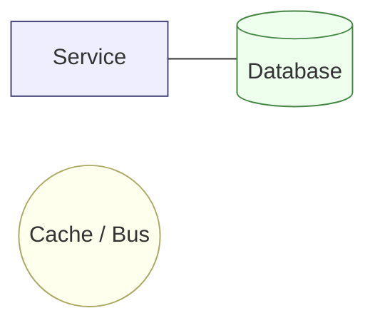
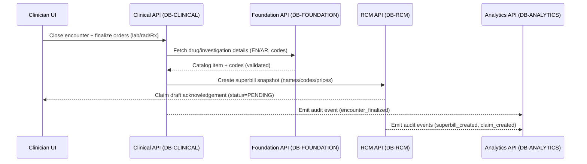

# Service ↔ Database Interaction Map

## Purpose
This document captures how Zeal's core services interact with persistence layers across the platform. It highlights the domain boundaries, summarizes data ownership, and visualizes synchronous and asynchronous flows so teams can evaluate cross-service dependencies quickly.

## Domain Boundaries
- **Foundation**: Auth, tenant/org, and catalog capabilities backed by `DB-FOUNDATION`; shared identity and reference data lives here with role-based access controls.
- **Clinical**: Patient, scheduling, encounter, and care plan modules backed by `DB-CLINICAL`; row-level security (RLS) protects PHI.
- **Revenue Cycle (RCM)**: Billing, claims, eligibility, accounts receivable, and pharmacy flows backed by `DB-RCM`; financial artifacts snapshot catalog references for auditability.
- **Analytics & Audit**: Audit, reporting, and ML features backed by `DB-ANALYTICS`; downstream stores receive CDC/ETL streams.
- **Shared Infrastructure**: Event bus, cache, secret manager, and observability tooling reused by services across domains.

Each domain is currently deployed as a single NestJS service containing multiple modules. This keeps delivery velocity high while the architecture stabilises, yet the database and package boundaries allow future decomposition when teams or scale require it.

## Service ↔ Database Map
The diagram below shows how client-facing channels reach backend services, which in turn interact with their respective domain databases and shared infrastructure. Cross-domain reads occur through service APIs rather than SQL joins to preserve ownership boundaries.

```mermaid
flowchart LR
    subgraph Clients
        W["Web App &#40;Clinicians/Front Office&#41;"]
        B["Backoffice Admin"]
        P["Public APIs / Partners"]
    end

    subgraph Edge
        GW["API Gateway / Ingress"]
        BFF["BFF / GraphQL Router"]
    end

    Clients --> GW
    GW --> BFF

    %% Foundation
    subgraph DBF["DB-FOUNDATION"]
        TBL1[(tenants<br/>users/roles<br/>locations/facilities/departments/spaces<br/>staff/staff_licenses<br/>specialties/value_sets<br/>catalogs: drugs/investigations + translations<br/>post_offices)]
    end
    subgraph S1["Foundation Service"]
        FND["Foundation API (Auth, Tenant, Catalog)"]
    end
    BFF --> FND
    FND --- DBF

    %% Clinical
    subgraph DBC["DB-CLINICAL"]
        TBL2[(patients<br/>policies/consents<br/>appointments<br/>encounters/notes/vitals<br/>orders &#40;lab/rad/Rx&#41;<br/>care_plans)]
    end
    subgraph S2["Clinical Service"]
        CLN["Clinical API (Patients, Scheduling, Encounters, Care Plans)"]
    end
    BFF --> CLN
    CLN --- DBC

    %% RCM
    subgraph DBR["DB-RCM"]
        TBL3[(payers/fee_schedules<br/>superbills/items<br/>claims/lines &#40;partitioned&#41;<br/>remittances/lines &#40;partitioned&#41;<br/>eligibility/preauth/policy_benefits<br/>patient_payments<br/>pharmacy_orders<br/>pharmacy_inventory/transactions<br/>cost_estimates)]
    end
    subgraph S3["RCM Service"]
        RCMAPI["RCM API (Billing, Claims, Eligibility, AR, Pharmacy)"]
    end
    BFF --> RCMAPI
    RCMAPI --- DBR

    %% Analytics & Audit
    subgraph DBA["DB-ANALYTICS"]
        TBL4[(audit_logs/security_events/api_requests<br/>usage_events<br/>facts/dimensions for BI)]
    end
    subgraph S4["Analytics & Insights"]
        ANA["Analytics API (Audit, Reporting, Insights)"]
    end
    ANA --- DBA

    %% Cross-service infra
    subgraph Infra["Shared Infra"]
        BUS[(Event Bus / Kafka)]
        CACHE[(Cache / Redis)]
        SECRETS[(Secret Manager)]
        OBS[(Metrics/Logs/Tracing)]
    end

    %% Event flows
    CLN -- "emits events" --> BUS
    RCMAPI -- "emits events" --> BUS
    FND -- "publishes auth/audit" --> BUS
    ANA -- "consumes" --> BUS
    ANA -- "ETL/CDC" --> DBA

    %% Catalog lookups (read)
    CLN -.-> FND
    RCMAPI -.-> FND

    %% Cache hits
    CLN -. "cache" .-> CACHE
    FND -. "cache" .-> CACHE
    RCMAPI -. "cache" .-> CACHE
```



### Interaction Notes
- Client traffic terminates at the API gateway/BFF, which routes requests to the domain APIs.
- The Foundation API centralizes identity, tenancy, and reference catalogs to support other domains; catalog reads are cached and versioned.
- Clinical and RCM APIs apply RLS to protect tenant-scoped PHI and financial data; cross-domain workflows happen via service APIs and the event bus.
- The Analytics API ingests events from the bus and CDC pipelines rather than querying operational stores directly.



## Cross-Domain Flow: Encounter → Superbill → Claim
The sequence below traces how a clinician finalizing an encounter triggers billing and claims creation, with audit events emitted along the way.



## Implementation Considerations
- Enforce RLS in Clinical and RCM databases; rely on role-based access in Foundation and Analytics.
- Persist reference IDs (e.g., `drug_ref_id`) alongside human-readable snapshots to satisfy auditability and downstream legal requirements.
- Use the event bus to orchestrate multi-domain workflows (Saga-style) and keep services decoupled.
- Cache catalog, value sets, and payer rules with ETags or version stamps to minimize load on Foundation services.
- Stream operational data from Clinical and RCM into Analytics via CDC/ETL and partition high-volume tables such as audit logs and claim facts.

## Future Scalability Options
- **Module-to-service extraction**: When a module demands independent scaling (e.g., Catalog read-heavy workloads or Eligibility real-time integrations), peel it into its own deployable by reusing the domain Prisma package and gRPC/OpenAPI contracts already in place.
- **Team ownership shifts**: As domain squads grow, split the monorepo workspaces (e.g., `services/clinical`) into smaller packages or repos while preserving the shared contracts to avoid breaking callers.
- **Data tier partitioning**: Use read replicas or additional Postgres clusters per domain if load/HA requirements exceed a single instance; the environment variables already support different connection strings per service.
- **Sidecar specialisation**: Introduce dedicated workers (Kafka consumers, batch processors) alongside the domain API when asynchronous throughput becomes a bottleneck.
- **Service mesh adoption**: Once service count increases, layer in mesh-driven retries, mTLS, and traffic policies to keep the same communication playbook without hand-crafted interceptors.

## Ownership & Runbooks
| Domain | Database | Current Deployable | Owning Team & Contacts | Primary Runbooks |
| --- | --- | --- | --- | --- |
| Foundation | `DB-FOUNDATION` | `services/foundation` (Auth, Tenant, Catalog modules) | Foundation Platform Team<br/>PagerDuty: `foundation-platform`<br/>Slack: `#team-foundation` | [Foundation Platform Runbook](runbooks/foundation-platform.md) |
| Clinical | `DB-CLINICAL` | `services/clinical` (Patients, Scheduling, Encounters, Care Plans) | Clinical Experience Team<br/>PagerDuty: `clinical-core`<br/>Slack: `#team-clinical` | [Clinical Core Runbook](runbooks/clinical-core.md) |
| Revenue Cycle | `DB-RCM` | `services/rcm` (Billing, Claims, Eligibility, AR, Pharmacy) | Revenue Cycle Team<br/>PagerDuty: `rcm-primary`<br/>Slack: `#team-rcm` | [RCM Services Runbook](runbooks/rcm-services.md) |
| Analytics & Audit | `DB-ANALYTICS` | `services/analytics` (planned; batch jobs handle ingestion today) | Insights & Compliance Team<br/>PagerDuty: `analytics-oncall`<br/>Slack: `#team-analytics` | [Analytics & Audit Runbook](runbooks/analytics-audit.md) |
| Shared Infra | Event Bus, Redis, Secret Manager, Observability | Kafka, Redis, Secret Manager, Metrics/Logs/Tracing stack, API Gateway | Platform Infrastructure Team<br/>PagerDuty: `infra-primary`<br/>Slack: `#team-infra` | [Shared Infrastructure Runbook](runbooks/shared-infra.md) |

> The Analytics deployable is on the roadmap; until it ships, ETL jobs publish to `DB-ANALYTICS` and the runbook covers operational hand-offs.

## Communication Playbook

### Synchronous Request/Response
- Use when the caller must render or validate immediately (for example, "create superbill from encounter").
- Edge traffic flows over REST via the API Gateway/BFF; internal service-to-service calls prefer gRPC (schema contracts, lower latency) with REST as a fallback.
- Apply tight timeouts (300–1000 ms), retries only on idempotent GET/PUT, and circuit breakers that open after repeated failures (e.g., five) with 30 s half-open probes.
- Propagate authentication and tenancy by forwarding the JWT, `X-Tenant-Id`, and request context headers.
- NestJS tip: use `axios` (REST) or `@grpc/grpc-js` (gRPC) with `timeout`, `maxRedirects: 0`, `validateStatus`, and a narrow retry handler (e.g., `ECONNRESET`).

```http
POST /api/v1/billing/superbills
Authorization: Bearer <JWT>
X-Tenant-Id: 1111...
X-Idempotency-Key: enc-5f3e-...
Content-Type: application/json

{
  "encounterId": "e-123",
  "charges": [ ... ],
  "currency": "AED"
}
```

A `201 Created` returns the superbill payload; reuse of the same idempotency key yields `409 Conflict` without duplicating state.

### Asynchronous Event-Driven Flows
- Use for cross-DB workflows, fan-out, and work the user does not need to wait on (claims generation, remittance posting, analytics updates).
- Kafka (or NATS JetStream) provides durable topics, replay, and consumer groups aligned with service domains.
- Implement the Outbox pattern per service database: write domain changes and outbox records in one transaction, stream the outbox table, publish to the bus, then mark sent.
- Emit at-least-once domain events with rich context so downstream consumers stay idempotent by tracking `eventId`.

```json
{
  "eventId": "01HF...",
  "type": "EncounterFinalized",
  "occurredAt": "2025-10-16T10:15:00Z",
  "tenantId": "1111-...",
  "actor": {"userId": "2222-..."},
  "data": {
    "encounterId": "e-123",
    "primaryStaffId": "s-456",
    "diagnoses": [{"code": "J06.9", "system": "ICD-10"}],
    "procedures": [{"code": "99213", "system": "CPT"}]
  }
}
```

### Path Selection Guide

| Call | Path | Rationale |
| --- | --- | --- |
| UI → Auth | Sync REST | Tokens required immediately |
| Encounter → Catalog lookup | Sync | Data needed for validation/display |
| Encounter → Create Superbills | Sync for acknowledgement + async event | UI needs confirmation; downstream claim can fan out |
| Superbill → Generate Claim | Sync for draft or async batch | Depends on real-time vs scheduled submission |
| Remittance ingestion | Async | File/stream driven with multiple consumers |
| Pharmacy dispense → Inventory txn | Sync for stock write + async event | Inventory must commit before notifying others |

### Request Context Propagation
- Include `Authorization`, `X-Tenant-Id`, `X-User-Id`, `X-Roles`, `X-Request-Id`, and `X-Idempotency-Key` (for POST) on every internal call.
- Global middleware seeds `AsyncLocalStorage` with the decoded JWT and request metadata.
- Each request sets Postgres session settings so RLS and audit triggers operate automatically:

```sql
select set_config('app.current_tenant_id', :tenantId, true);
select set_config('app.current_user_id', :userId, true);
select set_config('app.user_agent', :userAgent, true);
```

### Failure & Resilience Checklist
- Timeouts: Gateway 2–3 s, BFF → service 1 s, service → service 300–800 ms.
- Bulkheads: isolate Clinical vs RCM workloads on separate pools/nodes to avoid noisy neighbors.
- Circuit breakers: leverage `opossum` in Nest or mesh policies (Istio/Linkerd) for consistent limits.
- Idempotency: accept `X-Idempotency-Key` on all POST mutations and record `(tenantId, key)` to short-circuit retries.
- Contracts & versioning: maintain gRPC proto/OpenAPI specs, generate TypeScript clients, and evolve APIs via additive `/api/v1/...` fields.
- Observability: propagate `traceparent`, log request outcomes, and expose RED (Rate, Errors, Duration) metrics per endpoint.

### Stack Recommendation
- Edge: API Gateway (NGINX/Envoy) → channel-specific BFFs (NestJS).
- Internal sync: gRPC between domain services (Clinical, RCM, Catalog, Auth) while keeping REST for public/admin APIs.
- Async: Kafka or NATS JetStream plus service-local Outbox tables in Clinical and RCM databases.
- Key RPC contracts: Catalog (`GetDrugById`, `SearchInvestigations`), Billing (`CreateSuperbill`, `PriceSuperbill`), Claims (`GenerateClaimDraft`, `SubmitClaim`), Pharmacy (`Dispense`, `AdjustInventory`).

### Hybrid Flow Example
1. UI finalizes an encounter via the Encounter Service (sync).
2. Encounter Service queries Catalog synchronously for code validation, writes encounter data, and records an outbox entry.
3. Outbox worker publishes `EncounterFinalized` to Kafka.
4. Billing Service consumes, creates superbills idempotently, and emits `SuperbillCreated`.
5. UI polls or receives a websocket notifying the superbill is ready; clinician triggers "Generate Claim" which calls the Claims Service synchronously.
6. Claims Service finalizes the claim, emits `ClaimCreated`, and Audit/Analytics consume the event for downstream reporting.

## Optional Extensions
If helpful, we can add endpoint groupings (for example, `/api/v1/claims/**`, `/api/v1/catalog/**`) and team ownership overlays to this document.
