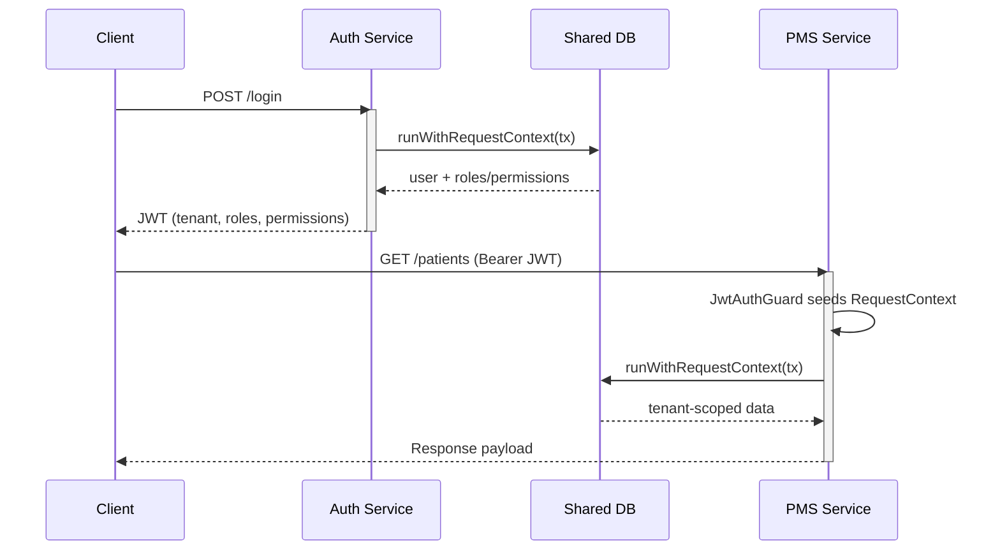

# Backend Technical Overview

## Architectural Structure

### Workspace Layout
```mermaid
graph TD
    A[backend/] --> B[services/]
    A --> C[shared/]
    A --> D[contracts/]
    B --> B1([@zeal/auth])
    B --> B2([@zeal/foundation])
    B --> B3([@zeal/pms])
    C --> C1([@zeal/shared-database])
    C --> C2([@zeal/shared-utils])
```

- **services/** — domain-specific NestJS applications (`auth`, `foundation`, `pms`) written in TypeScript; additional folders under `services/` are placeholders awaiting implementation.
- **shared/** — reusable libraries: `shared-database` (Prisma client + helpers) and `shared-utils` (request context, permission cache).
- **contracts/** — shared Zod/TypeScript contracts exported as a library for request/response schemas.
- **turbo.json** (root) — turbo pipeline orchestrating builds/tests per workspace.

### Core Services
- **Auth Service (`services/auth`)**: NestJS service handling authentication, token issuance, basic MFA flows, and permission hydration.
- **Foundation Service (`services/foundation`)**: NestJS 10 service that owns canonical master data (tenants, facilities, spaces, staff) and RBAC provisioning aligned with ADR-0003/ADR-0005. Uses `@zeal/shared-database` (Prisma 5.7) for RLS-aware persistence, `@zeal/contracts` for DTOs, and `@nestjs/swagger` to publish OpenAPI 3.1 specs for downstream consumers.
- **PMS Service (`services/pms`)**: Entry point for practice-management APIs. Currently minimal (health endpoint) but scaffolded for future modules.
- **Other services (billing, rcm, etc.)**: Placeholders for domain-specific APIs that will mirror the same NestJS + Prisma stack once activated.

### Shared Libraries
- **`@zeal/shared-database`**
  - Prisma 5.7 client + helpers compiled as NodeNext modules; `runWithRequestContext` sets `app.tenant_id` to honour ADR-0003 (multi-tenancy via Postgres RLS).
  - Provides reusable transaction helpers (`transaction.ts`) and the injectable `DatabaseModule` for Nest services.
- **`@zeal/shared-utils`**
  - AsyncLocalStorage `RequestContext` capturing `tenantId`, `userId`, `userAgent`, powering audit + RLS enforcement across auth/foundation/pms flows.
  - In-memory permission cache with invalidation hooks to support ADR-0005 (RBAC) without duplicating logic.
- **`@zeal/contracts`**
  - Zod + TypeScript DTO library that backs OpenAPI schemas and cross-runtime type generation per ADR-0001/ADR-0002.
  - Serves as the handshake layer between Nest services and forthcoming Python AI/ETL workloads.

### Package Alignment

| Package | Framework & Build | Data / Contracts | Notes |
| --- | --- | --- | --- |
| `@zeal/auth` | NestJS 10 + TypeScript 5.3 (`tsc -p tsconfig.build.json` → CommonJS) | Consumes Prisma via `@zeal/shared-database`; seeds AsyncLocalStorage from `@zeal/shared-utils` | Implements auth, MFA, and JWT per ADR-0001/0005 |
| `@zeal/foundation` | NestJS 10 + TypeScript 5.3 (`tsc -p tsconfig.build.json` → CommonJS) | Prisma-backed tenant/facility/staff/RBAC modules; OpenAPI via `@nestjs/swagger` using `@zeal/contracts` | Canonical master-data surface enforcing ADR-0003/0005 |
| `@zeal/pms` | NestJS 10 + TypeScript 5.3 (`tsc -p tsconfig.build.json` → CommonJS) | Shares request context + Prisma wiring; domain endpoints to be reintroduced incrementally | Follows same scaffold; currently health endpoints only |
| `@zeal/shared-database` | TypeScript 5.3 (NodeNext/ESM) | Prisma 5.7 client & transaction helpers with `runWithRequestContext` | Centralizes Postgres access; enforces RLS guardrails |
| `@zeal/shared-utils` | TypeScript 5.3 (NodeNext/ESM) | AsyncLocalStorage request context, permission cache | Powers tenant isolation and authorization checks |
| `@zeal/contracts` | TypeScript 5.3 (CommonJS) | Zod schemas for REST payloads + contract generation | Bridges Node/Python per ADR-0001 and ADR-0002 |

### Build & Tooling
- **Node 18+ / TypeScript 5.3** strict mode (`exactOptionalPropertyTypes`, `isolatedModules`, `verbatimModuleSyntax=true` at the root) with per-package `tsconfig.build.json` files emitting CommonJS bundles (services + shared libraries) for a uniform runtime surface.
- **NestJS 10** DI + module system shared across services; consistent `tsconfig.build.json` pipelines ensure matching emit targets and decorator metadata.
- **TurboRepo 1.11** orchestrates `npm run build|dev|test|type-check` per workspace; individual packages remain runnable via `npm run <script> --workspace=@zeal/<pkg>`.
- **Prisma 5.7** (wrapped in `@zeal/shared-database`) manages the Postgres schema, migrations, and RLS hooks required by ADR-0003.
- **OpenAPI toolchain** via `@nestjs/swagger` in the foundation service to generate 3.1 specs for internal and partner integration.

### Cross-Cutting Concerns
- **Tenant Isolation**: `RequestContext` + Prisma `runWithRequestContext` ensures Postgres RLS policies act per request.
- **Global Context Seeding**: Shared `RequestContextModule` (middleware + interceptor) wires AsyncLocalStorage + JWT claims into every Nest service so guards/controllers get tenant/user context without bespoke setup.
- **Master Data Backbone**: Foundation service exposes REST + OpenAPI endpoints for tenants, facilities, staff, spaces, and RBAC, providing the system of record while other services adopt those APIs per ADR-0002.
- **RBAC**: Foundation persists canonical roles/permissions (ADR-0005); Auth hydrates JWTs and caches permissions so downstream guards (e.g., PMS) can enforce them consistently.
- **Observability Hooks**: Shared utils capture userAgent, etc., priming future logging/metrics.



## Advantages

1. **Consistent NestJS Pattern**
   - Uniform module/controller/service structure simplifies onboarding.
   - Shared database module reduces boilerplate around Prisma clients.

2. **Tenant-Aware Transactions**
   - Centralized `runWithRequestContext` ensures RLS enforcement without duplicating logic in each service.
   - AsyncLocalStorage-based context is lightweight and works across async call chains.

3. **Shared Contracts & Utilities**
   - `@zeal/contracts` enables type-safe DTO reuse between services and clients.
   - Utilities (permission cache, request context) prevent code duplication and centralize critical logic.

4. **Canonical Master Data Service**
   - Foundation owns tenants, facilities, staff, and RBAC, giving every domain the same source of truth.
   - OpenAPI 3.1 contracts generated from Nest keep admin/ops tools and partner integrations aligned.

5. **Modular Workspaces**
   - Each service/library can build independently, easing CI/CD and allowing parallel development.
   - Turbo pipeline coordinates builds but individual `npm run build --workspace` commands remain available.

6. **Strict TypeScript Configuration**
   - Early detection of missing tenant IDs, undefined fields, and mis-typed Prisma calls.
   - Encourages explicit handling of `unknown` errors and optional properties.

## Disadvantages / Trade-offs

1. **Strictness Noise**
   - `exactOptionalPropertyTypes` and strict mode surface numerous TypeScript errors during refactors (e.g., missing Prisma fields), requiring disciplined DTO design.

2. **Context Reliance**
   - AsyncLocalStorage-based context is powerful but requires every entry point (guards, controllers) to seed it correctly; missing setup can cause runtime errors.

3. **Turbo + Platform Friction**
   - TurboRepo requires access to macOS keychain for TLS (observed build blocker). Environment configuration must be handled (e.g., unlock keychain) before full builds.

4. **Shared Library Coupling**
   - Services depend on local file references (`file:../../shared/...`); during installation they require network access unless packages are pre-built. Recreating a service (like PMS) necessitates reinstalling dependencies.

5. **Minimal PMS Implementation**
   - Current PMS service is only a health endpoint; substantial functionality must be rebuilt. While the scaffold compiles, domain features (appointments, encounters) need reimplementation mindful of earlier TypeScript pitfalls.

## Recommended Next Steps

1. Reintroduce PMS domain modules incrementally, validating Prisma models and TypeScript types as they are added.
2. Address Turbo keychain issue to restore monorepo-wide builds.
3. Expand shared contracts to cover the rebuilt PMS endpoints, maintaining alignment between services and shared libs.
4. Add integration tests to ensure tenant isolation + RBAC guards behave as expected in each service, including the shared context module wiring.
5. Route auth/admin flows through the foundation service HTTP APIs (instead of direct Prisma calls) as those endpoints solidify, aligning implementation with ADR-0002 boundaries.
