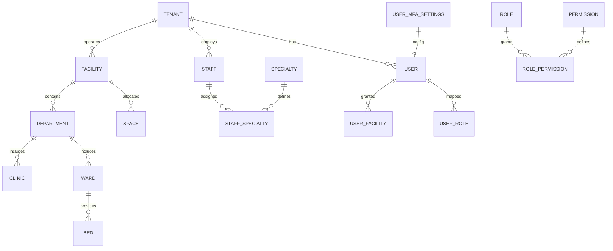
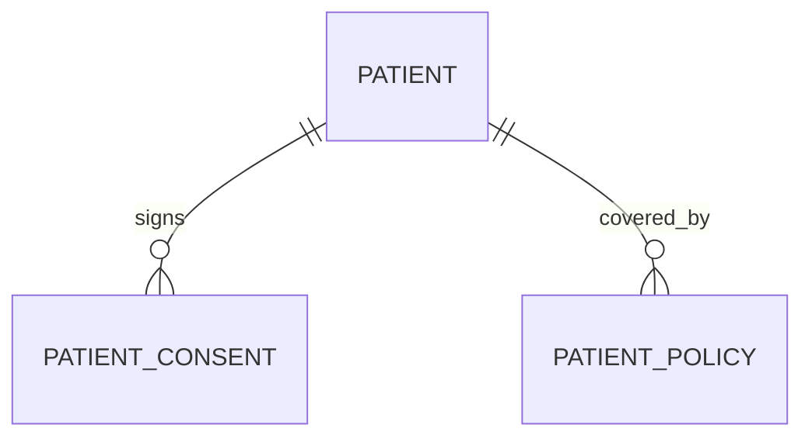
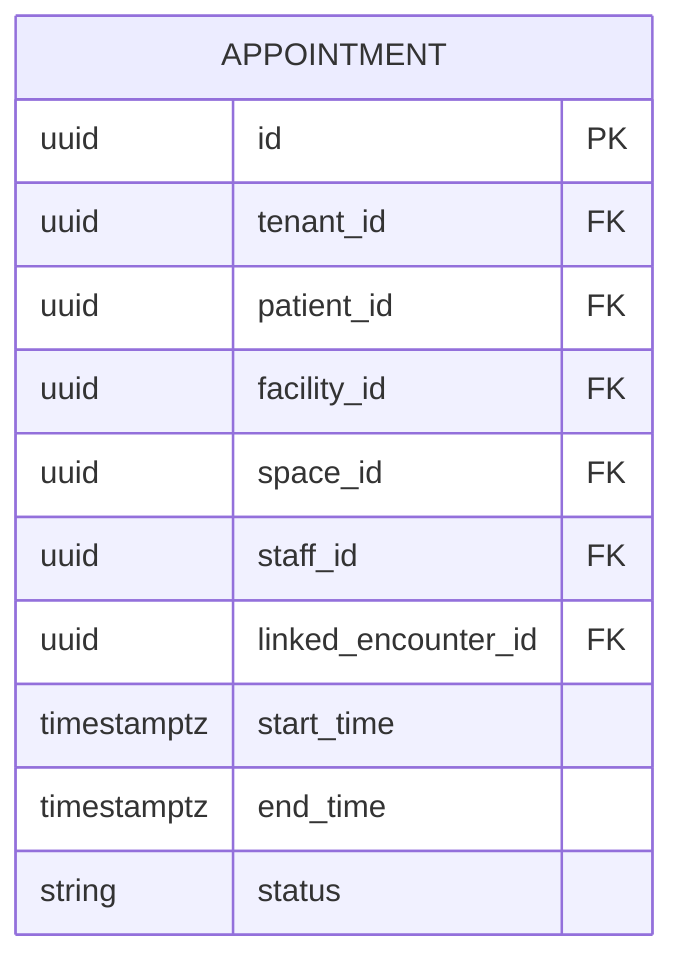
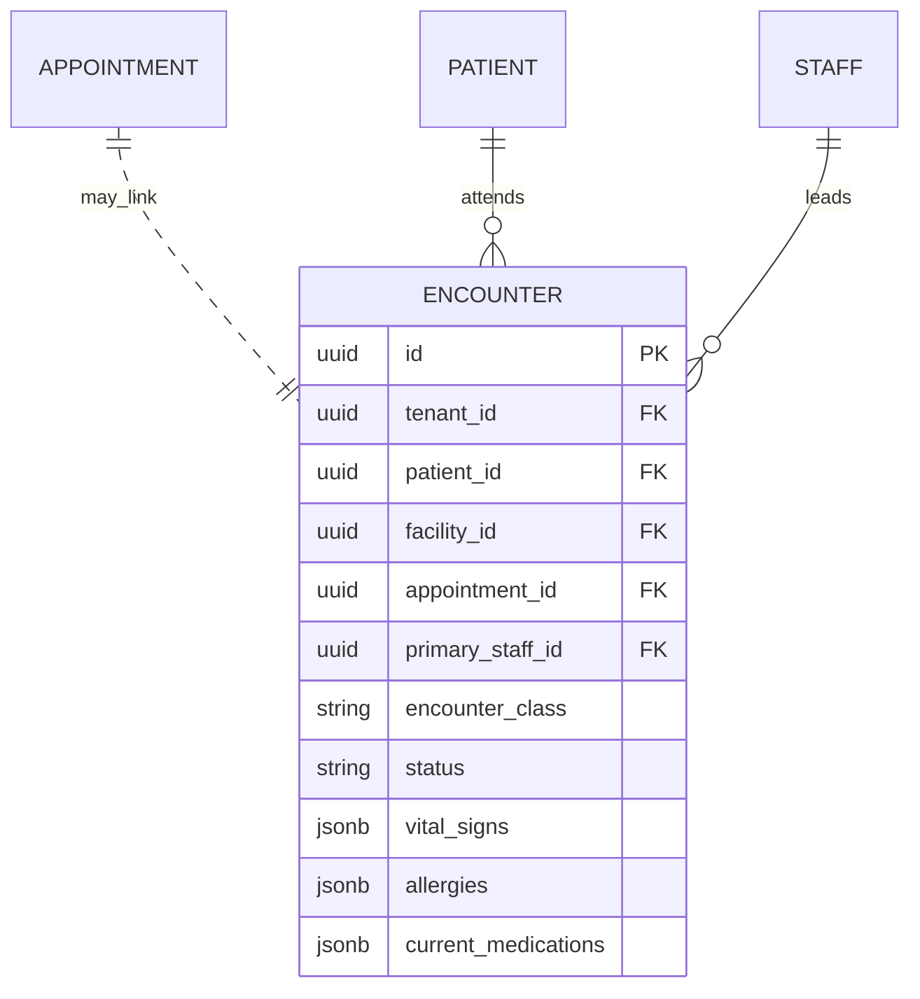

# Domain Model

_Last updated: 06 Oct 2025_

athma-ce’s backend is organised into bounded contexts (ADR-0013). Each context exposes REST endpoints and publishes events via the contracts package. This document outlines the canonical entities and their relationships to guide front-end consumers, integration partners, and downstream services.

## 1. Context Overview

| Context | Primary Entities | Notes |
| --- | --- | --- |
| **Foundation** | Tenant, User, Facility, Department, Ward, Bed, Clinic, Space, Staff, Specialty, Role, Permission, UserFacility, MFA artefacts | Shared master data. Every other service treats these as reference records. |
| **Patient Service** | Patient, PatientConsent, PatientPolicy | Owns PHI demographics and insurance details. Emits events (`patient.created`, `patient.updated`). |
| **Scheduling Service** | Appointment | Builds on foundation spaces/staff/patients to manage time-based resources. |
| **Encounter Service** | Encounter | Stores clinical context (complaint, history, vitals, instructions) linked back to appointments/patients. |

Future contexts (e.g., Billing/RCM, Orders, Care Management) will extend this table once implemented.

## 2. Foundation Relationships

Key points:
- Users may be linked to staff (`staff_id`) and default facilities (`default_facility_id`).
- `UserFacility` drives multi-location workflows.
- RBAC is tenant-scoped: a role belongs to a tenant; a permission can be global.

## 3. Patient Service Relationships

Highlights:
- `patient_id` appears in every clinical transaction; always accompany requests with the tenant-aware ID.
- Consents capture audit metadata (`signed_by`, `signed_at`, `consent_text`).
- Policies reference external payer systems via codes stored in JSON or future lookup tables.

## 4. Scheduling Service Relationships

Scheduling ties together reference data from Foundation and PHI from the Patient context. Additional service tables (provider templates, blackout rules) will live exclusively in the Scheduling database.

## 5. Encounter Service Relationships

Notes:
- Encounters can exist without a scheduled appointment (`encounter_source = walk_in/emergency`).
- Some encounter fields still contain structured JSON, but dedicated tables already exist for several clinical domains, including observations, diagnoses, prescriptions, and shared clinical orders.

## 6. Cross-Context Interactions

- **Foundation ➜ Patient/Scheduling/Encounter**: reference lookups (staff roster, facility metadata, RBAC).
- **Patient ➜ Scheduling**: patient availability validations, insurance checks before booking.
- **Scheduling ➜ Encounter**: start encounter workflow and update status (e.g., `checked-in`, `complete`).
- **Encounter ➜ Future Billing**: final coding and charges will feed into the Billing context once implemented.

Every cross-context call must include tenant metadata and propagate the athma-ce request context (user ID, facility ID, trace ID) so RLS and audit trails remain consistent.

## 7. Planned Extensions

| Upcoming Domain | Planned Entities | Status |
| --- | --- | --- |
| **Orders & Results** | `clinical_orders`, `prescription_orders`, `lab_reports`, `lab_result_items`, `imaging_reports`, `procedure_reports` | Core shared order header and result/report tables already exist in the Clinical database. Future work adds execution-detail tables such as `package_orders`, `lab_order_tests`, and specialty-specific operational workflow tables. |
| **Billing & RCM** | Payer, Plan, Claim, Remittance, Payment, Denial | Not yet implemented; will consume encounter discharge data and appointment metadata. |
| **Care Management** | CarePlan, Task, OutreachEvent | Pending roadmap alignment. |

Documentation should be kept aligned as execution-detail order tables are introduced so it does not fall back to the historical `orders/lab_orders/imaging_orders` model.
