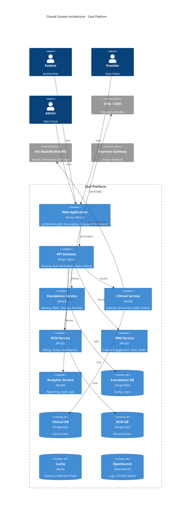
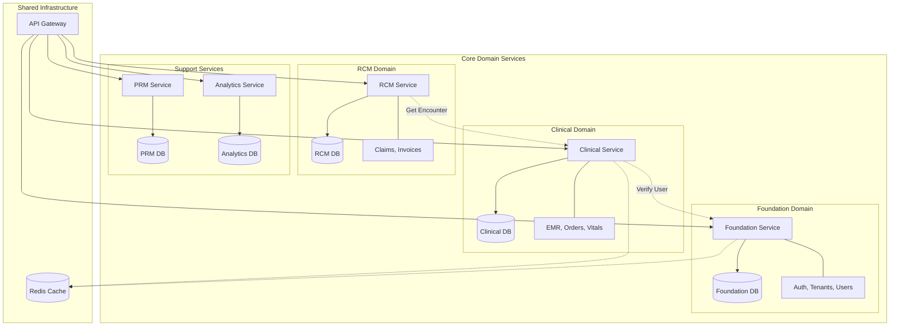
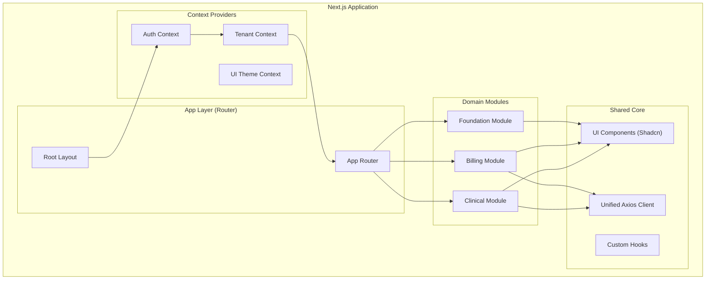

# Zeal Platform - Technical Architecture

**Version**: 1.0.0
**Last Updated**: January 2026
**Status**: Active

## 1. Executive Summary

Zeal is a comprehensive, multi-tenant SaaS platform for healthcare providers in the UAE. It combines Practice Management (PMS) and Revenue Cycle Management (RCM) into a unified solution. The architecture is designed for:

*   **Scalability**: Microservices-based backend with independent scaling.
*   **Compliance**: Strict data isolation and regulatory adherence (DHA, DOH, MOH).
*   **Performance**: Optimized frontend and efficient database patterns.
*   **Maintainability**: Domain-Driven Design (DDD) with clear boundaries.

---

## 2. Overall System Architecture

The high-level architecture follows a modern cloud-native pattern, connecting varied client interfaces to a robust set of backend services via a unified API Gateway.

### Technology Stack Overview

| Layer | Technology | Key Components |
| :--- | :--- | :--- |
| **Frontend** | React (Next.js) | App Router, Tailwind CSS, TanStack Query, Zustand |
| **Backend** | Node.js (NestJS) | TypeScript, Prisma ORM, Express (micro-services) |
| **Database** | PostgreSQL 16 | Row-Level Security (RLS), Partitioning |
| **Infra** | Docker/K8s | Redis, Kafka (Future), OpenSearch |

---

## 3. Backend Architecture

The backend adopts a **Database-per-Service** pattern to ensure decoupling and domain isolation. Communication between services occurs primarily via synchronous REST APIs, with future provisions for asynchronous event-driven patterns.

### Key Architectural Patterns

1.  **Multi-Tenancy**: Implemented via **Row-Level Security (RLS)** in PostgreSQL. Every query is scoped to a `tenant_id` passed via the session context.
2.  **Shared Libraries**: A monorepo structure hosts shared packages for standard tasks:
    *   `@zeal/database-*`: Typed Prisma clients for each DB.
    *   `@zeal/common`: Middleware, Guards, DTOs, and Utilities.
3.  **Type Safety**: End-to-end TypeScript. Prisma schemas generate types that are used in service logic and exposed to the frontend via shared DTOs.

---

## 4. Frontend Architecture

The frontend is a **Modular Monolith** built on Next.js. It logically separates business domains (modules) while sharing core UI foundations and context providers.

### Frontend Strategy

*   **Framework**: **Next.js 14+ (App Router)** for server-side rendering capability and efficient routing.
*   **State Management**:
    *   **Server State**: `TanStack Query` (React Query) handles data fetching, caching, and synchronization.
    *   **Client State**: `Zustand` for lightweight global state (auth tokens, user preferences).
    *   **Form State**: `React Hook Form` + `Zod` for schema-based validation.
*   **Styling**: `Tailwind CSS` for utility-first styling combined with `Shadcn/ui` for accessible, pre-built component primitives.
*   **Design System**: A centralized `shared/components` directory ensures visual consistency across all modules.

---

## 5. Deployment & Data Flow

1.  **Request Flow**:
    *   User \-> CDN \-> API Gateway \-> Service \-> DB.
2.  **Security**:
    *   All Traffic over TLS 1.3.
    *   JWT Tokens (Access + Refresh) for stateless authentication.
    *   WAF protection at the Gateway level.
3.  **Scalability**:
    *   Services are stateless containerized (Docker) applications.
    *   Can scale horizontally based on CPU/Memory load.
    *   Read-heavy operations can be offloaded to Read Replicas (future).

## 6. Future Considerations

*   **Message Queue**: Introduction of Kafka/RabbitMQ for decoupling complex workflows (e.g., Claim Submission -> Status Update).
*   **AI Integration**: Dedicated Python microservices for AI/ML tasks (OCR, coding assistance), communicating via gRPC/REST.
