# Zeal Platform - Technical Architecture


**Last Updated**: January 2026  
**Document Owner**: Engineering Team  
**Review Cycle**: Quarterly

---

## Table of Contents

1. [Executive Summary](#1-executive-summary)
2. [System Overview](#2-system-overview)
3. [Backend Architecture](#3-backend-architecture)
4. [Frontend Architecture](#4-frontend-architecture)
5. [Security Architecture](#5-security-architecture)
6. [Integration Architecture](#6-integration-architecture)
7. [Data Architecture](#7-data-architecture)
8. [Deployment & Infrastructure](#8-deployment--infrastructure)
9. [Observability & Monitoring](#9-observability--monitoring)
10. [Performance & Scalability](#10-performance--scalability)
11. [Future Roadmap](#11-future-roadmap)
12. [Related Documentation](#12-related-documentation)

---

## 1. Executive Summary

Zeal is a comprehensive, multi-tenant SaaS platform for healthcare providers in the UAE, combining Practice Management (PMS), Electronic Health Records (EHR), and Revenue Cycle Management (RCM) into a unified solution.

### Key Design Principles

| Principle | Implementation |
|-----------|----------------|
| 🔒 **Security First** | PHI isolation, encryption at rest/transit, RBAC |
| 📈 **Scalability** | Microservices architecture, horizontal scaling |
| 🏥 **Compliance** | HIPAA, GDPR, UAE PDPL, DHA/DOH regulations |
| 🧩 **Modularity** | Domain-driven design with clear boundaries |
| 🌍 **Localization** | Arabic/English support, RTL-ready UI |

### Architecture Highlights

```
┌────────────────────────────────────────────────────────────────────┐
│                         ZEAL PLATFORM                              │
├────────────────────────────────────────────────────────────────────┤
│  ┌──────────────┐  ┌──────────────┐  ┌──────────────┐             │
│  │   Next.js    │  │   NestJS     │  │  PostgreSQL  │             │
│  │   Frontend   │  │   Services   │  │   4 DBs      │             │
│  └──────────────┘  └──────────────┘  └──────────────┘             │
│         │                 │                 │                      │
│         └────────┬────────┴────────┬────────┘                      │
│                  │                 │                               │
│           ┌──────┴──────┐   ┌──────┴──────┐                       │
│           │    Redis    │   │   JWT Auth  │                       │
│           │    Cache    │   │   + RBAC    │                       │
│           └─────────────┘   └─────────────┘                       │
└────────────────────────────────────────────────────────────────────┘
```

---

## 2. System Overview

### 2.1 High-Level Architecture

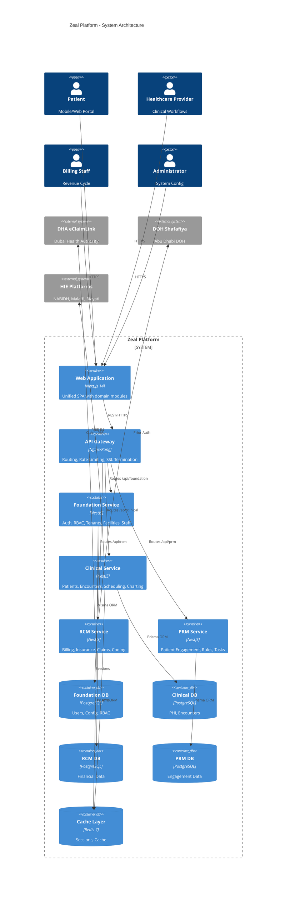

### 2.2 Technology Stack

| Layer | Technology | Version | Purpose | Status |
|-------|------------|---------|---------|--------|
| **Frontend** | Next.js | 14.x | App Router, SSR, RSC | ✅ Active |
| | TypeScript | 5.x | Type Safety | ✅ Active |
| | Tailwind CSS | 3.x | Utility Styling | ✅ Active |
| | shadcn/ui | Latest | Component Library | ✅ Active |
| | React Query | 5.x | Server State | ✅ Active |
| | Zustand | 4.x | Client State | ✅ Active |
| **Backend** | NestJS | 10.x | API Framework | ✅ Active |
| | Prisma | 5.x | ORM | ✅ Active |
| | Zod | 3.x | Validation | ✅ Active |
| | Pino | 8.x | Logging | ✅ Active |
| **Database** | PostgreSQL | 16 | Primary Store | ✅ Active |
| | Redis | 7.x | Cache & Sessions | ✅ Active |
| **Infrastructure** | Docker | 24.x | Containerization | ✅ Active |
| | Kubernetes | 1.28+ | Orchestration | 🔄 Planned |
| **Observability** | Prometheus | 2.x | Metrics | 🔄 Planned |
| | Grafana | 10.x | Dashboards | 🔄 Planned |
| | OpenSearch | 2.x | Logs & Search | 🔄 Planned |

### 2.3 Service Inventory

```
┌─────────────────────────────────────────────────────────────────────────┐
│                          SERVICE INVENTORY                              │
├──────────────┬──────┬─────────────┬──────────────────┬─────────────────┤
│ Service      │ Port │ Database    │ Health Check     │ API Docs        │
├──────────────┼──────┼─────────────┼──────────────────┼─────────────────┤
│ Foundation   │ 3010 │ zeal_found. │ /health          │ /docs           │
│ Clinical     │ 3011 │ zeal_clin.  │ /health          │ /docs           │
│ RCM          │ 3012 │ zeal_rcm    │ /health          │ /docs           │
│ PRM          │ 3013 │ zeal_prm    │ /health          │ /docs           │
│ Frontend     │ 3000 │ -           │ -                │ -               │
├──────────────┴──────┴─────────────┴──────────────────┴─────────────────┤
│ Infrastructure                                                          │
├──────────────┬──────┬─────────────────────────────────────────────────┤
│ PostgreSQL   │ 5432 │ Primary database server                          │
│ Redis        │ 6379 │ Cache and session store                          │
│ pgAdmin      │ 8080 │ Database administration UI                       │
│ RedisInsight │ 5540 │ Redis administration UI                          │
└──────────────┴──────┴─────────────────────────────────────────────────┘
```

---

## 3. Backend Architecture

### 3.1 Service Design Pattern

The backend follows a **Database-per-Service** pattern aligned with Domain-Driven Design (DDD). Each service owns its domain and database, ensuring loose coupling and independent deployability.

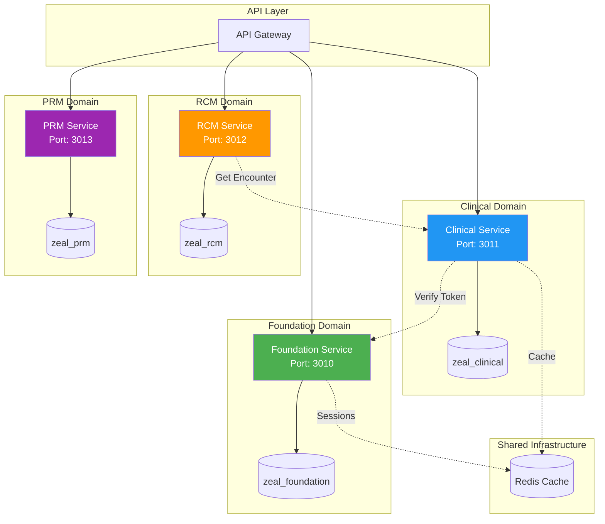

### 3.2 Service Responsibilities

#### 🟢 Foundation Service (Port 3010)

| Module | Responsibility |
|--------|----------------|
| **Auth** | JWT authentication, refresh tokens, MFA |
| **Tenant** | Multi-tenant management, configuration |
| **User** | User accounts, profiles |
| **RBAC** | Roles, permissions, access control |
| **Facility** | Facility hierarchy (departments, wards, beds) |
| **Staff** | Healthcare provider profiles, specialties |
| **Config** | Hierarchical configuration (instance/tenant/facility) |

#### 🔵 Clinical Service (Port 3011)

| Module | Responsibility |
|--------|----------------|
| **Patient** | Registration, demographics, history |
| **Scheduling** | Appointments, availability, recurring series |
| **Encounter** | Clinical encounters, triage |
| **Charting** | Notes, diagnoses, prescriptions, orders |
| **Inpatient** | Admissions, discharges, transfers |
| **Consent** | Consent templates and tracking |
| **Catalog** | Medical catalogs (meds, labs, procedures) |

#### 🟠 RCM Service (Port 3012)

| Module | Responsibility |
|--------|----------------|
| **Billing** | Charges, invoices, receipts |
| **Insurance** | Payers, policies, coverage |
| **Medical Coding** | ICD/CPT coding sessions |
| **Fee Schedule** | Pricing rules, contracts |
| **Charge Posting** | Automatic charge rules |

#### 🟣 PRM Service (Port 3013)

| Module | Responsibility |
|--------|----------------|
| **Events** | Patient engagement events |
| **Rules** | Engagement rule engine |
| **Tasks** | Patient tasks and reminders |
| **Messages** | Communication history |

### 3.3 Cross-Service Communication

> [!IMPORTANT]
> **No cross-database joins allowed.** Services communicate via REST APIs only.

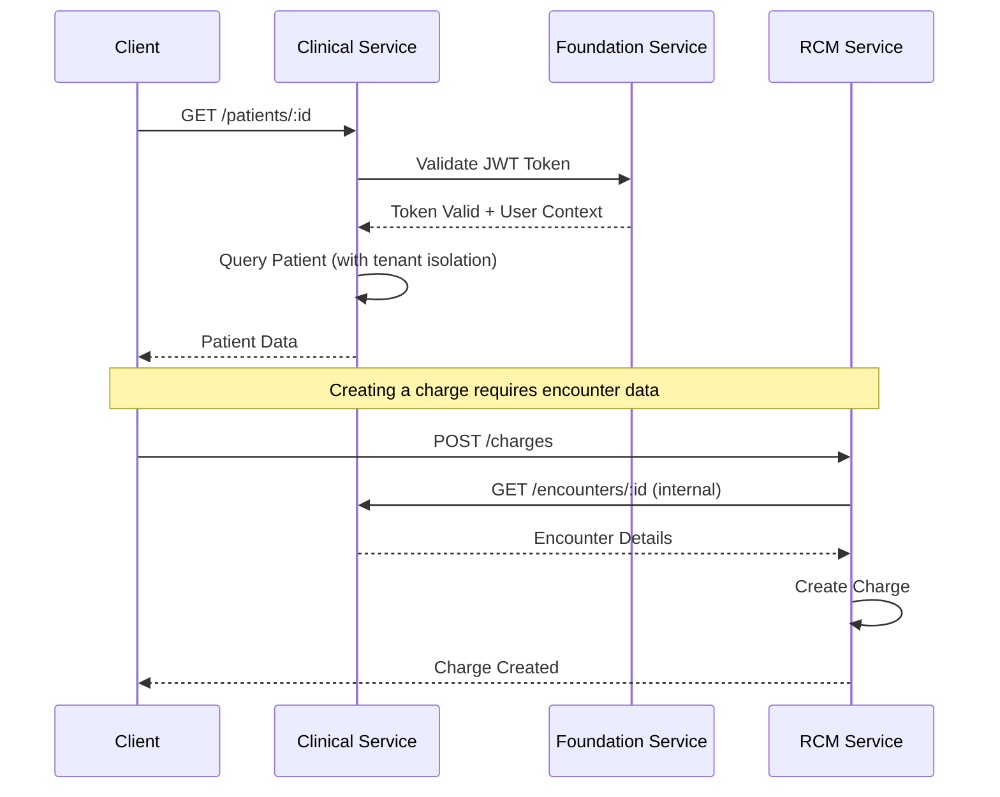

### 3.4 NestJS Module Structure

Each service follows a consistent internal structure:

```
services/<service>/src/
├── main.ts                     # Application bootstrap
├── app.module.ts               # Root module
├── common/
│   ├── decorators/             # @TenantId, @UserId, @FacilityId
│   ├── guards/                 # JwtAuthGuard, RolesGuard
│   ├── interceptors/           # RequestContext, Logging
│   └── filters/                # Exception filters
└── modules/
    └── <module>/
        ├── <module>.module.ts
        ├── <module>.controller.ts
        ├── <module>.service.ts
        ├── <module>.repository.ts
        └── dto/
            ├── create-<module>.dto.ts
            └── update-<module>.dto.ts
```

---

## 4. Frontend Architecture

### 4.1 Application Structure

The frontend is a **Modular Monolith** built with Next.js 14 App Router, logically separating business domains while sharing core infrastructure.

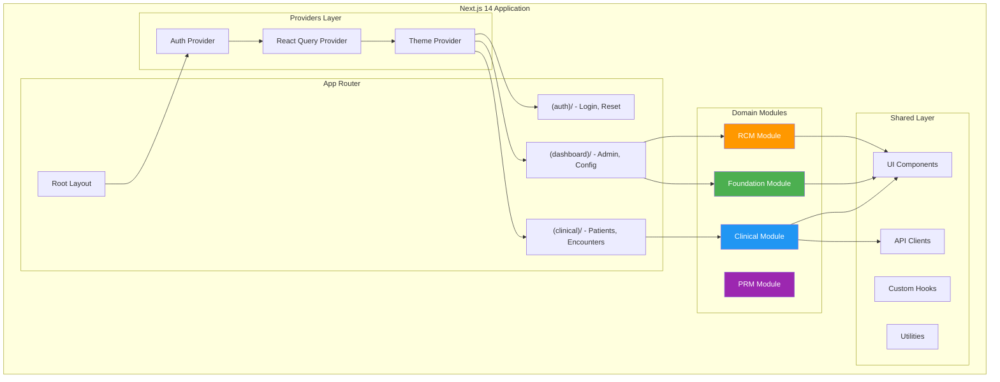

### 4.2 Directory Structure

```
frontend/src/
├── app/                        # Next.js App Router
│   ├── [locale]/
│   │   ├── (auth)/             # Public routes
│   │   │   ├── login/
│   │   │   └── reset-password/
│   │   ├── (clinical)/         # Clinical domain
│   │   │   ├── patients/
│   │   │   ├── encounters/
│   │   │   ├── scheduling/
│   │   │   └── charting/
│   │   └── (dashboard)/        # Admin domain
│   │       ├── facilities/
│   │       ├── users/
│   │       ├── billing-workspace/
│   │       └── medical-coding/
│   └── api/                    # API routes
├── components/
│   ├── ui/                     # shadcn/ui primitives
│   ├── layout/                 # Sidebar, Topbar
│   ├── forms/                  # Form components
│   └── tables/                 # Data tables
├── modules/
│   ├── clinical/
│   │   ├── components/
│   │   ├── hooks/              # React Query hooks
│   │   ├── services/           # API services
│   │   └── types/
│   ├── foundation/
│   ├── rcm/
│   └── prm/
├── lib/
│   ├── api/                    # Axios clients
│   ├── auth/                   # Token utilities
│   ├── stores/                 # Zustand stores
│   └── utils/                  # Helpers
└── hooks/                      # Shared hooks
```

### 4.3 State Management Strategy

| State Type | Solution | Use Case |
|------------|----------|----------|
| **Server State** | React Query | API data, caching, sync |
| **Client State** | Zustand | Auth, preferences, UI |
| **Form State** | React Hook Form | Form validation |
| **URL State** | Next.js Router | Navigation, filters |

```typescript
// Example: React Query hook for patients
export function usePatients(params?: QueryParams) {
  return useQuery({
    queryKey: ['patients', params],
    queryFn: () => patientService.findAll(params),
    staleTime: 5 * 60 * 1000, // 5 minutes
  });
}

// Example: Zustand store for auth
export const useAuthStore = create<AuthState>((set) => ({
  session: null,
  setSession: (session) => set({ session }),
  clearSession: () => set({ session: null }),
}));
```

### 4.4 API Client Architecture

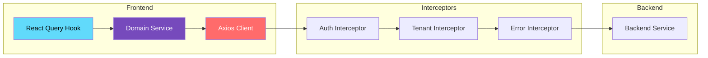

---

## 5. Security Architecture

### 5.1 Authentication Flow

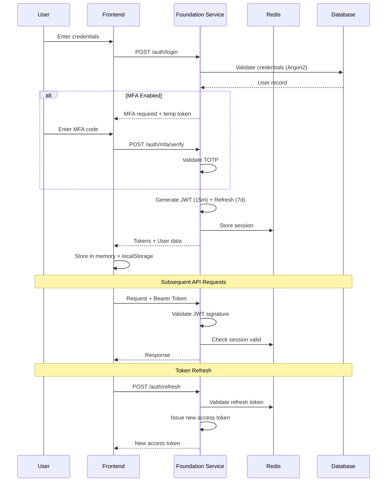

### 5.2 Authorization (RBAC)

```
┌─────────────────────────────────────────────────────────────────────┐
│                    ROLE-BASED ACCESS CONTROL                        │
├─────────────────────────────────────────────────────────────────────┤
│                                                                     │
│   User ──────► Role ──────► Permissions                            │
│     │           │              │                                    │
│     │           │              ├── patients:read                   │
│     │           │              ├── patients:write                  │
│     │           │              ├── encounters:read                 │
│     │           │              └── billing:manage                  │
│     │           │                                                   │
│     │           ├── Physician                                      │
│     │           ├── Nurse                                          │
│     │           ├── Billing Staff                                  │
│     │           └── Administrator                                  │
│     │                                                               │
│     └──────► Facility Scope (restricts access to specific facility)│
│                                                                     │
└─────────────────────────────────────────────────────────────────────┘
```

### 5.3 Security Controls

| Layer | Control | Implementation |
|-------|---------|----------------|
| **Transport** | TLS 1.3 | All traffic encrypted |
| **Authentication** | JWT + Refresh | 15m access / 7d refresh |
| **Password** | Argon2id | Industry-standard hashing |
| **MFA** | TOTP | Google Authenticator compatible |
| **Authorization** | RBAC + RLS | Permission + row-level |
| **Input Validation** | Zod schemas | Request validation |
| **Rate Limiting** | Redis-based | Per-user/IP limits |
| **CORS** | Strict origin | Whitelist only |
| **Headers** | Security headers | CSP, HSTS, X-Frame-Options |

### 5.4 Data Protection

> [!WARNING]
> **PHI (Protected Health Information)** must only reside in the `zeal_clinical` database.

| Data Type | Database | Encryption | Access |
|-----------|----------|------------|--------|
| User credentials | Foundation | Argon2 hash | Auth only |
| Patient demographics | Clinical | AES-256 at rest | Clinical staff |
| Medical records | Clinical | AES-256 at rest | Authorized providers |
| Financial data | RCM | AES-256 at rest | Billing staff |
| Audit logs | Analytics | Encrypted | Compliance officers |

---

## 6. Integration Architecture

### 6.1 UAE Healthcare Ecosystem

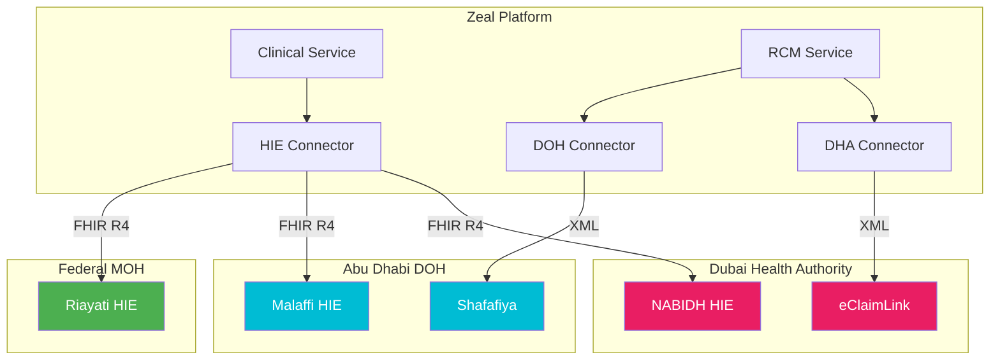

### 6.2 Integration Protocols

| System | Protocol | Format | Purpose |
|--------|----------|--------|---------|
| DHA eClaimLink | HTTPS | XML | Claims submission |
| DOH Shafafiya | HTTPS | XML | Prior authorization |
| NABIDH | FHIR R4 | JSON | Clinical data exchange |
| Malaffi | FHIR R4 | JSON | Clinical data exchange |
| Riayati | FHIR R4 | JSON | National patient index |
| Labs | HL7 v2.x | HL7 | Orders & results |
| Imaging | DICOM | Binary | Radiology integration |

### 6.3 Claims Submission Flow

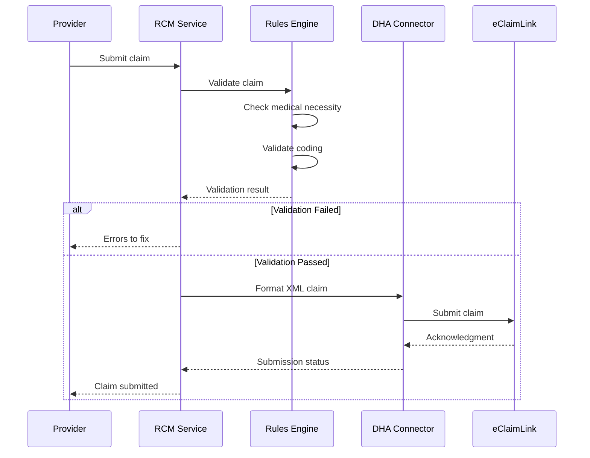

---

## 7. Data Architecture

### 7.1 Database Topology

> [!NOTE]
> The platform uses a **4-database architecture** for domain isolation (see [ADR-0013](../adr/ADR-0013-service-decomposition.md)).

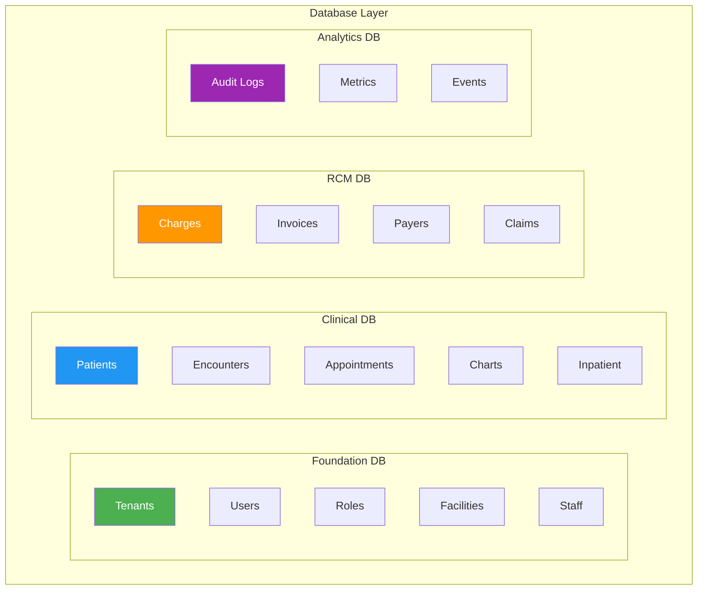

### 7.2 Database Summary

| Database | Schema | Tables | Primary Data | Est. Size |
|----------|--------|--------|--------------|-----------|
| `zeal_foundation` | public | ~25 | Config, Users, RBAC | Small |
| `zeal_clinical` | public | ~50 | PHI, Encounters, Scheduling | Large |
| `zeal_rcm` | public | ~30 | Billing, Claims, Insurance | Medium |
| `zeal_analytics` | public | ~15 | Audit, Metrics | Growing |

### 7.3 Multi-Tenancy Implementation

All tables include a `tenant_id` column with **Row-Level Security (RLS)** enforced at the database level.

```sql
-- Example RLS policy
CREATE POLICY tenant_isolation ON patients
    USING (tenant_id = current_setting('app.tenant_id')::uuid);

-- Set tenant context before queries
SET app.tenant_id = 'tenant-uuid-here';
```

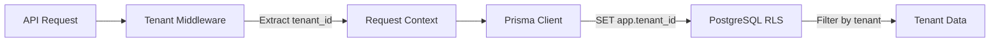

---

## 8. Deployment & Infrastructure

### 8.1 Environment Strategy

| Environment | Purpose | URL Pattern | Database |
|-------------|---------|-------------|----------|
| **Local** | Development | localhost:3xxx | Local Docker |
| **Dev** | Integration testing | dev.zeal.health | Dev cluster |
| **Staging** | Pre-production | staging.zeal.health | Staging cluster |
| **Production** | Live system | app.zeal.health | Production cluster |

### 8.2 Container Architecture

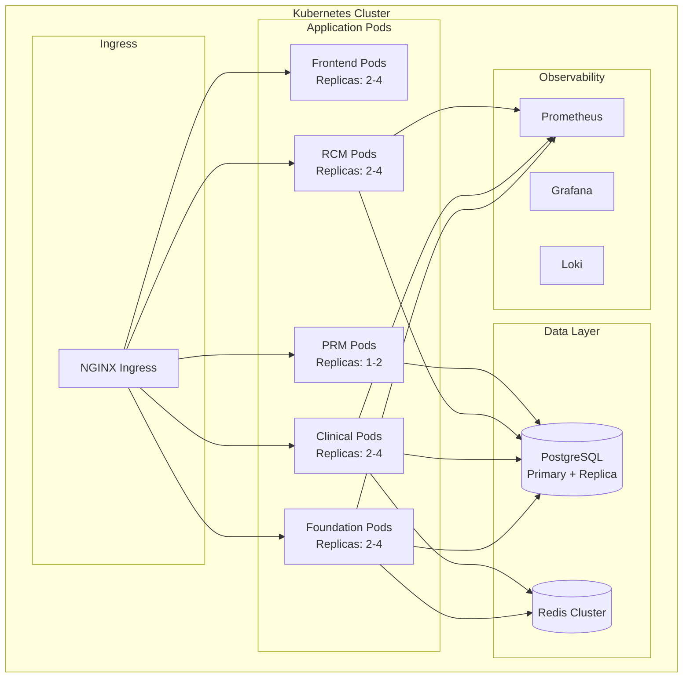

### 8.3 CI/CD Pipeline

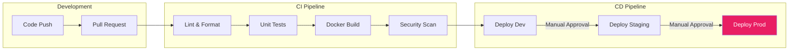

### 8.4 Local Development Setup

```bash
# 1. Start infrastructure
docker-compose up -d postgres redis

# 2. Setup backend
cd backend
npm install
npm run build --workspace=@zeal/database-foundation
npm run build --workspace=@zeal/database-clinical
npx prisma db push --schema shared/database-foundation/prisma/schema.prisma
./seed/run-seeds.sh foundation

# 3. Start services
npm run dev --workspace=@zeal/foundation  # Port 3010
npm run dev --workspace=@zeal/clinical    # Port 3011
npm run dev --workspace=@zeal/rcm         # Port 3012

# 4. Start frontend
cd frontend
npm install
npm run dev                               # Port 3000
```

---

## 9. Observability & Monitoring

### 9.1 Observability Stack

```
┌─────────────────────────────────────────────────────────────────────┐
│                      OBSERVABILITY STACK                            │
├─────────────────────────────────────────────────────────────────────┤
│                                                                     │
│   ┌─────────────┐    ┌─────────────┐    ┌─────────────┐           │
│   │   METRICS   │    │    LOGS     │    │   TRACES    │           │
│   │ Prometheus  │    │    Loki     │    │   Jaeger    │           │
│   └──────┬──────┘    └──────┬──────┘    └──────┬──────┘           │
│          │                  │                  │                   │
│          └──────────────────┼──────────────────┘                   │
│                             │                                       │
│                      ┌──────┴──────┐                               │
│                      │   GRAFANA   │                               │
│                      │  Dashboards │                               │
│                      └─────────────┘                               │
│                                                                     │
└─────────────────────────────────────────────────────────────────────┘
```

### 9.2 Key Metrics

| Category | Metric | Alert Threshold |
|----------|--------|-----------------|
| **Availability** | Service uptime | < 99.9% |
| **Latency** | P95 response time | > 500ms |
| **Errors** | 5xx error rate | > 1% |
| **Saturation** | CPU utilization | > 80% |
| **Database** | Connection pool | > 90% used |
| **Cache** | Redis hit rate | < 80% |

### 9.3 Logging Strategy

| Level | Use Case | Retention |
|-------|----------|-----------|
| **ERROR** | Exceptions, failures | 90 days |
| **WARN** | Degraded performance | 30 days |
| **INFO** | Business events | 14 days |
| **DEBUG** | Development only | 1 day |

```typescript
// Structured logging with Pino
logger.info({
  event: 'patient_created',
  patientId: patient.id,
  tenantId: context.tenantId,
  userId: context.userId,
  duration: Date.now() - startTime,
});
```

---

## 10. Performance & Scalability

### 10.1 Caching Strategy

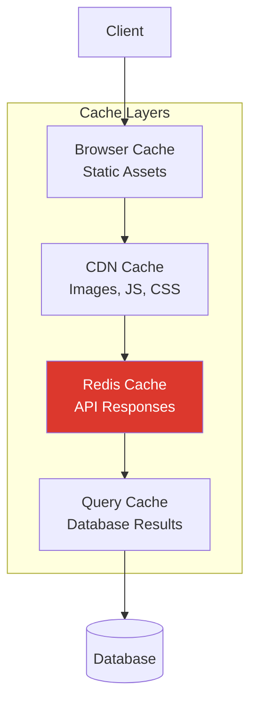

### 10.2 Cache TTL Configuration

| Data Type | Cache Location | TTL | Invalidation |
|-----------|---------------|-----|--------------|
| Static assets | CDN | 1 year | Version hash |
| Config | Redis | 5 min | Manual |
| User session | Redis | 15 min | Logout |
| Reference data | Redis | 1 hour | Scheduled |
| Search results | Redis | 5 min | On write |

### 10.3 Database Optimization

| Technique | Implementation |
|-----------|----------------|
| **Connection Pooling** | Prisma connection pool (10-50) |
| **Indexing** | Composite indexes on tenant_id + common filters |
| **Query Optimization** | Eager loading, select specific fields |
| **Read Replicas** | For reporting queries (planned) |
| **Partitioning** | By tenant_id for large tables (planned) |

### 10.4 Scalability Targets

| Metric | Current | Target |
|--------|---------|--------|
| Concurrent users | 100 | 10,000 |
| API requests/sec | 50 | 5,000 |
| Database connections | 50 | 500 |
| Response time (P95) | 200ms | < 100ms |

---

## 11. Future Roadmap

### 11.1 Planned Enhancements

| Timeline | Feature | Description |
|----------|---------|-------------|
| **Q1 2026** | Message Queue | Kafka for async workflows |
| **Q2 2026** | AI Integration | Clinical note drafting, coding assistance |
| **Q3 2026** | Mobile App | React Native provider app |
| **Q4 2026** | Real-time | WebSocket for live updates |

### 11.2 Architecture Evolution

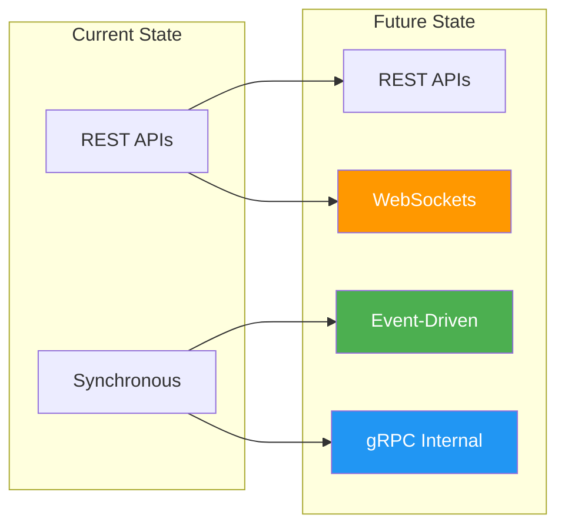

---

## 12. Related Documentation

| Document | Description |
|----------|-------------|
| [Architecture Diagrams](./02-Architecture-Diagram.md) | Detailed C4 diagrams and sequences |
| [Domain Model](./03-Domain-Model.md) | DDD domain models |
| [Data Model](./05-Data-Model.md) | Database schema design |
| [Backend Architecture](./BACKEND-ARCHITECTURE.md) | Detailed backend design |
| [ADR-0013: Service Decomposition](../adr/ADR-0013-service-decomposition.md) | 4-database architecture decision |
| [ADR-0003: Multi-tenancy](../adr/ADR-0003-multitenancy.md) | Tenant isolation strategy |
| [ADR-0005: RBAC](../adr/ADR-0005-rbac-access-control.md) | Access control design |
| [Security & Compliance](../security/08-Security-&-Compliance.md) | Security architecture |
| [Multi-tenancy Guide](../multitenancy/README.md) | Tenant implementation details |

---

## Quick Reference

### Local Development URLs

```
┌─────────────────────────────────────────────────────────────────┐
│ SERVICE            │ URL                      │ PURPOSE         │
├────────────────────┼──────────────────────────┼─────────────────┤
│ Frontend           │ http://localhost:3000    │ Web Application │
│ Foundation API     │ http://localhost:3010    │ Auth, Users     │
│ Foundation Docs    │ http://localhost:3010/docs│ Swagger UI     │
│ Clinical API       │ http://localhost:3011    │ Patients, EMR   │
│ Clinical Docs      │ http://localhost:3011/docs│ Swagger UI     │
│ RCM API            │ http://localhost:3012    │ Billing         │
│ RCM Docs           │ http://localhost:3012/docs│ Swagger UI     │
│ pgAdmin            │ http://localhost:8080    │ Database UI     │
│ RedisInsight       │ http://localhost:5540    │ Cache UI        │
└────────────────────┴──────────────────────────┴─────────────────┘
```

### Essential Commands

```bash
# Start all infrastructure
docker-compose up -d

# Run all services (from backend/)
npm run dev --workspace=@zeal/foundation &
npm run dev --workspace=@zeal/clinical &
npm run dev --workspace=@zeal/rcm &

# Seed databases
./seed/run-seeds.sh foundation
./seed/run-seeds.sh clinical

# Run tests
npm test --workspace=@zeal/foundation
npm run test --workspace=frontend
```

---

*Document maintained by the Engineering Team. For questions, contact the Architecture Guild.*
