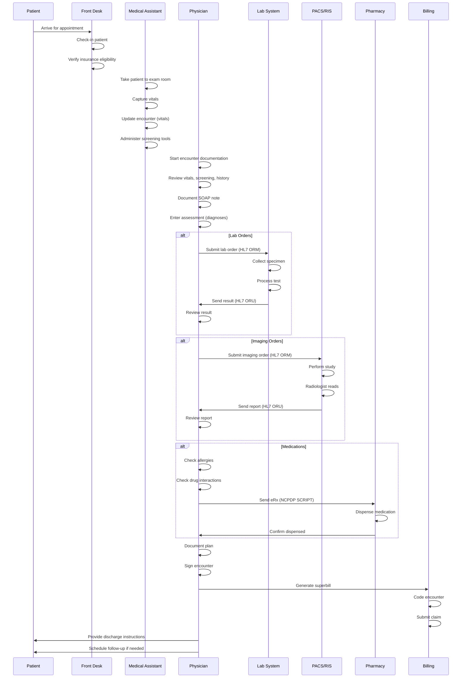
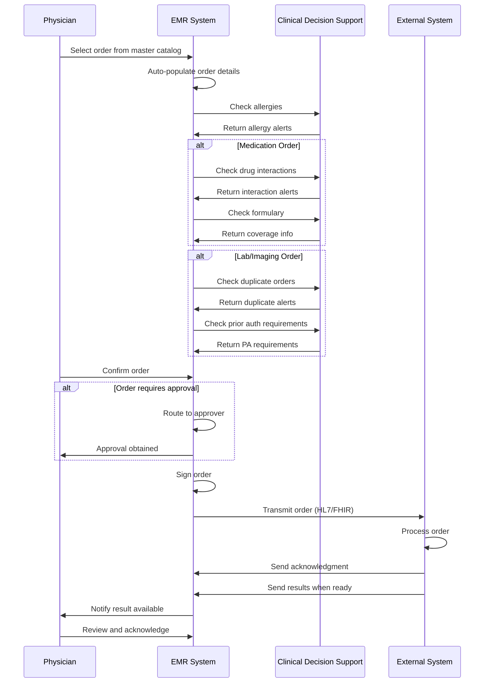
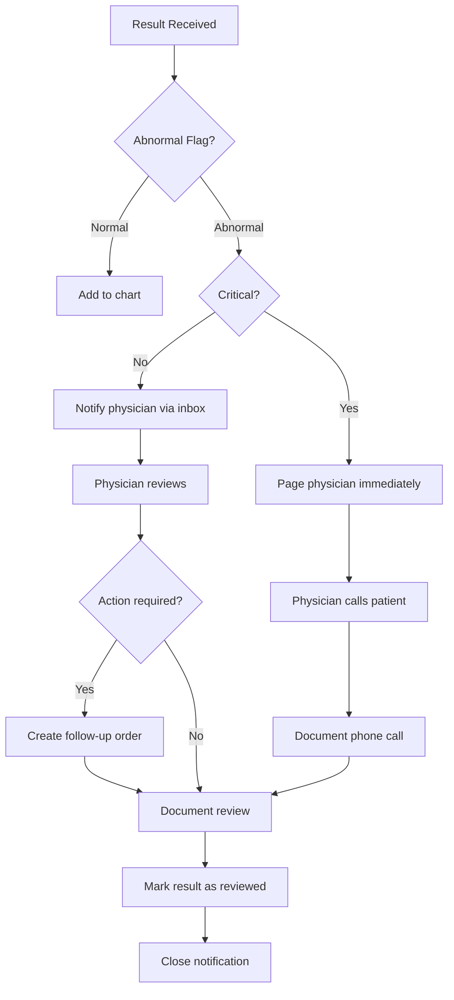

# EMR/Clinical Data Capture & Flow Design

## Overview

This document outlines the **Electronic Medical Records (EMR)** and **Clinical Data Capture** architecture for the athma-ce Platform. It covers the complete clinical workflow from patient registration through encounter documentation, orders, results, and clinical decision support.

---

## Table of Contents

1. [Clinical Workflow Overview](#clinical-workflow-overview)
2. [Patient Registration & Demographics](#patient-registration--demographics)
3. [Encounter Management](#encounter-management)
4. [Clinical Documentation](#clinical-documentation)
5. [Order Management](#order-management)
6. [Results Management](#results-management)
7. [Clinical Decision Support](#clinical-decision-support)
8. [Care Coordination](#care-coordination)
9. [Data Flow Diagrams](#data-flow-diagrams)
10. [Integration Points](#integration-points)
11. [Compliance & Security](#compliance--security)

---

## Clinical Workflow Overview

### High-Level Flow

```
Patient Registration
    ↓
Appointment Scheduling
    ↓
Patient Check-In
    ↓
Vital Signs Capture
    ↓
Encounter Start
    ↓
Clinical Documentation (SOAP)
    ├── Subjective (Chief Complaint, HPI)
    ├── Objective (Physical Exam, Vitals)
    ├── Assessment (Diagnosis, Problem List)
    └── Plan (Orders, Prescriptions, Follow-up)
    ↓
Order Entry & Execution
    ├── Lab Orders → Lab Results
    ├── Imaging Orders → Imaging Results
    ├── Medication Orders → Prescriptions
    ├── Procedure Orders → Procedure Results
    └── Referral Orders
    ↓
Encounter Sign-Off
    ↓
Charge Capture (Superbill)
    ↓
Billing & Claims
```

---

## Patient Registration & Demographics

### Core Patient Data

**Table: `patients`**

```sql
CREATE TABLE patients (
    id UUID PRIMARY KEY,
    tenant_id UUID NOT NULL,
    mrn VARCHAR(50) UNIQUE NOT NULL,      -- Medical Record Number
    emirates_id VARCHAR(50) UNIQUE,       -- UAE Emirates ID
    first_name VARCHAR(100) NOT NULL,
    last_name VARCHAR(100) NOT NULL,
    date_of_birth DATE NOT NULL,
    sex VARCHAR(20),
    nationality VARCHAR(100),
    preferred_language VARCHAR(10) DEFAULT 'en',
    contact_info JSONB DEFAULT '{}',
    demographics JSONB DEFAULT '{}',
    emergency_contact JSONB DEFAULT '{}',
    is_active BOOLEAN DEFAULT TRUE
);
```

### Extended Patient Information

#### Allergies
```sql
CREATE TABLE patient_allergies_enhanced (
    patient_id UUID,
    allergen_type VARCHAR(50),    -- medication, food, environmental
    allergen_name VARCHAR(255),
    severity VARCHAR(20),          -- mild, moderate, severe, life_threatening
    reaction_type VARCHAR(100),    -- rash, anaphylaxis, respiratory
    verified_by UUID,
    verified_at TIMESTAMPTZ
);
```

#### Problem List
```sql
CREATE TABLE patient_problems (
    patient_id UUID,
    icd10_code VARCHAR(20),
    problem_description TEXT,
    status VARCHAR(30),            -- active, resolved, chronic
    severity VARCHAR(20),
    onset_date DATE,
    is_primary_diagnosis BOOLEAN,
    is_chronic_condition BOOLEAN
);
```

#### Family History
```sql
CREATE TABLE family_history (
    patient_id UUID,
    family_member_relationship VARCHAR(50),
    condition_name VARCHAR(255),
    icd10_code VARCHAR(20),
    condition_type VARCHAR(100),
    is_genetic BOOLEAN,
    genetic_inheritance VARCHAR(50)
);
```

#### Immunizations
```sql
CREATE TABLE immunizations (
    patient_id UUID,
    vaccine_code VARCHAR(50),      -- CVX code
    vaccine_name VARCHAR(255),
    lot_number VARCHAR(100),
    administered_at TIMESTAMPTZ,
    dose_number INTEGER,
    total_series INTEGER,
    next_due_at DATE
);
```

---

## Encounter Management

### Encounter Types & Sources

**Table: `encounters`**

```sql
CREATE TABLE encounters (
    id UUID PRIMARY KEY,
    patient_id UUID NOT NULL,
    encounter_date TIMESTAMPTZ DEFAULT NOW(),
    encounter_source VARCHAR(20),   -- appointment, walk_in, emergency, telemedicine
    encounter_type VARCHAR(50),     -- outpatient, inpatient, emergency, telemedicine
    primary_staff_id UUID,
    facility_id UUID,
    episode_id UUID,               -- link to episode of care
    visit_category_concept_id UUID, -- NEW, REVISIT, FOLLOW_UP
    status VARCHAR(30),            -- scheduled, in_progress, completed, cancelled
    walk_in_details JSONB DEFAULT '{}'
);
```

### Encounter Sources

| Source | Description | Workflow |
|--------|-------------|----------|
| **appointment** | Pre-scheduled visit | Standard workflow with appointment link |
| **walk_in** | Unscheduled visit | Immediate registration, triage, encounter creation |
| **emergency** | Emergency department | Priority triage, immediate attention |
| **telemedicine** | Virtual visit | Video/phone consultation, digital documentation |

### Episode of Care

**Table: `episodes`**

```sql
CREATE TABLE episodes (
    id UUID PRIMARY KEY,
    patient_id UUID NOT NULL,
    primary_staff_id UUID,
    specialty VARCHAR(100),
    diagnosis_snapshot JSONB DEFAULT '{}',
    started_at TIMESTAMPTZ,
    closed_at TIMESTAMPTZ,
    status VARCHAR(30)             -- active, closed, transferred
);
```

**Purpose**: Groups related encounters for chronic disease management, surgical episodes, pregnancy care, etc.

### Encounter Links

**Table: `encounter_links`**

```sql
CREATE TABLE encounter_links (
    from_encounter_id UUID,
    to_encounter_id UUID,
    relationship_type VARCHAR(40), -- follow_up_of, referred_from, related_to
    notes TEXT
);
```

**Use Cases**:
- Link follow-up visits to original encounter
- Track referrals between specialists
- Group related encounters (e.g., pre-op → surgery → post-op)

---

## Clinical Documentation

### SOAP Notes

**Table: `clinical_notes`**

```sql
CREATE TABLE clinical_notes (
    id UUID PRIMARY KEY,
    encounter_id UUID NOT NULL,
    note_type VARCHAR(50),         -- soap, progress, discharge, consult
    section VARCHAR(50),           -- subjective, objective, assessment, plan
    content TEXT NOT NULL,
    is_signed BOOLEAN DEFAULT FALSE,
    signed_by UUID,
    signed_at TIMESTAMPTZ
);
```

### SOAP Structure

#### S - Subjective
- **Chief Complaint**: Primary reason for visit
- **History of Present Illness (HPI)**: Detailed symptom history
- **Review of Systems (ROS)**: Systematic review by body system
- **Past Medical History**: Previous conditions, surgeries
- **Medications**: Current medications
- **Allergies**: Known allergies
- **Social History**: Smoking, alcohol, occupation
- **Family History**: Genetic conditions

#### O - Objective
- **Vital Signs**: BP, HR, RR, Temp, O2 sat, height, weight, BMI
- **Physical Examination**: By body system
- **Lab Results**: Recent laboratory findings
- **Imaging Results**: Radiological findings

#### A - Assessment
- **Differential Diagnosis**: Possible diagnoses
- **Primary Diagnosis**: ICD-10 code
- **Secondary Diagnoses**: Additional conditions
- **Problem List**: Active, chronic, resolved problems

#### P - Plan
- **Orders**: Labs, imaging, procedures
- **Prescriptions**: Medications
- **Referrals**: Specialist consultations
- **Follow-up**: Return visit instructions
- **Patient Education**: Instructions, handouts

### Vitals Capture

**Table: `vitals`**

```sql
CREATE TABLE vitals (
    id UUID PRIMARY KEY,
    patient_id UUID NOT NULL,
    encounter_id UUID,
    recorded_at TIMESTAMPTZ,
    height_cm NUMERIC(5,2),
    weight_kg NUMERIC(5,2),
    temperature_c NUMERIC(4,1),
    systolic_bp INT,
    diastolic_bp INT,
    heart_rate INT,
    respiratory_rate INT,
    oxygen_saturation NUMERIC(4,1),
    bmi NUMERIC(4,1)
);
```

**Workflow**:
1. Medical assistant measures vitals at check-in
2. Vitals auto-populate in encounter
3. Abnormal values trigger alerts (e.g., BP > 140/90)
4. Historical trends available to physician

### Screening Tools

**Table: `screenings`**

```sql
CREATE TABLE screenings (
    id UUID PRIMARY KEY,
    patient_id UUID NOT NULL,
    encounter_id UUID,
    tool_code VARCHAR(50),         -- PHQ9, GAD7, PAIN, FALL
    tool_name VARCHAR(255),
    score NUMERIC(5,2),
    interpretation VARCHAR(100),   -- normal, mild, moderate, severe
    responses JSONB                -- raw questionnaire answers
);
```

**Common Screening Tools**:
- **PHQ-9**: Depression screening (0-27 score)
- **GAD-7**: Anxiety screening (0-21 score)
- **AUDIT**: Alcohol use disorder (0-40 score)
- **Pain Scale**: 0-10 numeric rating
- **Fall Risk**: Morse Fall Scale
- **MMSE**: Cognitive screening (0-30 score)

---

## Order Management

### Order Types

**Table: `orders`**

```sql
CREATE TABLE orders (
    id UUID PRIMARY KEY,
    encounter_id UUID NOT NULL,
    order_type VARCHAR(50),        -- medication, lab, imaging, procedure, referral
    status VARCHAR(30),            -- draft, ordered, in_progress, completed, cancelled
    priority VARCHAR(20),          -- routine, urgent, stat, asap
    ordered_by UUID,
    ordered_at TIMESTAMPTZ,
    approved_by UUID,
    approved_at TIMESTAMPTZ,
    clinical_notes TEXT
);
```

### Medication Orders

**Table: `medication_orders`**

```sql
CREATE TABLE medication_orders (
    id UUID PRIMARY KEY,
    order_id UUID,
    medication_master_id UUID,     -- link to master catalog
    medication_name VARCHAR(255),
    dosage VARCHAR(100),
    frequency VARCHAR(100),
    route VARCHAR(50),
    duration VARCHAR(100),
    refills INTEGER,
    quantity NUMERIC(10,2),
    start_date DATE,
    end_date DATE,
    special_instructions TEXT
);
```

**Workflow**:
1. Physician searches medication master catalog
2. Auto-populate dosage, route, frequency from master
3. Allergy check against patient allergies
4. Drug-drug interaction check
5. Formulary check (insurance coverage)
6. eRx transmission to pharmacy

### Lab Orders

**Table: `lab_orders`**

```sql
CREATE TABLE lab_orders (
    id UUID PRIMARY KEY,
    order_id UUID,
    lab_test_master_id UUID,
    test_name VARCHAR(255),
    loinc_code VARCHAR(20),        -- LOINC for test identification
    cpt_code VARCHAR(10),          -- CPT for billing
    specimen_type VARCHAR(100),
    collection_method VARCHAR(100),
    requires_fasting BOOLEAN,
    fasting_hours INTEGER,
    special_instructions TEXT
);
```

**Workflow**:
1. Physician orders test from master catalog
2. Auto-populate LOINC and CPT codes
3. Check for duplicate recent orders
4. Generate specimen collection label
5. Send to lab system (HL7/FHIR)
6. Track status: ordered → collected → in_lab → resulted

### Imaging Orders

**Table: `imaging_orders`**

```sql
CREATE TABLE imaging_orders (
    id UUID PRIMARY KEY,
    order_id UUID,
    imaging_study_master_id UUID,
    study_name VARCHAR(255),
    cpt_code VARCHAR(10),
    modality VARCHAR(50),          -- X-ray, CT, MRI, Ultrasound
    body_part VARCHAR(100),
    contrast_required BOOLEAN,
    preparation_instructions TEXT,
    clinical_indication TEXT
);
```

**Workflow**:
1. Physician orders study from master catalog
2. Check for prior authorization requirements
3. Verify insurance eligibility
4. Schedule imaging appointment
5. Send order to PACS/RIS (HL7/DICOM)
6. Radiologist reads and signs report

### Procedure Orders

**Table: `procedure_orders`**

```sql
CREATE TABLE procedure_orders (
    id UUID PRIMARY KEY,
    order_id UUID,
    procedure_master_id UUID,
    procedure_name VARCHAR(255),
    cpt_code VARCHAR(10),
    anesthesia_type VARCHAR(50),
    consent_required BOOLEAN,
    preparation_instructions TEXT,
    estimated_duration_minutes INTEGER
);
```

---

## Results Management

### Lab Results

**Table: `lab_results`**

```sql
CREATE TABLE lab_results (
    id UUID PRIMARY KEY,
    lab_order_id UUID NOT NULL,
    test_name VARCHAR(255),
    loinc_code VARCHAR(20),
    result_value VARCHAR(500),
    result_unit VARCHAR(50),
    reference_range_min NUMERIC(10,2),
    reference_range_max NUMERIC(10,2),
    abnormal_flag VARCHAR(20),     -- normal, low, high, critical
    result_status VARCHAR(30),     -- preliminary, final, corrected
    resulted_at TIMESTAMPTZ,
    reviewed_by UUID,
    reviewed_at TIMESTAMPTZ
);
```

**Workflow**:
1. Lab completes test
2. Result ingested via HL7 ORU message or manual entry
3. Auto-flag abnormal results
4. Notify ordering physician
5. Physician reviews and acknowledges
6. Critical results escalated (phone call required)

### Imaging Results

**Table: `imaging_results`**

```sql
CREATE TABLE imaging_results (
    id UUID PRIMARY KEY,
    imaging_order_id UUID NOT NULL,
    study_name VARCHAR(255),
    findings TEXT,
    impression TEXT,
    radiologist_id UUID,
    signed_at TIMESTAMPTZ,
    dicom_study_uid VARCHAR(255),
    pacs_url TEXT
);
```

**Workflow**:
1. Imaging study performed
2. Images sent to PACS
3. Radiologist reads study in PACS
4. Report dictated/typed
5. Report signed and transmitted to EMR
6. Ordering physician notified
7. Results reviewed with patient

### Procedure Results

**Table: `procedure_results`**

```sql
CREATE TABLE procedure_results (
    id UUID PRIMARY KEY,
    procedure_order_id UUID NOT NULL,
    procedure_name VARCHAR(255),
    start_time TIMESTAMPTZ,
    end_time TIMESTAMPTZ,
    performing_staff_id UUID,
    anesthesia_used VARCHAR(100),
    findings TEXT,
    complications TEXT,
    specimens_collected JSONB
);
```

---

## Clinical Documentation

### Problem List Management

**Table: `patient_problems`**

```sql
CREATE TABLE patient_problems (
    id UUID PRIMARY KEY,
    patient_id UUID,
    icd10_code VARCHAR(20),
    problem_description TEXT,
    status VARCHAR(30),            -- active, resolved, chronic
    severity VARCHAR(20),
    onset_date DATE,
    is_primary_diagnosis BOOLEAN
);
```

**Workflow**:
1. Problems added during encounter
2. Problems persist across encounters
3. Status updated (active → resolved)
4. Used for disease management, quality reporting

### Care Plans

**Table: `care_plans`**

```sql
CREATE TABLE care_plans (
    id UUID PRIMARY KEY,
    patient_id UUID,
    care_plan_type VARCHAR(100),   -- chronic_disease, post_surgical, preventive
    start_date DATE,
    end_date DATE,
    status VARCHAR(30),            -- active, completed, discontinued
    primary_goal TEXT,
    secondary_goals TEXT[]
);
```

**Table: `care_plan_interventions`**

```sql
CREATE TABLE care_plan_interventions (
    care_plan_id UUID,
    intervention_type VARCHAR(100), -- medication, therapy, education
    intervention_description TEXT,
    frequency VARCHAR(100),
    target_date DATE,
    completion_status VARCHAR(30)
);
```

**Workflow**:
1. Care plan created for chronic conditions (diabetes, hypertension)
2. Goals and interventions defined
3. Interventions tracked over time
4. Care plan reviewed at each encounter
5. Outcomes measured against goals

---

## Order Management

### Unified Order Entry

**Design Principle**: All orders go through a unified `orders` table with type-specific child tables.

```
orders (parent)
    ├── medication_orders
    ├── lab_orders
    ├── imaging_orders
    ├── procedure_orders
    └── referral_orders
```

### Order Lifecycle

```
Draft → Ordered → Approved → Sent → In Progress → Completed
                      ↓                               ↓
                  Cancelled                      Cancelled
```

### Order Approval Workflow

**For high-risk orders:**
- Controlled substances → Require supervisor approval
- High-cost imaging → Require medical director approval
- Off-formulary medications → Require pharmacy approval

```sql
-- Order approval tracking
SELECT 
    o.id,
    o.order_type,
    o.status,
    o.ordered_by,
    o.approved_by,
    o.ordered_at,
    o.approved_at
FROM orders o
WHERE o.status = 'pending_approval';
```

### Order Signing & Attestation

**Electronic Signature:**
```sql
-- Clinical notes signing
UPDATE clinical_notes
SET is_signed = true,
    signed_by = 'physician-uuid',
    signed_at = NOW()
WHERE encounter_id = 'encounter-uuid';

-- Order signing
UPDATE orders
SET status = 'ordered',
    approved_by = 'physician-uuid',
    approved_at = NOW()
WHERE id = 'order-uuid';
```

---

## Results Management

### Result Ingestion

**HL7 Integration:**

```typescript
// HL7 ORU (Lab Results) message handling
async function processHL7LabResult(hl7Message: string): Promise<void> {
  const parsed = parseHL7(hl7Message);
  
  // Extract key segments
  const patient = parsed.PID;  // Patient Identification
  const order = parsed.OBR;    // Order
  const results = parsed.OBX;  // Observations (results)
  
  // Find matching lab order
  const labOrder = await findLabOrder(order.placerOrderNumber);
  
  // Insert results
  for (const obx of results) {
    await db.query(`
      INSERT INTO lab_results (
        lab_order_id,
        test_name,
        loinc_code,
        result_value,
        result_unit,
        reference_range_min,
        reference_range_max,
        abnormal_flag,
        resulted_at
      ) VALUES ($1, $2, $3, $4, $5, $6, $7, $8, $9)
    `, [
      labOrder.id,
      obx.observationIdentifier,
      obx.loincCode,
      obx.observationValue,
      obx.units,
      obx.referenceRangeLow,
      obx.referenceRangeHigh,
      obx.abnormalFlag,
      obx.observationDateTime
    ]);
  }
  
  // Update order status
  await db.query(`
    UPDATE orders SET status = 'completed' WHERE id = $1
  `, [labOrder.order_id]);
  
  // Notify physician if abnormal
  if (hasAbnormalResults(results)) {
    await notifyPhysician(labOrder.ordered_by, labOrder.id);
  }
}
```

### Critical Result Alerting

```sql
-- Critical lab results requiring immediate notification
SELECT 
    lr.id,
    lr.test_name,
    lr.result_value,
    lr.abnormal_flag,
    p.first_name || ' ' || p.last_name as patient_name,
    s.first_name || ' ' || s.last_name as ordering_physician
FROM lab_results lr
JOIN lab_orders lo ON lo.id = lr.lab_order_id
JOIN orders o ON o.id = lo.order_id
JOIN encounters e ON e.id = o.encounter_id
JOIN patients p ON p.id = e.patient_id
JOIN staff s ON s.id = o.ordered_by
WHERE lr.abnormal_flag = 'critical'
  AND lr.reviewed_by IS NULL
ORDER BY lr.resulted_at DESC;
```

---

## Clinical Decision Support

### Drug-Drug Interaction Checking

```typescript
async function checkDrugInteractions(
  patientId: string,
  newMedicationCode: string
): Promise<{
  hasInteractions: boolean;
  interactions: Interaction[];
}> {
  // Get patient's current medications
  const currentMeds = await db.query(`
    SELECT DISTINCT m.ndc_code, m.medication_name
    FROM medication_orders mo
    JOIN medication_master m ON m.id = mo.medication_master_id
    JOIN orders o ON o.id = mo.order_id
    JOIN encounters e ON e.id = o.encounter_id
    WHERE e.patient_id = $1
      AND o.status IN ('ordered', 'in_progress')
      AND (mo.end_date IS NULL OR mo.end_date > NOW())
  `, [patientId]);
  
  // Check interactions using drug interaction database
  const interactions = await checkInteractionDatabase(
    currentMeds.rows.map(m => m.ndc_code),
    newMedicationCode
  );
  
  return {
    hasInteractions: interactions.length > 0,
    interactions
  };
}
```

### Allergy Checking

```typescript
async function checkAllergies(
  patientId: string,
  medicationName: string
): Promise<{
  hasAllergy: boolean;
  allergies: Allergy[];
}> {
  const result = await db.query(`
    SELECT 
      allergen_name,
      severity,
      reaction_type
    FROM patient_allergies_enhanced
    WHERE patient_id = $1
      AND is_active = true
      AND (
        allergen_name ILIKE $2
        OR allergen_code IN (
          SELECT atc_code FROM medication_master WHERE medication_name = $2
        )
      )
  `, [patientId, medicationName]);
  
  return {
    hasAllergy: result.rows.length > 0,
    allergies: result.rows
  };
}
```

### Duplicate Order Detection

```typescript
async function checkDuplicateOrder(
  patientId: string,
  orderType: string,
  code: string,
  withinDays: number = 7
): Promise<boolean> {
  const result = await db.query(`
    SELECT COUNT(*) as count
    FROM orders o
    JOIN encounters e ON e.id = o.encounter_id
    LEFT JOIN lab_orders lo ON lo.order_id = o.id
    LEFT JOIN imaging_orders io ON io.order_id = o.id
    WHERE e.patient_id = $1
      AND o.order_type = $2
      AND o.ordered_at > NOW() - INTERVAL '$3 days'
      AND (
        (lo.loinc_code = $4) OR
        (io.cpt_code = $4)
      )
  `, [patientId, orderType, withinDays, code]);
  
  return parseInt(result.rows[0].count) > 0;
}
```

---

## Care Coordination

### Referral Management

**Table: `referral_orders`**

```sql
CREATE TABLE referral_orders (
    id UUID PRIMARY KEY,
    order_id UUID,
    referred_to_staff_id UUID,
    referred_to_facility_id UUID,
    referred_to_specialty VARCHAR(100),
    referral_reason TEXT,
    urgency VARCHAR(20),
    clinical_summary TEXT,
    records_to_send TEXT[]
);
```

**Workflow**:
1. Primary care physician creates referral
2. Select specialist/facility
3. Attach clinical summary and relevant records
4. Send notification to specialist
5. Track referral status (sent → scheduled → completed)
6. Receive consult note back from specialist

### Transfer of Care

```sql
-- Transfer patient to another provider
INSERT INTO encounter_links (
    from_encounter_id,
    to_encounter_id,
    relationship_type,
    notes
) VALUES (
    'original-encounter-uuid',
    'new-encounter-uuid',
    'transferred_from',
    'Transfer of care from Dr. Ahmed to Dr. Sara for specialty consultation'
);

-- Update episode primary staff
UPDATE episodes
SET primary_staff_id = 'new-staff-uuid'
WHERE id = 'episode-uuid';
```

---

## Data Flow Diagrams

### Complete Clinical Encounter Flow



### Order Processing Flow



### Result Review & Acknowledgment Flow



---

## Clinical Decision Support

### Clinical Alerts & Reminders

**Preventive Care Reminders:**
```sql
-- Patients due for annual checkup
SELECT 
    p.id,
    p.mrn,
    p.first_name || ' ' || p.last_name as patient_name,
    MAX(e.encounter_date) as last_visit,
    NOW() - MAX(e.encounter_date) as days_since_visit
FROM patients p
JOIN encounters e ON e.patient_id = p.id
WHERE e.status = 'completed'
GROUP BY p.id, p.mrn, p.first_name, p.last_name
HAVING NOW() - MAX(e.encounter_date) > INTERVAL '365 days'
ORDER BY days_since_visit DESC;

-- Patients due for screening (e.g., mammography)
SELECT 
    p.id,
    p.mrn,
    p.first_name || ' ' || p.last_name as patient_name,
    EXTRACT(YEAR FROM AGE(p.date_of_birth)) as age,
    MAX(io.created_at) as last_mammogram
FROM patients p
LEFT JOIN encounters e ON e.patient_id = p.id
LEFT JOIN orders o ON o.encounter_id = e.id
LEFT JOIN imaging_orders io ON io.order_id = o.id AND io.cpt_code = '77067'
WHERE p.sex = 'female'
  AND EXTRACT(YEAR FROM AGE(p.date_of_birth)) >= 40
GROUP BY p.id, p.mrn, p.first_name, p.last_name, p.date_of_birth
HAVING MAX(io.created_at) IS NULL 
    OR NOW() - MAX(io.created_at) > INTERVAL '2 years';
```

### Medication Adherence Tracking

```sql
-- Patients with overdue prescription refills
SELECT 
    p.id,
    p.mrn,
    p.first_name || ' ' || p.last_name as patient_name,
    m.medication_name,
    mo.end_date,
    NOW()::DATE - mo.end_date as days_overdue
FROM patients p
JOIN encounters e ON e.patient_id = p.id
JOIN orders o ON o.encounter_id = e.id
JOIN medication_orders mo ON mo.order_id = o.id
JOIN medication_master m ON m.id = mo.medication_master_id
WHERE mo.end_date < NOW()
  AND mo.refills > 0
  AND NOT EXISTS (
    SELECT 1 FROM medication_orders mo2
    JOIN orders o2 ON o2.id = mo2.order_id
    JOIN encounters e2 ON e2.id = o2.encounter_id
    WHERE e2.patient_id = p.id
      AND mo2.medication_master_id = mo.medication_master_id
      AND mo2.start_date > mo.end_date
  )
ORDER BY days_overdue DESC;
```

---

## Integration Points

### External System Integrations

| System | Protocol | Purpose | Data Flow |
|--------|----------|---------|-----------|
| **Lab (LIS)** | HL7 v2.x | Lab orders & results | ORM (orders) → ORU (results) |
| **Imaging (PACS/RIS)** | HL7/DICOM | Imaging orders & reports | ORM (orders) → ORU (reports) |
| **Pharmacy** | NCPDP SCRIPT | ePrescribing | NewRx, RefillRequest, RxFill |
| **Health Information Exchange (HIE)** | FHIR R4 | Care coordination | Patient, Encounter, Observation |
| **DHA eClaimLink** | XML | Claims submission | Claim → Remittance |
| **DOH Shafafiya** | XML | Claims submission | Claim → Remittance |

### HL7 Message Types

| Message | Type | Purpose | Direction |
|---------|------|---------|-----------|
| **ADT^A01** | Admit | Patient registration | EMR → HIE |
| **ADT^A08** | Update | Demographics update | EMR → HIE |
| **ORM^O01** | Order | Lab/imaging order | EMR → LIS/RIS |
| **ORU^R01** | Results | Lab/imaging results | LIS/RIS → EMR |
| **MDM^T02** | Document | Clinical document | EMR → HIE |

### FHIR Resources

| Resource | Purpose | Example |
|----------|---------|---------|
| **Patient** | Demographics | Patient registration, updates |
| **Encounter** | Visit record | Outpatient visit, admission |
| **Observation** | Clinical data | Vitals, lab results |
| **MedicationRequest** | Prescription | ePrescribing |
| **DiagnosticReport** | Results | Lab report, imaging report |
| **CarePlan** | Care coordination | Chronic disease management |

---

## Compliance & Security

### UAE PDPL Compliance

**Data Subject Rights:**

| Right | Implementation | Table |
|-------|----------------|-------|
| **Access** | Patient portal, data export | All patient tables |
| **Rectification** | Update demographics, clinical data | `patients`, `encounters` |
| **Deletion** | Anonymization (retain for legal period) | All tables |
| **Restriction** | Sensitive data flags | `patient_consents` |
| **Portability** | FHIR export | All clinical tables |
| **Objection** | Opt-out of marketing, research | `patient_consents` |

### PHI Protection

**Encryption:**
- Encryption at rest (AES-256)
- Encryption in transit (TLS 1.3)
- Field-level encryption for SSN, Emirates ID

**Access Logging:**
```sql
-- Log every patient chart access
INSERT INTO data_access_logs (
    tenant_id,
    user_id,
    patient_id,
    accessed_table,
    access_type,
    access_reason,
    ip_address,
    accessed_at
) VALUES (
    current_setting('app.current_tenant_id')::uuid,
    'user-uuid',
    'patient-uuid',
    'encounters',
    'view',
    'clinical_care',
    '192.168.1.100',
    NOW()
);
```

### Consent Management

**Table: `patient_consents`**

```sql
CREATE TABLE patient_consents (
    patient_id UUID,
    consent_type VARCHAR(100),     -- data_sharing, research, marketing, telemedicine
    consent_status VARCHAR(20),    -- granted, denied, withdrawn
    granted_at TIMESTAMPTZ,
    withdrawn_at TIMESTAMPTZ
);
```

**Use Cases**:
- Data sharing with specialists
- Research participation
- Marketing communications
- Telemedicine consent
- Emergency contact authorization

---

## Performance Optimizations

### Indexing Strategy

```sql
-- Patient lookups
CREATE INDEX idx_patients_mrn ON patients(mrn);
CREATE INDEX idx_patients_emirates_id ON patients(emirates_id);
CREATE INDEX idx_patients_name ON patients(last_name, first_name);

-- Encounter queries
CREATE INDEX idx_encounters_patient_date ON encounters(patient_id, encounter_date DESC);
CREATE INDEX idx_encounters_staff_date ON encounters(primary_staff_id, encounter_date DESC);
CREATE INDEX idx_encounters_status ON encounters(status, encounter_date DESC);

-- Order queries
CREATE INDEX idx_orders_encounter ON orders(encounter_id, order_type);
CREATE INDEX idx_orders_status ON orders(status, ordered_at DESC);

-- Result queries
CREATE INDEX idx_lab_results_order ON lab_results(lab_order_id);
CREATE INDEX idx_lab_results_abnormal ON lab_results(abnormal_flag, resulted_at DESC);
CREATE INDEX idx_imaging_results_order ON imaging_results(imaging_order_id);
```

### Query Optimization

**Efficient patient chart retrieval:**
```sql
-- Single query to get complete encounter summary
SELECT 
    e.id as encounter_id,
    e.encounter_date,
    e.encounter_type,
    s.first_name || ' ' || s.last_name as provider_name,
    
    -- Vitals (latest)
    (SELECT row_to_json(v.*) FROM vitals v 
     WHERE v.encounter_id = e.id 
     ORDER BY v.recorded_at DESC LIMIT 1) as vitals,
    
    -- Clinical notes
    (SELECT json_agg(cn.*) FROM clinical_notes cn 
     WHERE cn.encounter_id = e.id) as notes,
    
    -- Orders
    (SELECT json_agg(o.*) FROM orders o 
     WHERE o.encounter_id = e.id) as orders,
    
    -- Diagnoses
    e.diagnosis_codes
    
FROM encounters e
JOIN staff s ON s.id = e.primary_staff_id
WHERE e.patient_id = 'patient-uuid'
ORDER BY e.encounter_date DESC
LIMIT 10;
```

---

## AI-Assisted Clinical Documentation

### Auto-Documentation from Voice

```typescript
async function transcribeAndDocument(
  encounterId: string,
  audioFile: Buffer
): Promise<{
  transcription: string;
  structuredNote: SOAPNote;
}> {
  // 1. Transcribe audio using speech-to-text
  const transcription = await speechToText(audioFile);
  
  // 2. Extract PHI and de-identify for LLM
  const deidentified = await deidentifyText(transcription);
  
  // 3. Structure into SOAP format using LLM
  const structuredNote = await llm.structureSOAPNote(deidentified);
  
  // 4. Re-identify and save
  const reidentified = await reidentifyNote(structuredNote);
  
  // 5. Save as draft (requires physician review)
  await db.query(`
    INSERT INTO clinical_notes (
      encounter_id,
      note_type,
      section,
      content,
      is_signed
    ) VALUES 
    ($1, 'soap', 'subjective', $2, false),
    ($1, 'soap', 'objective', $3, false),
    ($1, 'soap', 'assessment', $4, false),
    ($1, 'soap', 'plan', $5, false)
  `, [
    encounterId,
    reidentified.subjective,
    reidentified.objective,
    reidentified.assessment,
    reidentified.plan
  ]);
  
  return { transcription, structuredNote: reidentified };
}
```

### Auto-Coding Suggestions

```typescript
async function suggestICDCodes(
  encounterText: string
): Promise<{
  codes: Array<{
    code: string;
    description: string;
    confidence: number;
    rationale: string;
  }>;
}> {
  // Extract clinical concepts from note
  const concepts = await extractClinicalConcepts(encounterText);
  
  // Use AI model to suggest ICD-10 codes
  const suggestions = await aiCodingModel.predict({
    clinical_concepts: concepts,
    note_text: encounterText
  });
  
  // Store suggestions for review
  await db.query(`
    INSERT INTO auto_coding_suggestions (
      encounter_id,
      suggestion_type,
      suggestions,
      confidence_score
    ) VALUES ($1, 'icd10', $2, $3)
  `, [encounterId, JSON.stringify(suggestions), suggestions.avgConfidence]);
  
  return { codes: suggestions };
}
```

---

## Best Practices

### 1. **Structured Data Entry**
- Use coded values (LOINC, SNOMED, ICD-10) whenever possible
- Capture discrete data fields instead of free text
- Enable analytics and decision support

### 2. **Copy-Forward with Caution**
- Allow copying previous notes, but require review
- Timestamp copied sections
- Audit copy-forward usage

### 3. **Clinical Note Templates**
- Provide specialty-specific templates
- Include required elements (HPI, ROS, Physical Exam)
- Allow customization per provider

### 4. **Order Sets**
- Pre-defined order sets for common scenarios
- Diabetes workup, chest pain evaluation, pre-op orders
- Reduce errors, improve efficiency

### 5. **Result Review Workflow**
- All results must be reviewed and acknowledged
- Critical results require immediate action
- Automated reminders for pending results

### 6. **Clinical Documentation Integrity**
- Once signed, notes are locked
- Addendums for corrections (never delete)
- Audit trail for all changes

### 7. **Interoperability**
- Use standard vocabularies (LOINC, SNOMED, ICD-10)
- Support HL7 and FHIR
- Enable data exchange with HIE

### 8. **Mobile Access**
- Support mobile clinical documentation
- Offline mode for areas with poor connectivity
- Sync when connection restored

---

## Summary

The athma-ce Platform EMR/Clinical Data Capture system provides:

✅ **Complete Clinical Workflow** — Registration → Encounter → Documentation → Orders → Results  
✅ **SOAP Documentation** — Structured clinical notes with templates  
✅ **Order Management** — Unified order entry for meds, labs, imaging, procedures  
✅ **Result Integration** — HL7/FHIR result ingestion with auto-flagging  
✅ **Clinical Decision Support** — Allergy checks, drug interactions, duplicate detection  
✅ **Care Coordination** — Referrals, care plans, episode management  
✅ **AI-Assisted Documentation** — Voice transcription, auto-coding, note drafting  
✅ **Compliance** — UAE PDPL, HIPAA, audit trails, consent management  
✅ **Interoperability** — HL7, FHIR, DICOM, NCPDP SCRIPT  
✅ **Performance** — Optimized indexes, efficient queries  

**Clinical Data Tables**: 30+  
**Integration Protocols**: HL7, FHIR, DICOM, NCPDP  
**Decision Support Rules**: Allergies, interactions, duplicates, preventive care  
**Audit & Compliance**: Complete access logging, consent management  

The EMR system is designed for:
- **Clinics**: Outpatient visits, primary care
- **Hospitals**: Inpatient care, emergency department
- **Diagnostic Centers**: Lab and imaging workflows
- **Surgery Centers**: Surgical procedures, anesthesia records
- **Telemedicine**: Virtual consultations

All workflows support the complete spectrum of healthcare delivery in the UAE.

